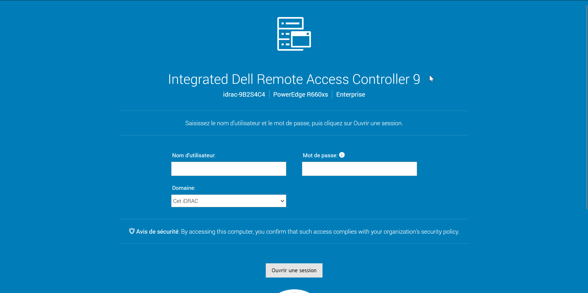
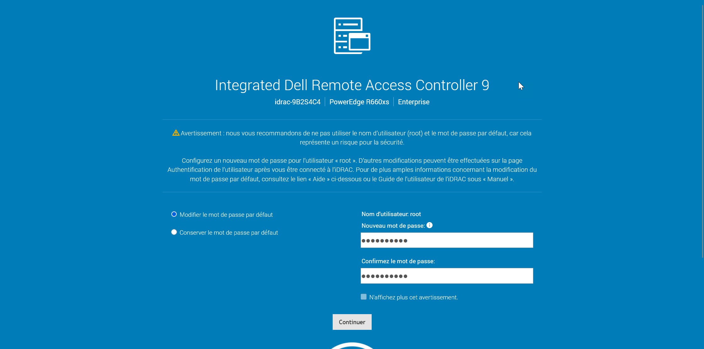
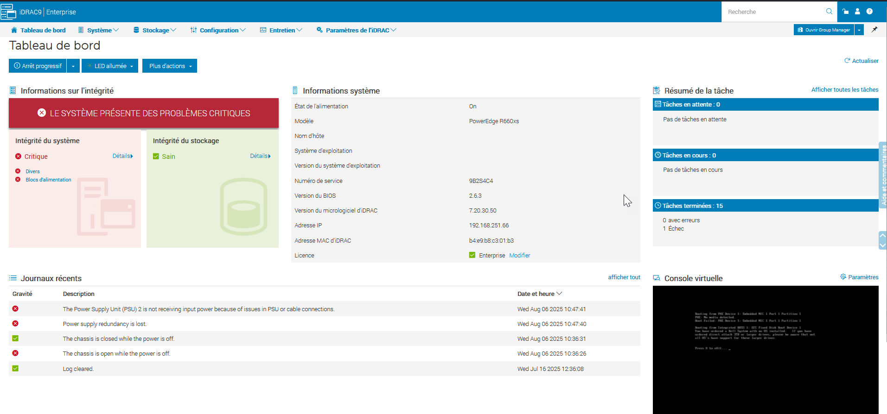
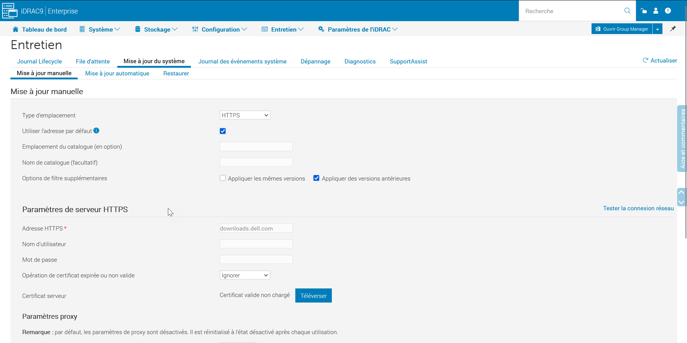
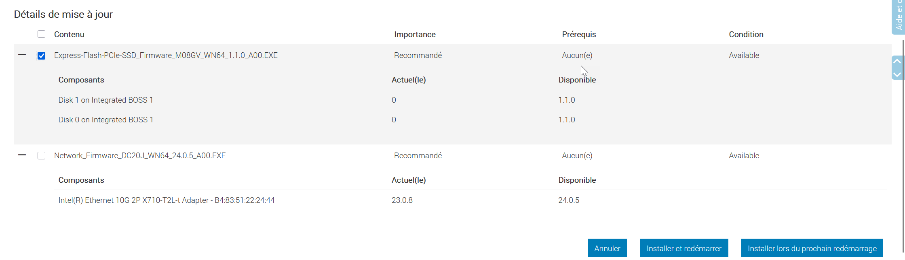
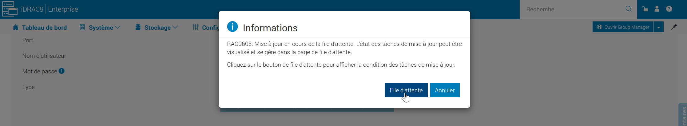
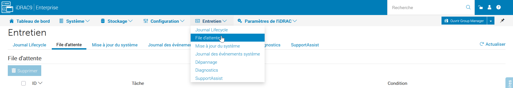
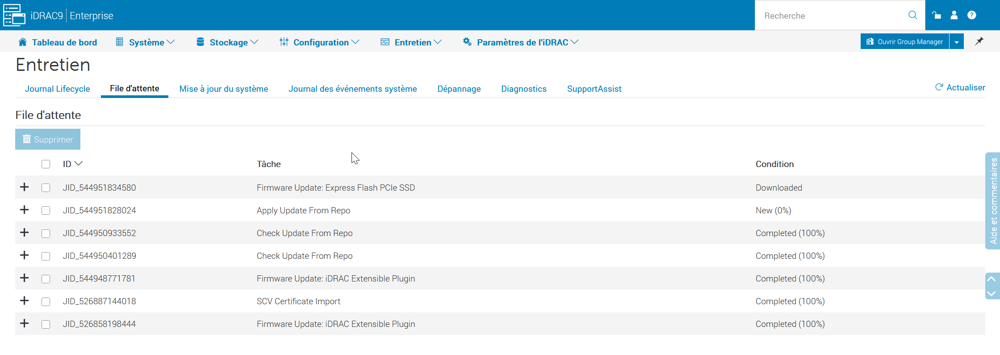
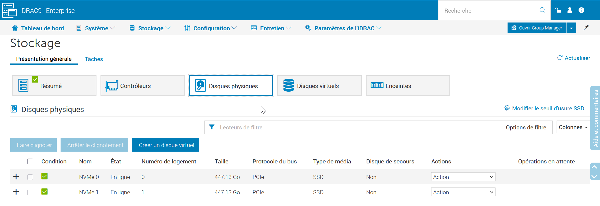

l’iDRAC (Integrated Dell Remote Access Controller) est un outil intégré aux serveurs Dell (R660xs) dans notre cas et qui permet de configurer le serveur sans avoir à se connecter avec un clavier et une souris.

Pour la première connexion, il faut créer un mot de passe pour le compte utilisateur root :

### Changement du mot de passe

Lors de la première connexion, nous sommes invités à saisir le nouveau mot de passe de l’utilisateur root.

#### Mise à jour

Sur le tableau de bord, il faut commencer par mettre à jour le serveur.

**Entretien > Mise à jour du système > Mise à jour Manuelle**.

En cochant la case utiliser l’adresse par défaut, l’adresse HTTPS se renseigne automatiquement.

En bas de page, on peut cliquer sur Vérifier les MAJ.

La liste se met à jour.

Nous lançons l’installation. Il est possible de suivre la progression en consultant la file d’attente.

### Stockage

Il est possible de consulter les disques avec le menu **Stockage > Disques physiques**.

