Connexion sur le QNAP, on arrive sur l’interface de gestion.

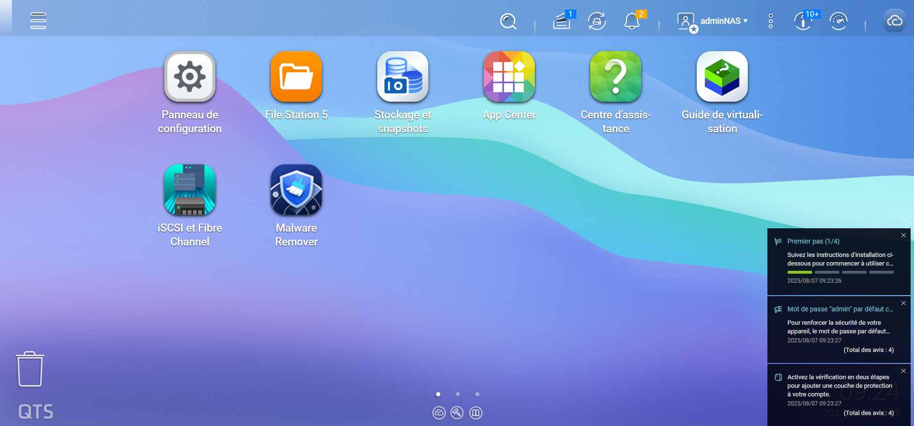

Dans Stockage et snapshots, on peut voir que les disques forment un volume de 60 To.

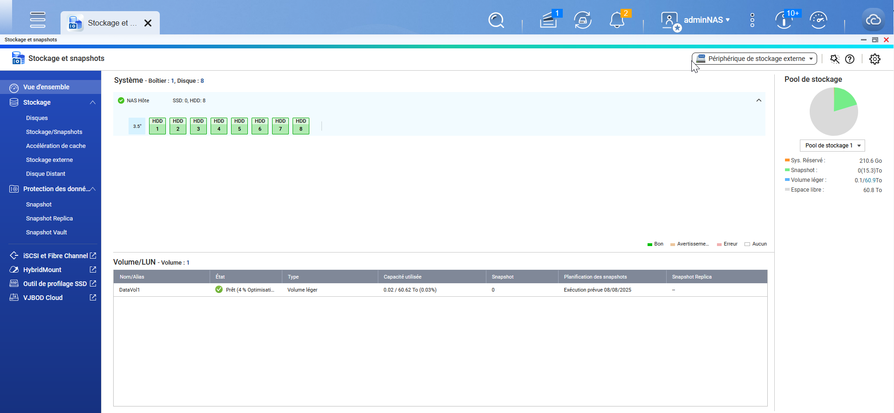

On lance l’application Services iSCSI et Fibre Channel et on active les services.

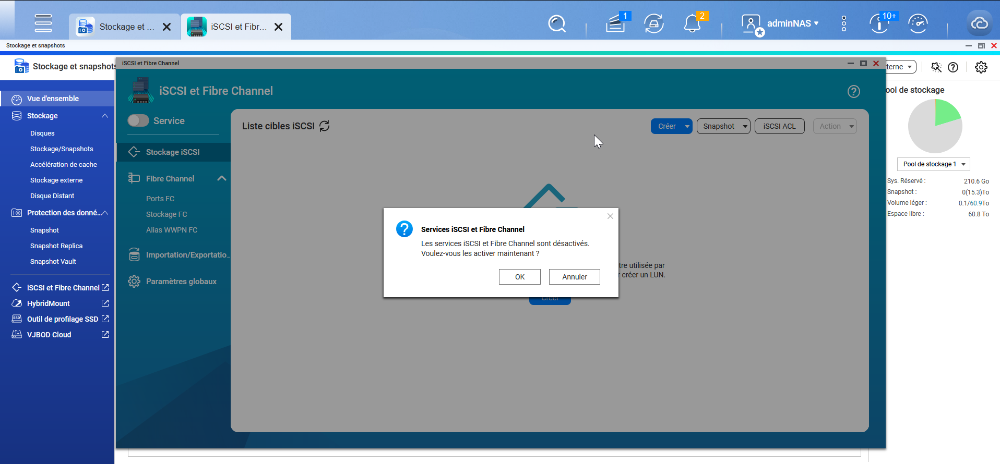

On peut utiliser l’assistant pour faire la configuration.

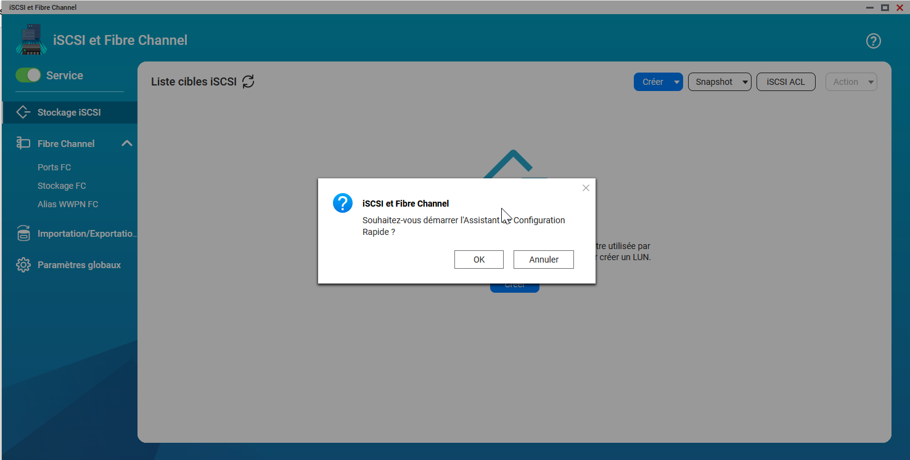

On passe à l’écran suivant en utilisant le bouton Suivant :

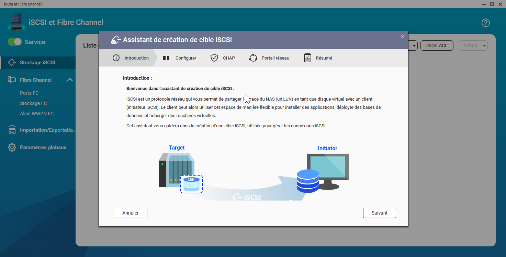

Il faut ensuite nommer la cible.

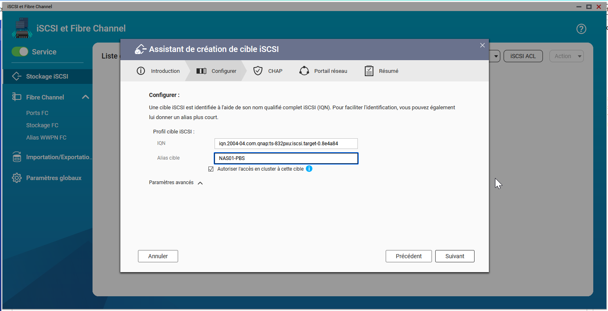

On va ensuite activer l’authentification CHAP pour sécuriser la connexion.

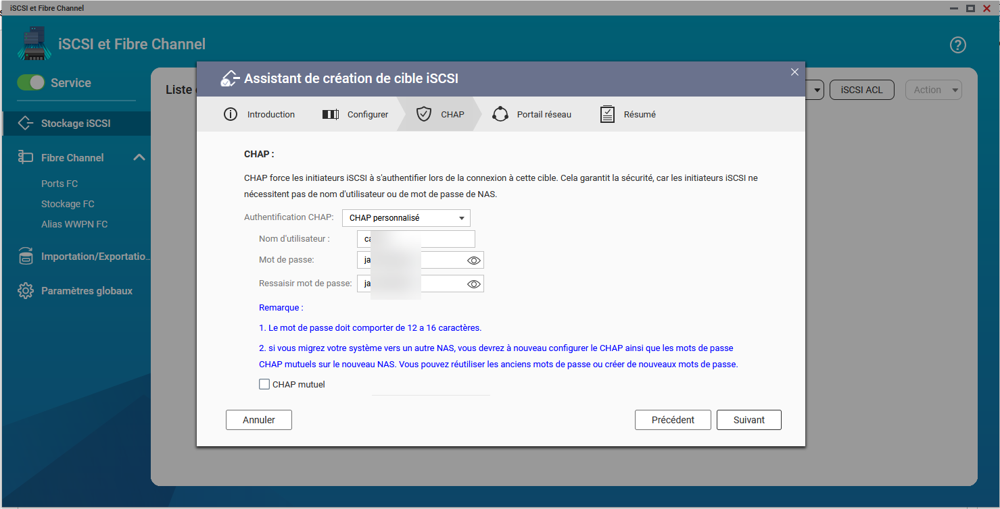

Puis, on choisit les adaptateurs Fibre Channel.

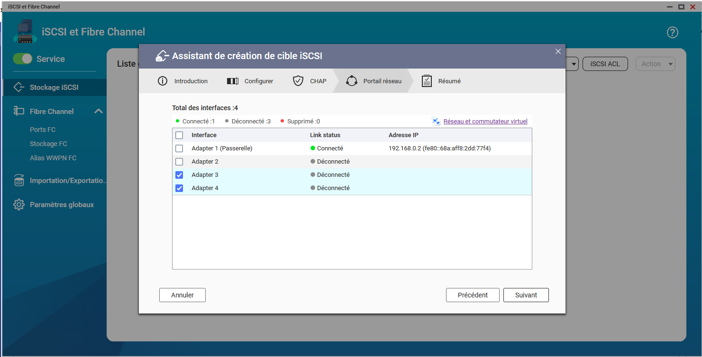

Il ne reste plus qu’à appliquer la configuration.

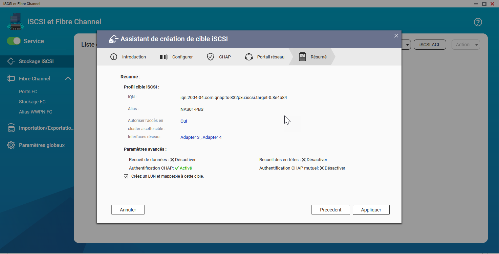

On va choisir ensuite le volume de stockage pour le LUN.

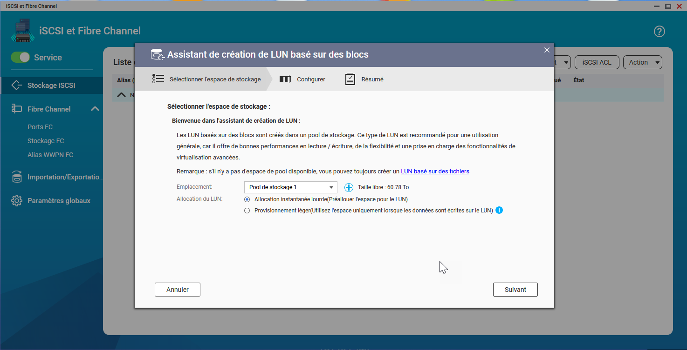

Nous avons décidé d’allouer 40 To pour le LUN iSCSI (ce sera la destination des sauvegardes de notre Proxmox Backup Server).

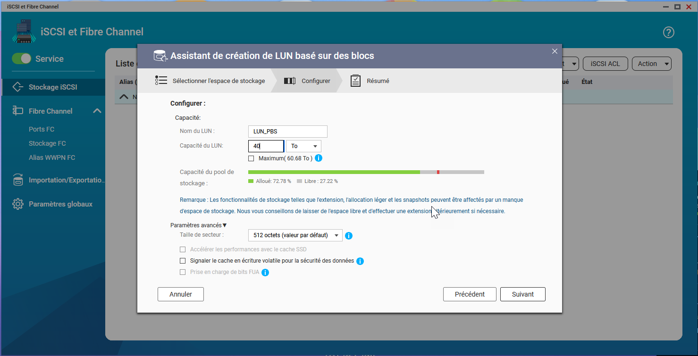

On termine l’installation.

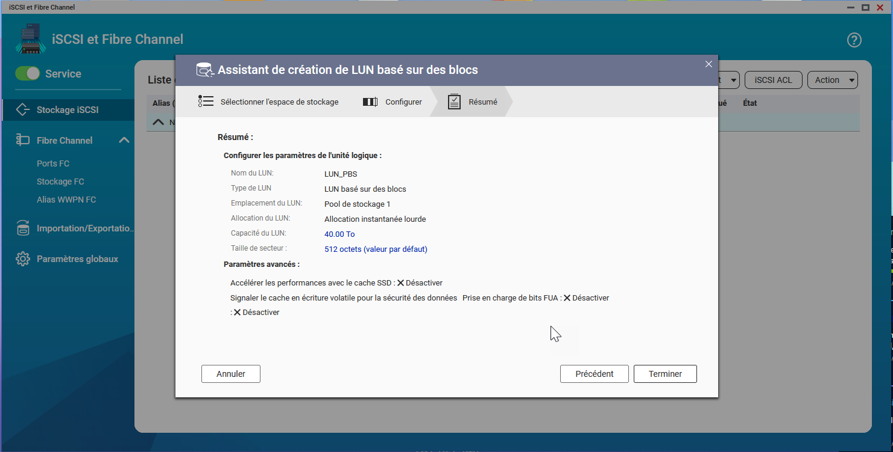

On peut voir la création du LUN dans le stockage iSCSI.

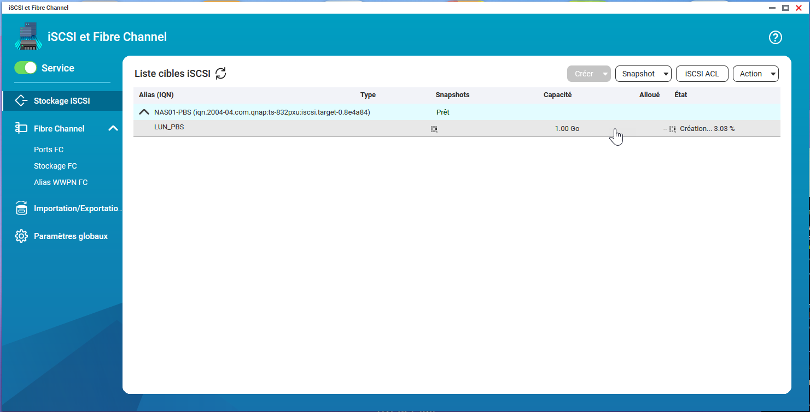