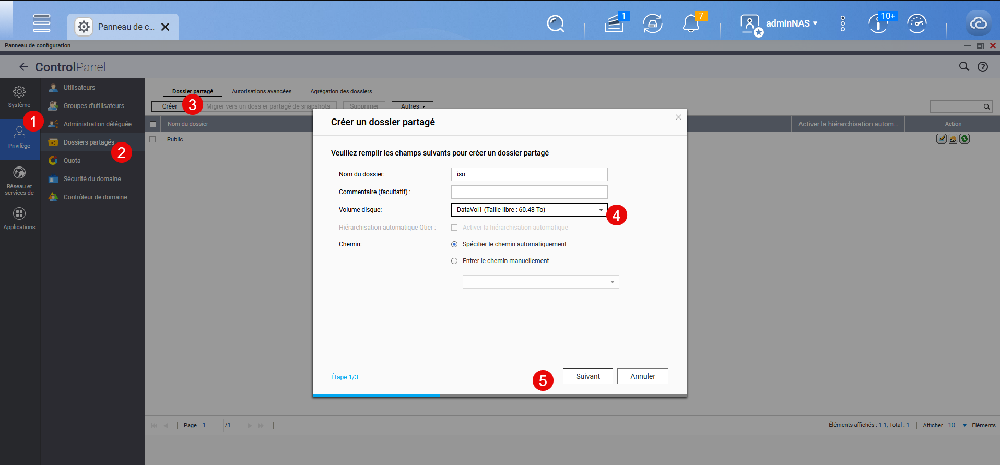
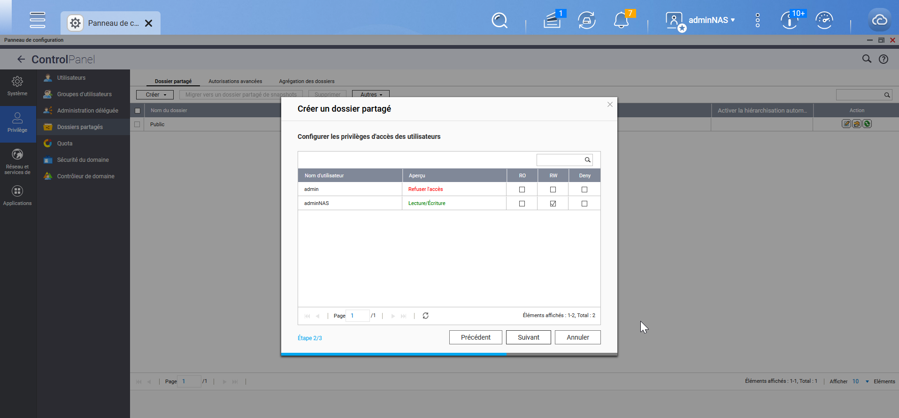
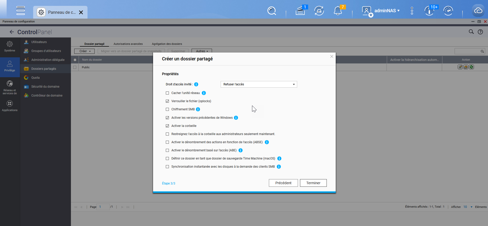
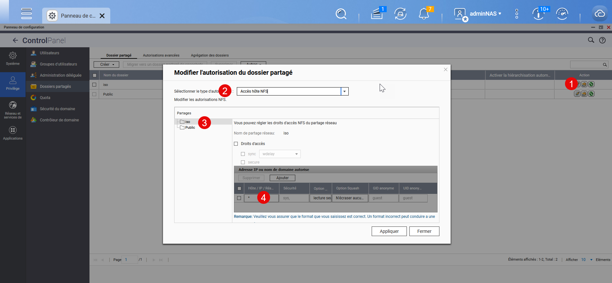
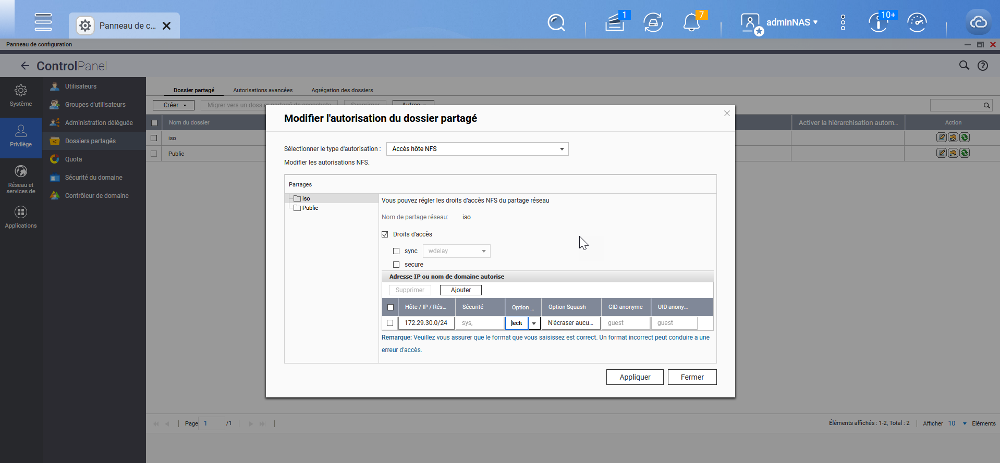
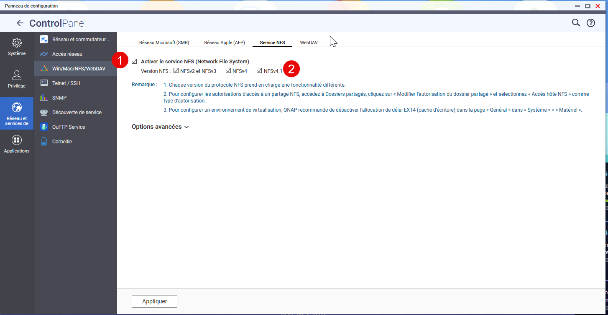

Dans notre cas, nous allons avoir besoin de créer un partage NFS 4 afin que Proxmox puisse stocker les fichiers iso sur le NAS.

Dans le dossier Panneau de configuration, on va dans les dossiers partagés.

On va ensuite ajouter un partage « iso ».

On ne va pas créer de compte spécifique, l’authentification se fera par l’IP.

On termine par valider.

On va ensuite dans les autorisations du dossier partagé et on va définir, l’IP, un réseau ou tout le monde.

Par exemple :

Dans le panneau de configuration, nous allons activer le NFSv4.
Réseau et services > Win/Mac/NFS …
On active le service NFS et on sélectionne la v4.

