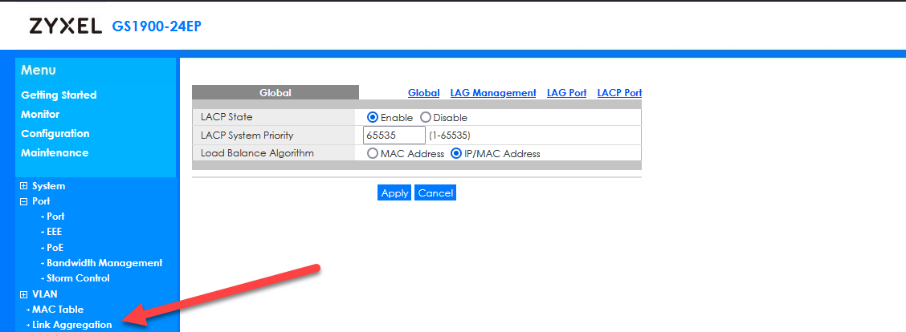
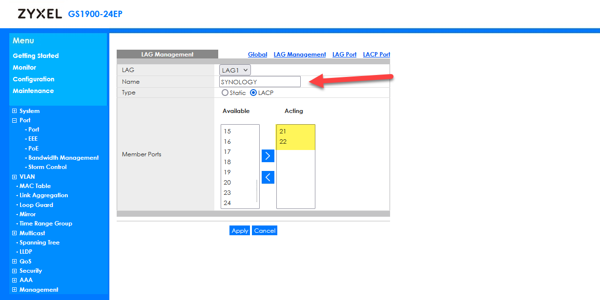
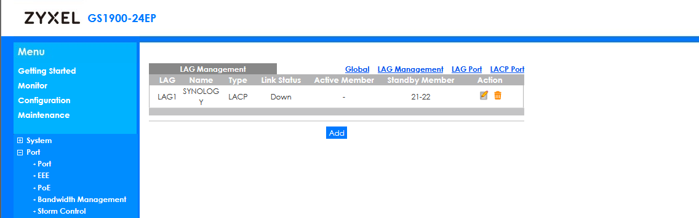
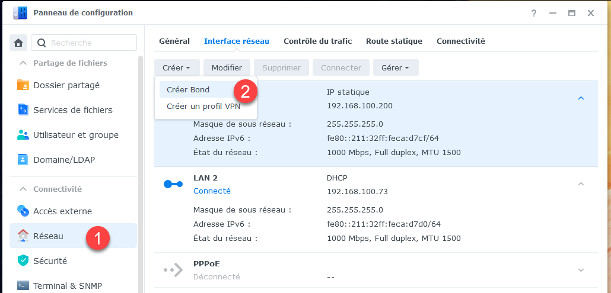
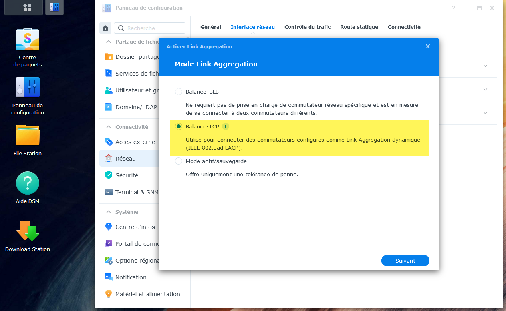
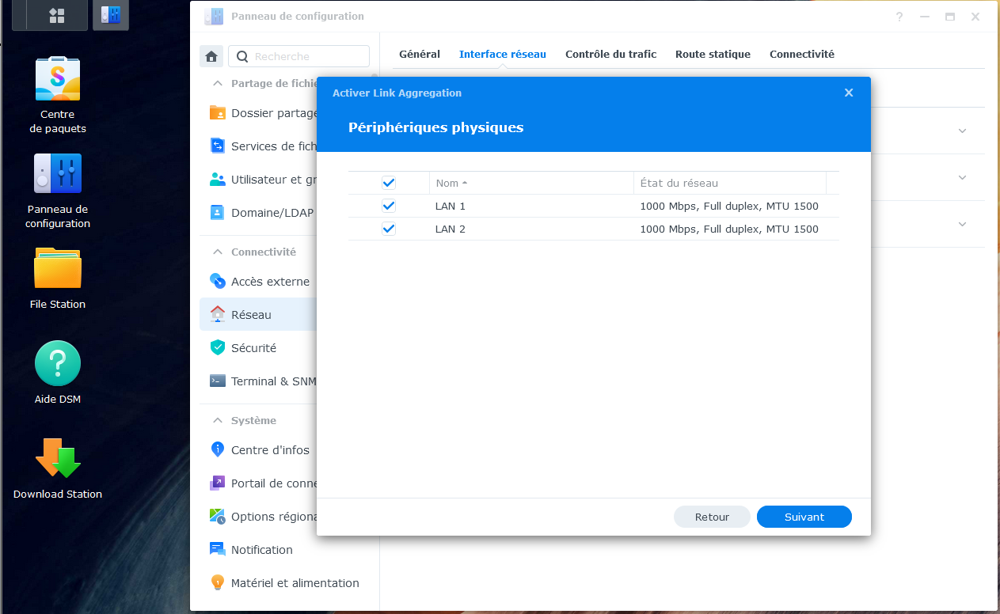
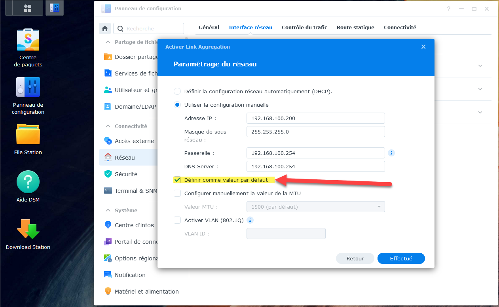
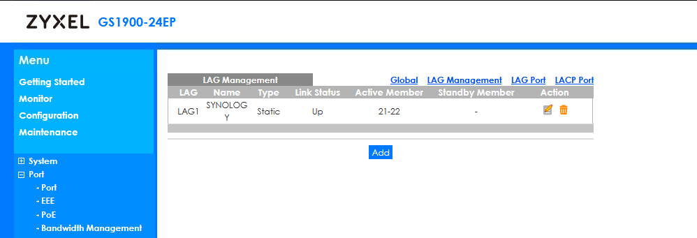
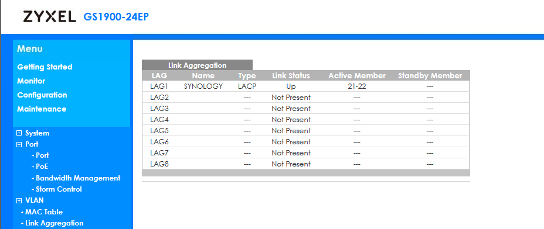
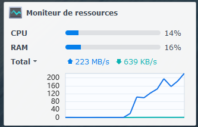

Si vous avez un NAS Synology et que vous disposez de deux interfaces réseau, il est possible de mettre en place une agrégation de lien, c’est-à-dire que votre NAS pourra envoyer non pas 1 Gb/s, mais environ 2Gb/s.

Si vous avez un réseau en 1Gb/s, cela peut rester intéressant, car si vous êtes connecté à plusieurs en même temps, la bande passante partagée sera alors de 2Gb/s quand même.

Direction l’interface de configuration du commutateur, menu « Link Aggregation »

Il faudra activer la configuration que lorsque le synology est configuré aussi sinon vous en perdrez l’accès.

On lui donne ensuite un nom et on positionne les deux interfaces concernées (pour moi la 21 et la 22) ainsi que le type LACP.

C’est tout bon, on passe au Synology.

Dans le panneau de configuration, on sélectionne Créer un bond dans le réseau

On sélectionne bien la technologie LACP

Et les deux interfaces

Il faut ensuite valider la configuration réseau en définissant la valeur par défaut

En activant la configuration, on voit que le statut devient « up » sur le commutateur

Et sur le Synology aussi

C’est parti ! on a une bande passante doublée maintenant !

