### Les Titres / En-têtes

Il existe deux méthodes :

Ajouter un dièse # devant votre chaine de caractères
```md
# En-tête niveau 1 
## En-tête niveau 2 
### En-tête niveau 3 
#### En-tête niveau 4
##### En-tête niveau 5
###### En-tête niveau 6
```
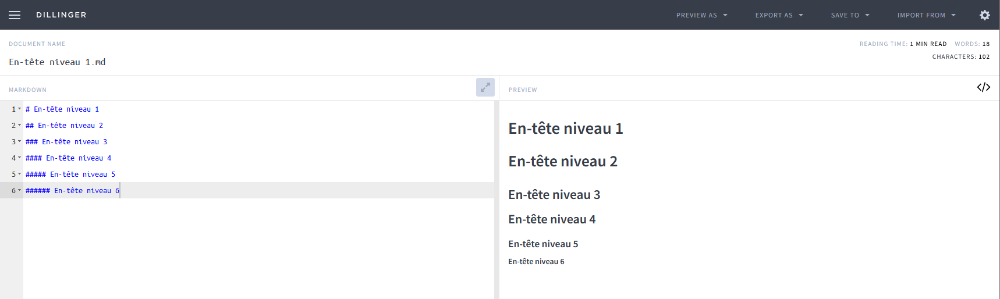

Ajouter un signe égal = en dessous de votre chaine de caractères

```md
En-tête 
=
```
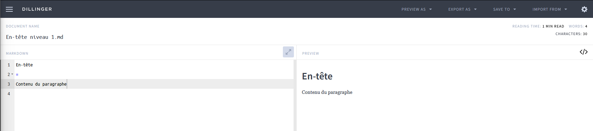

### Mettre un texte en gras

```md
# Exemple 1
__ABC__ 
 
# Exemple 2
**ABC**
```

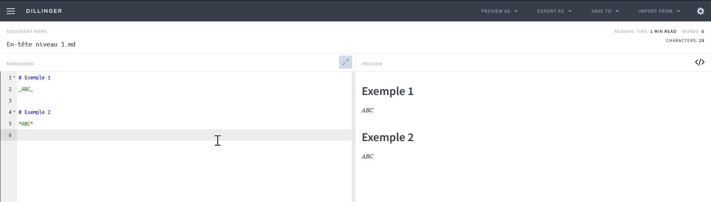

### Mettre un texte en italique

```md
# Exemple 1
_ABC_ 
 
# Exemple 2
*ABC*
```


### Les listes à puces

```md
- Élément A
- Élément B 
- Élément C
* Élément A 
* Élément B 
* Élément C
```
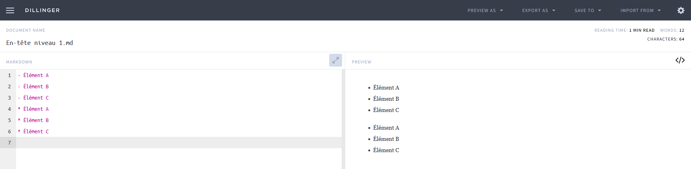

### Les listes numérotées

```md
0. Élément A
1. Élément B
2. Élément C
3. Élément D
```

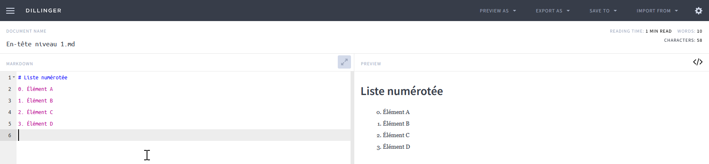

### Citation

```md
# Citation
> Lorem Ipsum is simply dummy text of the printing and typesetting industry. Lorem Ipsum has been the industry's standard dummy text ever since the 1500s, when an unknown printer took a galley of type and scrambled it to make a type specimen book. It has survived not only five centuries, but also the leap into electronic typesetting, remaining essentially unchanged. It was popularised in the 1960s with the release of Letraset sheets containing Lorem Ipsum passages, and more recently with desktop publishing software like Aldus PageMaker including versions of Lorem Ipsum
```
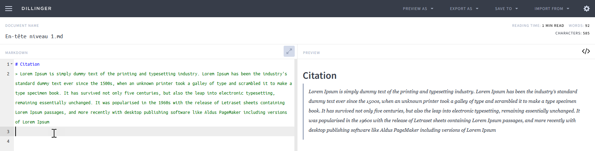

### Exemple de code (Mettre 3x ```)

```md
# Exemple en Bash
``bash 
ls -lah
mkdir test
``
 
# Exemple en PowerShell
``pwsh
Get-ChildItem
``
 
# Exemple en Python
``python
print('Hello world')
``
```

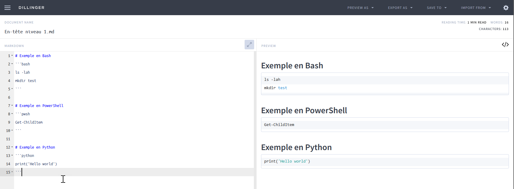

### Surligner du texte

```md
`Ceci permet de surligner du texte`
```

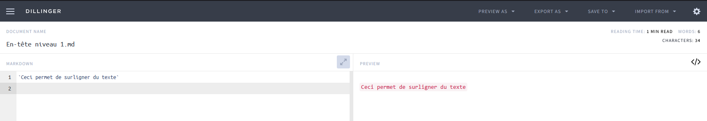

### Les tableaux

```md
# LES TABLEAUX
Colonne 1 | Colonne 2 | Colonne 3 
--------- | --------- |--------- 
Contenu 1 | Contenu 2 | Contenu 3 
Contenu 4 | Contenu 5 | Contenu 6
```

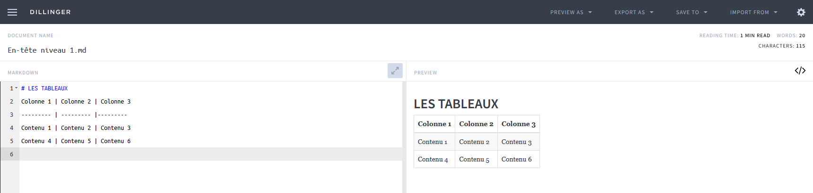

### Les images

```md
# Insertion des images

```

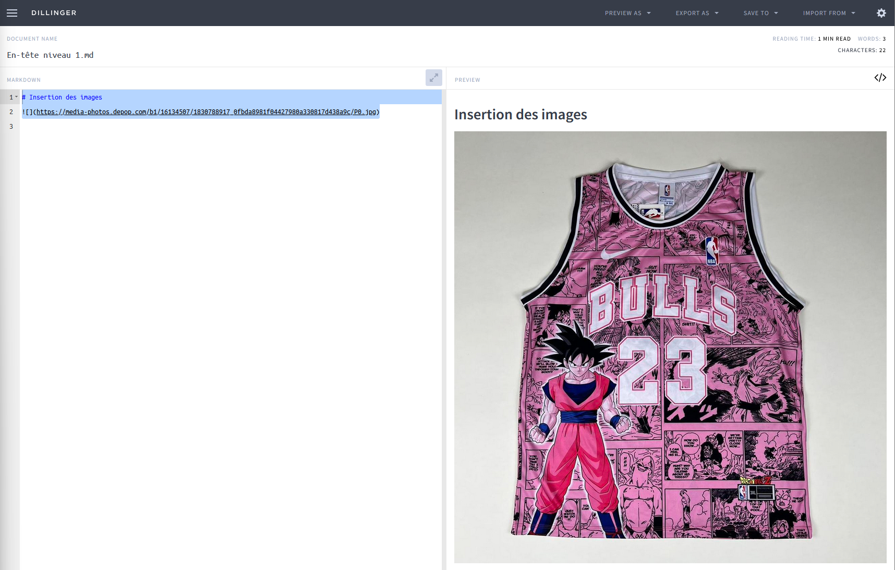

### Les liens

Externe

```md
# Exemples 
- [Google Markdown Style Guide](https://google.github.io/styleguide/docguide/style.html) 
```

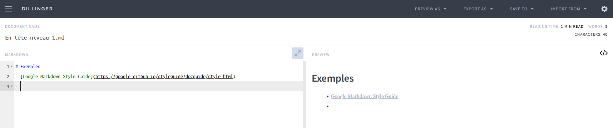

Interne

```md
# Exemple
[Document interne à lier](test2.md)
```

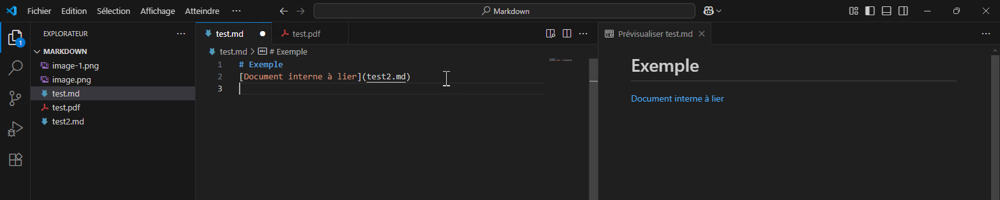