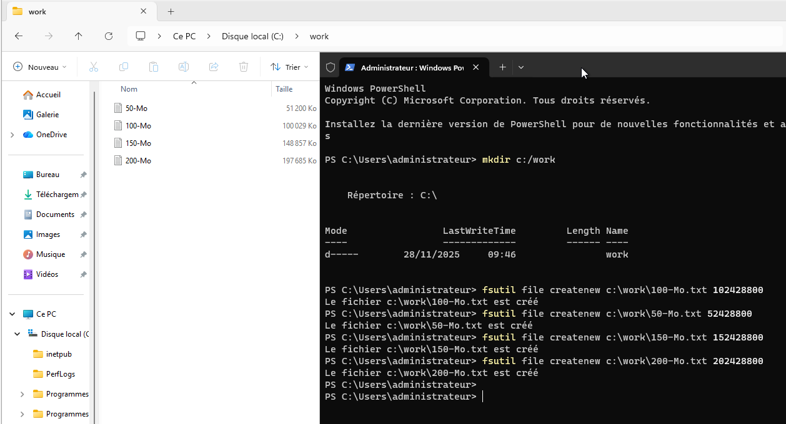

Pour créer des fichiers volumineux sous Windows, vous pouvez utiliser PowerShell avec la commande `fsutil` ou `dd`. Voici comment procéder avec les deux méthodes :

## Méthode 1 : Utilisation de fsutil

Ouvrez PowerShell en tant qu'administrateur et utilisez la commande suivante pour créer un fichier de la taille souhaitée (en octets) :

```powershell
fsutil file createnew C:\chemin\vers\le\fichier.txt taille_en_octets
```

Par exemple, pour créer des fichiers :

```powershell
fsutil file createnew c:\work\1GB.txt 1073741824
fsutil file createnew c:\work\100-Mo.txt 102428800
fsutil file createnew c:\work\50-Mo.txt 52428800
fsutil file createnew c:\work\150-Mo.txt 152428800
fsutil file createnew c:\work\200-Mo.txt 202428800
```



## Méthode 2 : Utilisation de dd

Si vous avez installé l'outil `dd` pour Windows, vous pouvez également l'utiliser pour      créer des fichiers volumineux. Voici un exemple de commande :

```powershell
dd if=NUL of=C:\chemin\vers\le\fichier.txt bs=1M count=taille_en_Mo
```

Par exemple, pour créer un fichier de 1 Go :

```powershell
dd if=NUL of=C:\temp\fichier_1GB.txt bs=1M count=1024
```

Ces méthodes vous permettront de créer rapidement des fichiers volumineux pour divers besoins, tels que les tests de performance ou le remplissage d'espace disque.