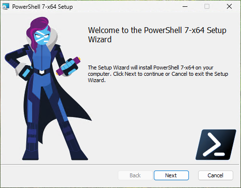
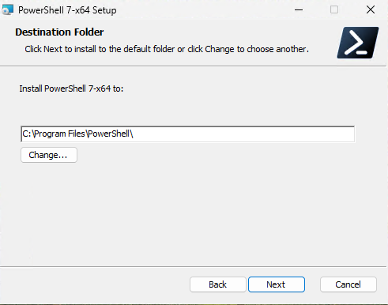
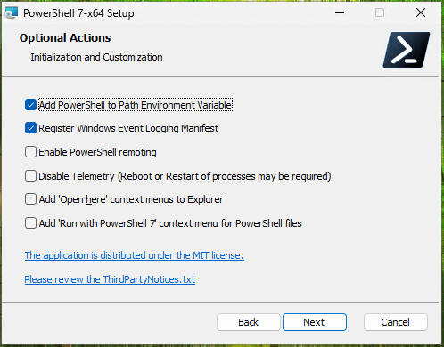
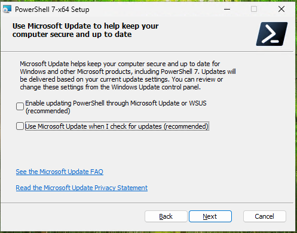
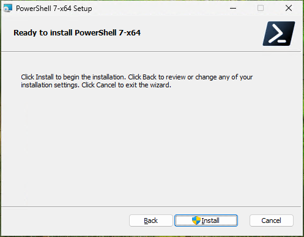

:::note
Testé avec la version 7.6.5 au 19/08/2026
:::

Téléchargez la dernière version de PowerShell depuis le Github de Microsoft :

[https://github.com/PowerShell/PowerShell](https://github.com/PowerShell/PowerShell)

Lancer le fichier `PowerShell-7.6.5-win-x64.msi` 

Choisir le repertoire d'installation, (vous pouvez laisser le répertoire par défaut) puis cliquer sur `Next`.

Laisser les options par défaut et cliquer sur `Next`.

Désactiver la collecte de données et  les mises à jour, nous sommes en test. Cliquer sur `Next`.

Lancer l'installation en cliquant sur `Install`.

