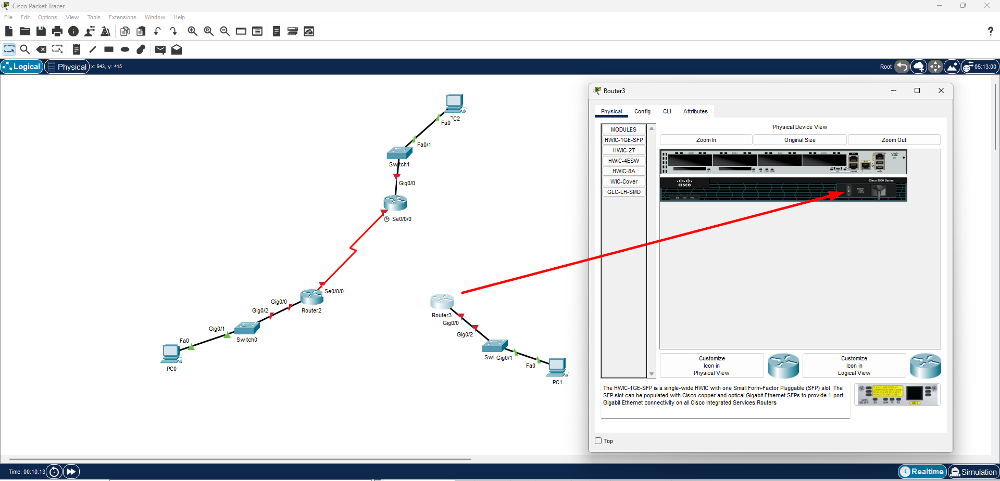
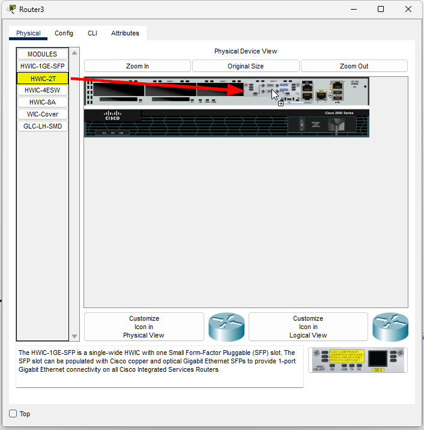
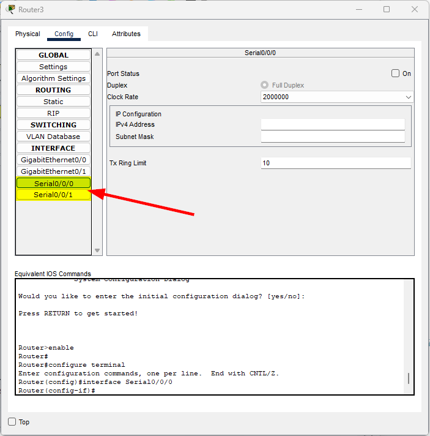

Pour pouvoir brancher plus de deux interfaces sur un routeur dans Cisco Packet Tracer, il est nécessaire d'ajouter des modules d'extension. Voici comment ajouter un port série à un routeur dans Cisco Packet Tracer :

1. **Sélectionner le routeur** : Cliquez sur le routeur auquel vous souhaitez ajouter un port série.
2. **Accéder à l'onglet "Physical"** : Dans la fenêtre des propriétés du routeur, cliquez sur l'onglet "Physical" pour accéder à la vue physique du routeur.
3. **Éteindre le routeur** : Avant d'ajouter un module, il est nécessaire d'éteindre le routeur en cliquant sur l'interrupteur situé à droite de l'image du routeur.

4. Choisir une carte d'extension HWIC-2T pour ajouter deux ports série.

5. Redémarrer le routeur en cliquant à nouveau sur l'interrupteur.

Une fois le routeur redémarré, vous verrez que deux nouveaux ports série ont été ajoutés et sont prêts à être utilisés.

