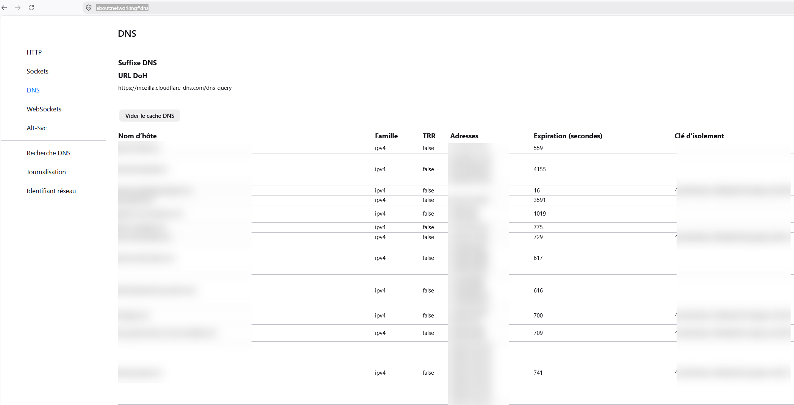

Pour vider le cache DNS dans Firefox, vous pouvez suivre ces étapes simples :
1. Ouvrez Firefox.
2. Dans la barre d'adresse, tapez `about:networking#dns` et appuyez sur Entrée.
3. Cliquez sur vider le cache DNS pour effacer les entrées DNS mises en cache.

4. Fermer et relancer Firefox pour que les modifications prennent effet.