GLPI est un logiciel libre de gestion des services informatiques et de gestion des services d’assistance. Cette solution libre est éditée en PHP et distribuée sous licence GPL.

Installation de GLPI 10 sur un serveur Debian 11.

Il faut déjà disposer d’un serveur LAMP.

Installation des dépendances et rechargement d’Apache

```bash
apt install php-ldap php-intl php-apcu php-xmlrpc php-zip php-bz2
service apache2 reload
```

Accès à la documentation :

[https://glpi-install.readthedocs.io/en/latest/](https://glpi-install.readthedocs.io/en/latest/)

Lien vers le GitHub :

[https://github.com/glpi-project/glpi/releases](https://github.com/glpi-project/glpi/releases)

## Installation des binaires

Téléchargement des binaires et décompression

```bash
wget https://github.com/glpi-project/glpi/releases/download/10.0.3/glpi-10.0.3.tgz
```

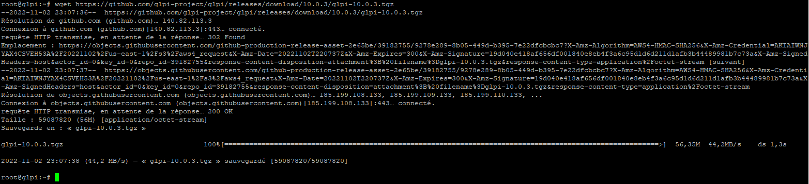

Décompresser l’archive et la placer dans le répertoire d’apache

```bash
tar -xvzf glpi-10.0.3.tgz
mv glpi/ /var/www/html/glpi
```

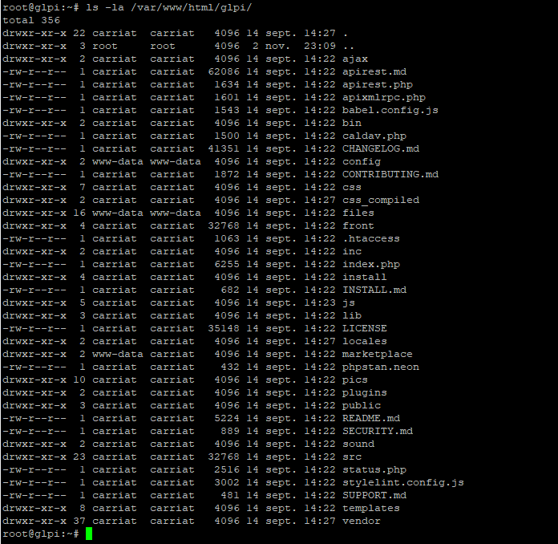

Donner les droits à Apache sur le repertoire files et config

```bash
chgrp www-data -R /var/www/html/glpi/{config,files}
chown www-data -R /var/www/html/glpi/{config,files}
chown www-data -R /var/www/html/glpi/marketplace
```

## Configuration de GLPI

Il faut se rendre à l’adresse : http://IP_DU_SERVEUR/glpi/

On valide la langue

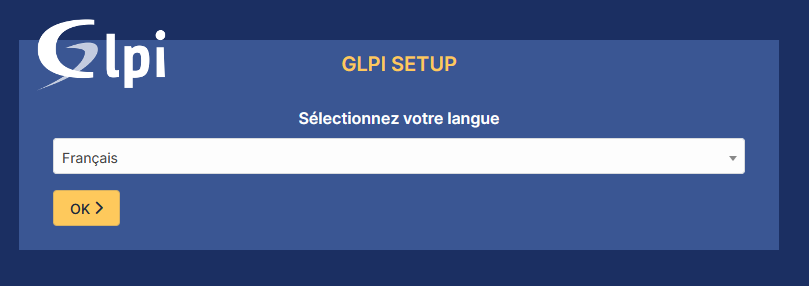

On accepte la licence

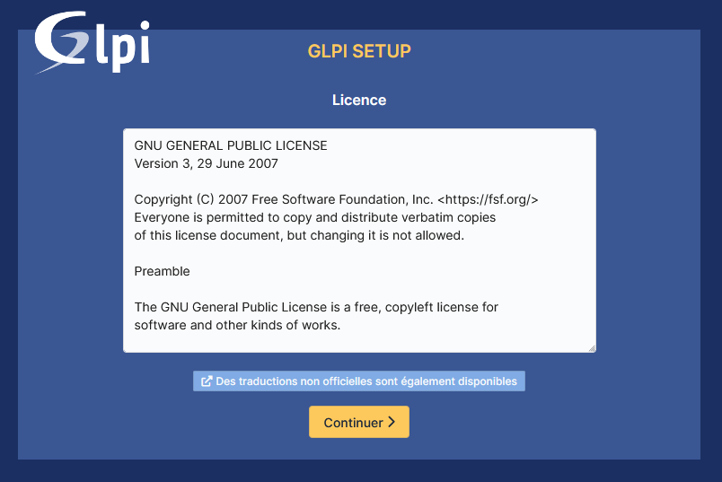

On choisit l’installation

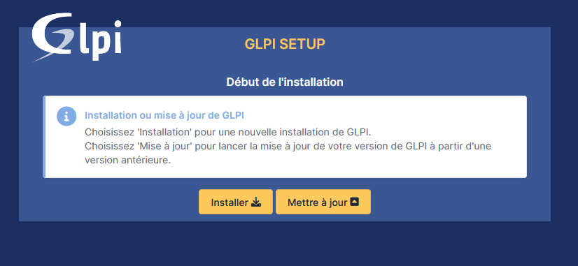

Il faut que tous les paramètres requis soient validés

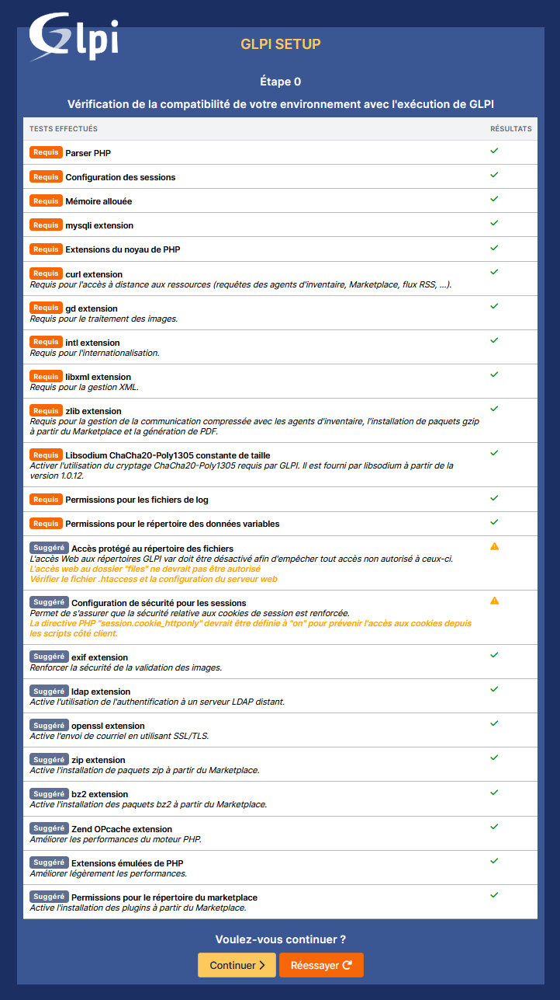

Remplir les informations de connexion à la base de données

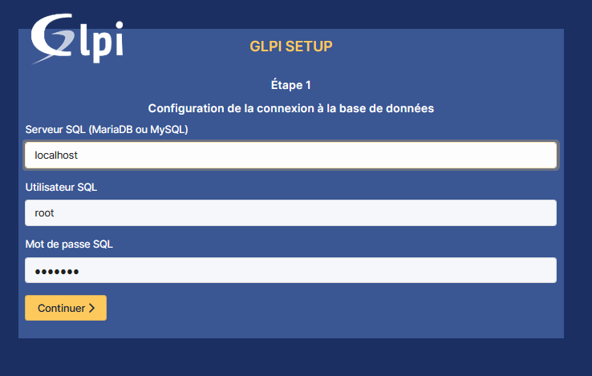

Créer une nouvelle base de données

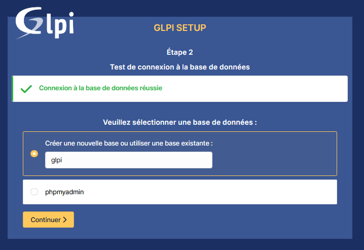

La base de données est bien créée

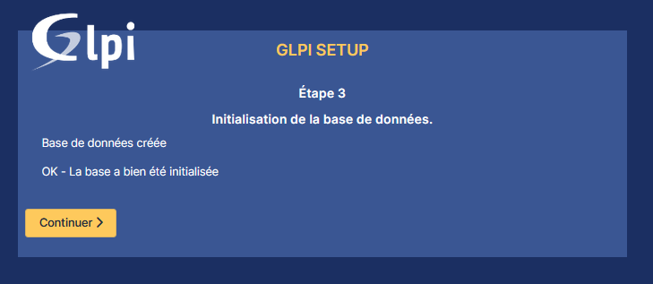

On désactive la collecte des données

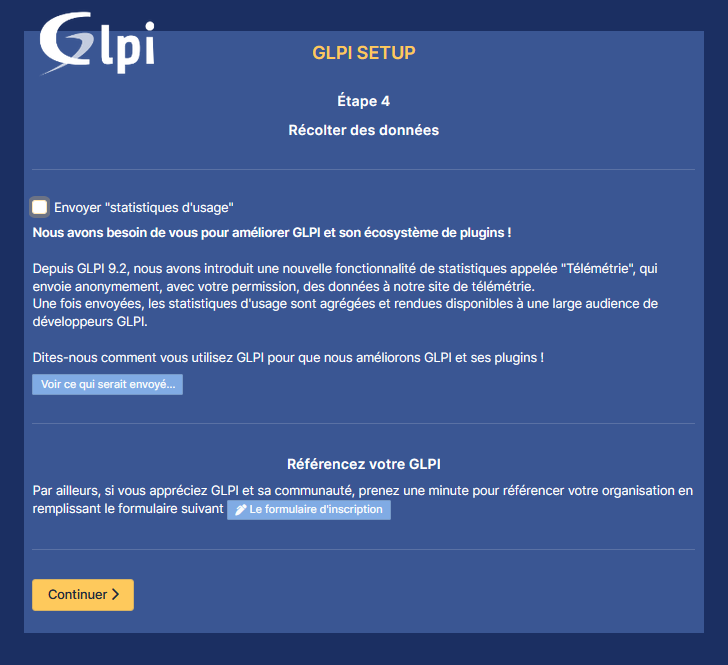

On valide

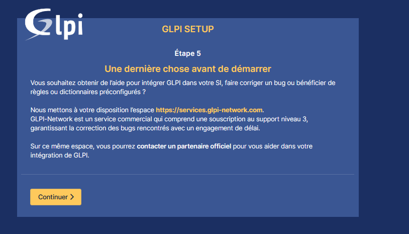

Un dernier écran avec les informations de connexion

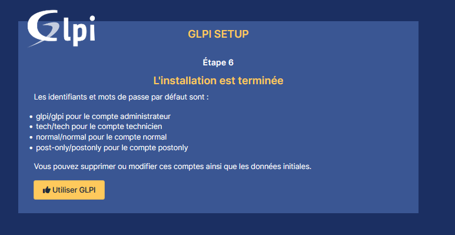

On peut maintenant se connecter

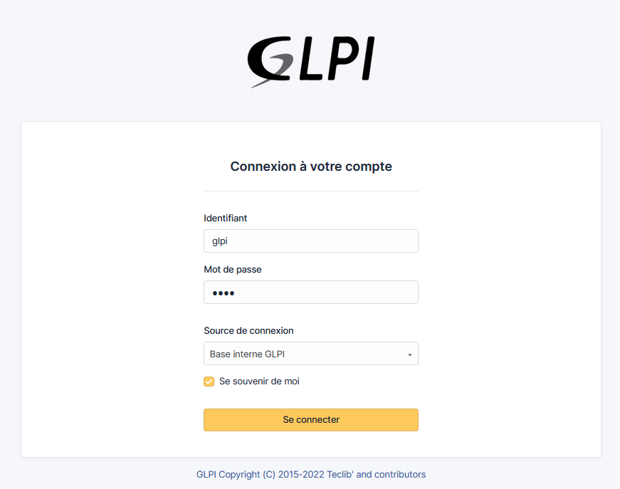

On arrive sur le tableau de bord

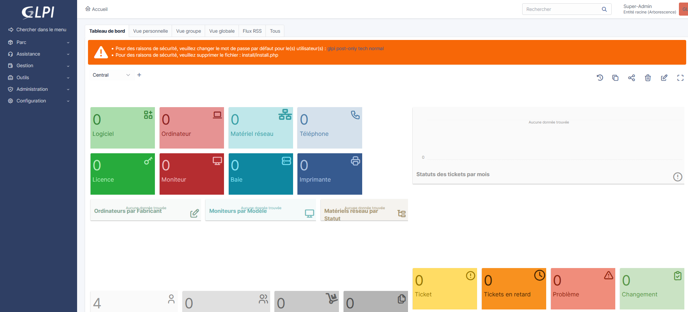
