GLPI (Gestionnaire Libre de Parc Informatique) est un logiciel open source créé en 2003 par INDEPNET Development afin de répondre à un besoin croissant de gestion centralisée des parcs informatiques.

À l’origine orienté principalement vers l’inventaire matériel et logiciel, GLPI a progressivement évolué pour intégrer un système de gestion des tickets, devenant ainsi un véritable outil ITSM conforme aux bonnes pratiques du support informatique.

Grâce à une communauté active et à un écosystème riche de plugins (inventaire automatique, rapports, gestion financière, interconnexions avec d’autres outils), GLPI s’est largement diffusé dans les établissements scolaires, collectivités territoriales et entreprises.

Aujourd’hui, il est maintenu par la société Teclib’, qui propose à la fois une version communautaire et des offres professionnelles, tout en conservant l’esprit open source du projet.

Avant d’installer GLPI, certains prérequis techniques sont nécessaires. GLPI est une application web qui fonctionne sur un serveur disposant d’un serveur HTTP (Apache ou Nginx), d’un serveur de base de données (MariaDB ou MySQL recommandé) et de PHP dans une version compatible avec celle de GLPI installée.

Le serveur peut être sous Linux ou Windows, avec des droits suffisants pour créer une base de données et gérer les fichiers applicatifs. Il est également conseillé de disposer d’un navigateur web récent côté client pour l’administration et l’utilisation quotidienne.

Enfin, pour aller plus loin dans un contexte professionnel ou pédagogique, l’intégration avec un annuaire Active Directory, ainsi que l’utilisation d’un agent d’inventaire (comme GLPI Agent), constituent des compléments fortement recommandés.

Les prérequis de GLPI sont disponibles sur [cette page](https://glpi-install.readthedocs.io/en/latest/prerequisites.html).

Vous aurez besoin :

- Un serveur Apache.
- Un serveur de base de données MariaDB.
- Un interpréteur de langage PHP.

## 1- Installation des pré-requis

### 1.1 Mise à jour du serveur

Avant tout, nous allons mettre à jour le serveur.

```bash
root@srv-glpi:~ # apt update && apt upgrade
```

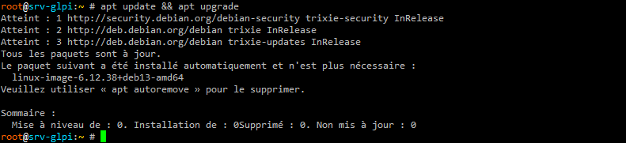

### 1.2 Installation des paquets de base

Une fois le serveur à jour, nous allons installer le serveur LAMP (Web).
Vérifier que vous n'avez pas de message d'erreur.

```bash
root@srv-glpi:~ # apt install apache2 php8.4-fpm mariadb-server
```

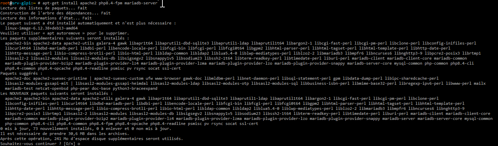

```bash
root@srv-glpi:~ # apt install php8.4-{common,curl,gd,intl,mysql,zip,bcmath,mbstring,xml,bz2,ldap}
```

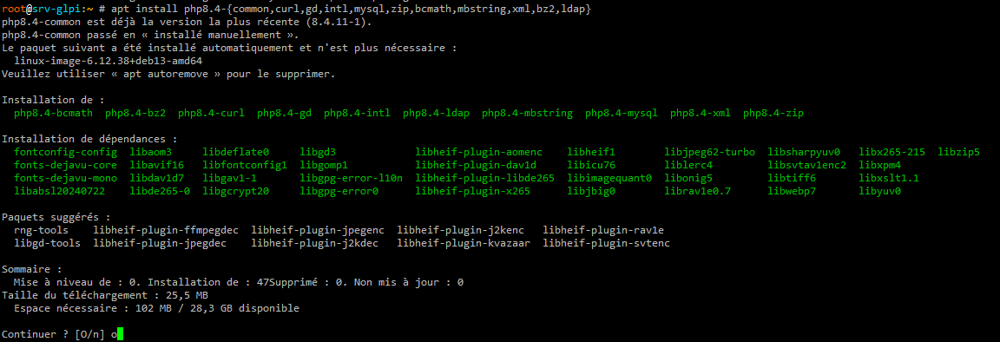

### 1.3 Sécurisation de la base de données

La commande mariadb-secure-installation est un outil essentiel après l’installation d’un serveur MariaDB, car elle permet de sécuriser rapidement la configuration initiale de la base de données.

Cette procédure interactive guide l’administrateur dans la définition d’un mot de passe pour le compte administrateur (root), la suppression des comptes anonymes, la désactivation des connexions distantes non sécurisées, ainsi que la suppression de la base de test créée par défaut.

En appliquant ces réglages, on réduit fortement les risques d’accès non autorisé et on met en place une base saine et sécurisée, indispensable avant l’hébergement d’applications comme GLPI ou tout autre service reposant sur MariaDB.

```bash
root@srv-glpi:~ # mariadb-secure-installation
```

Répondre aux questions comme dans l'image ci-dessous :

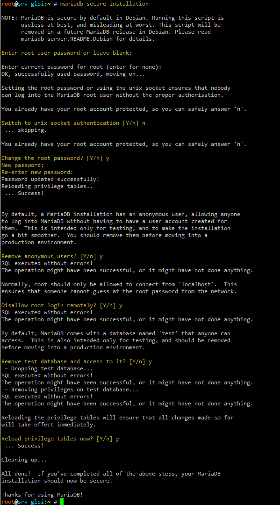

Votre serveur web doit être accessible depuis son adresse IP :


## 2- Installation de GLPI

### 2.1 Création de la base de données

La création de la base de données est une étape indispensable avant le déploiement d’une application web comme GLPI. Elle consiste à créer une base dédiée dans le serveur MariaDB, ainsi qu’un utilisateur spécifique disposant uniquement des droits nécessaires (lecture, écriture, modification), conformément aux bonnes pratiques de sécurité. 

Cette séparation permet d’éviter l’utilisation du compte administrateur root par les applications et de limiter l’impact en cas de compromission. Une fois la base et l’utilisateur créés, leurs paramètres (nom de la base, identifiant et mot de passe) seront renseignés lors de l’assistant d’installation de GLPI, afin de permettre à l’application de stocker de manière structurée ses données (tickets, utilisateurs, inventaire, historique des actions).

Se connecter à MariaDB :

```bash
root@srv-glpi:~ # mysql -u root -p
```

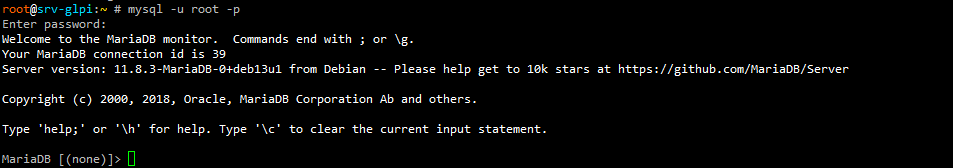

Puis, créer la base de données ainsi qu'un utilisateur.

```sql
CREATE DATABASE glpi;
GRANT ALL PRIVILEGES ON glpi.* TO glpi_admin@localhost IDENTIFIED BY "Etudiant_1234";
FLUSH PRIVILEGES;
EXIT
```

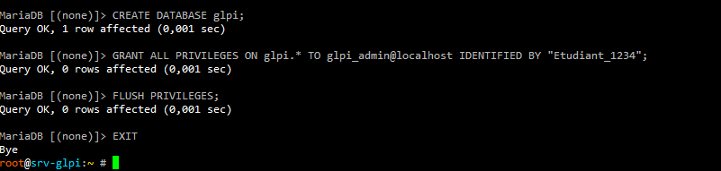

### 2.2 Téléchargement de GLPI

GLPI est disponible sur son GITHUB à l'adresse :

[https://github.com/glpi-project/glpi/releases/](https://github.com/glpi-project/glpi/releases/)

La dernière version à date est la version 11.0.4.

```bash
root@srv-glpi:~ # wget https://github.com/glpi-project/glpi/releases/download/11.0.4/glpi-11.0.4.tgz
```

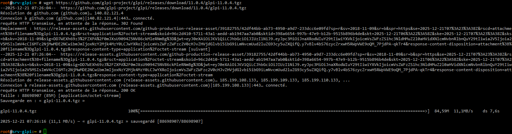

Nous allons ensuite décompresser l'archive de GLPI

```bash
root@srv-glpi:~ # tar -xzvf glpi-11.0.4.tgz
```

Un dossier glpi a été créé avec le contenu de l'application


Déplacer les fichiers de glpi dans le repertoire du serveur et changer le propriétaire du dossier.

```bash
root@srv-glpi:~ # mv glpi/* /var/www/html/
mv : voulez-vous écraser '/var/www/html/index.html' ? y
root@srv-glpi:~ # chown -R www-data /var/www/html/
```

La commande `ls -l /var/www/html` doit retourner ceci :

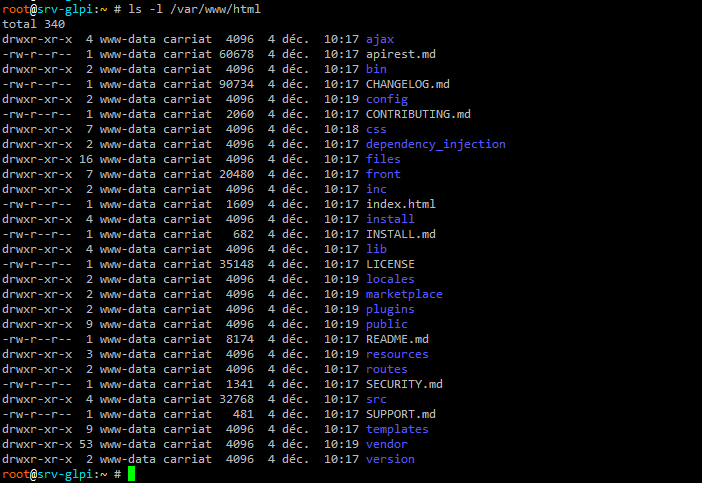

### 2.3 Configuration d'Apache

La configuration d'Apache est documentée sur le [wiki de GLPI](https://glpi-install.readthedocs.io/en/latest/prerequisites.html#webserver-configuration)

#### Modification de la configuration par défaut

Le site par défaut d'apache est configuré dans le fichier `000-default.conf`.
L'ouvrir avec `nano`

```bash
root@srv-glpi:~ # nano /etc/apache2/sites-enabled/000-default.conf
```

Ajouter les lignes en verts et supprimer celle en rouge.
Essayer de comprendre leur fonctionnement.

```bash title="/etc/apache2/sites-enabled/000-default.conf" del={6} ins={7,9-19}
<VirtualHost *:80>
        #ServerName www.example.com

        ServerAdmin webmaster@localhost

        DocumentRoot /var/www/html
        DocumentRoot /var/www/html/public

    <Directory /var/www/html/public>
        Require all granted

        RewriteEngine On

        RewriteCond %{HTTP:Authorization} ^(.+)$
        RewriteRule .* - [E=HTTP_AUTHORIZATION:%{HTTP:Authorization}]

        RewriteCond %{REQUEST_FILENAME} !-f
        RewriteRule ^(.*)$ index.php [QSA,L]
    </Directory>

        ErrorLog ${APACHE_LOG_DIR}/error.log
        CustomLog ${APACHE_LOG_DIR}/access.log combined

</VirtualHost>
```

#### Activation des modules d'Apache

Apache a besoin d'activer des modules spécifiques ainsi que la gestion de PHP.
Lancer les commandes suivantes :

```bash
root@srv-glpi:~ # a2enmod rewrite
root@srv-glpi:~ # a2enmod proxy_fcgi setenvif
root@srv-glpi:~ # a2enconf php8.4-fpm
root@srv-glpi:~ # systemctl reload apache2
```

Si vous avez suivi toutes les commandes, la page d'accueil de votre site lance l'installation de GLPI.

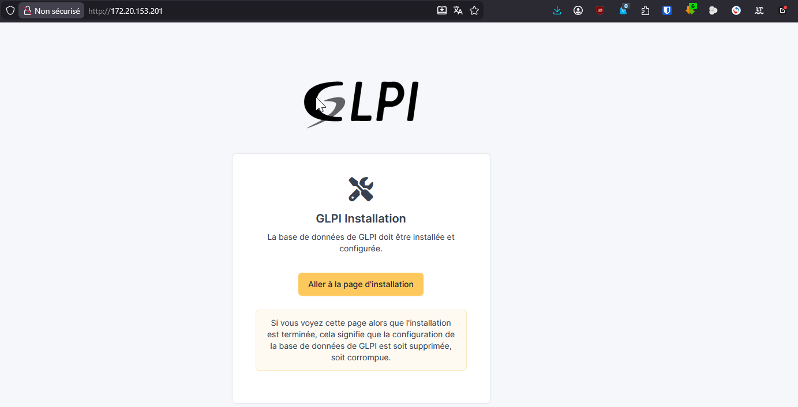

### 2.4 Assistant d'installation

Sur la page d'accueil, cliquer sur `Aller à la page d'installation`.

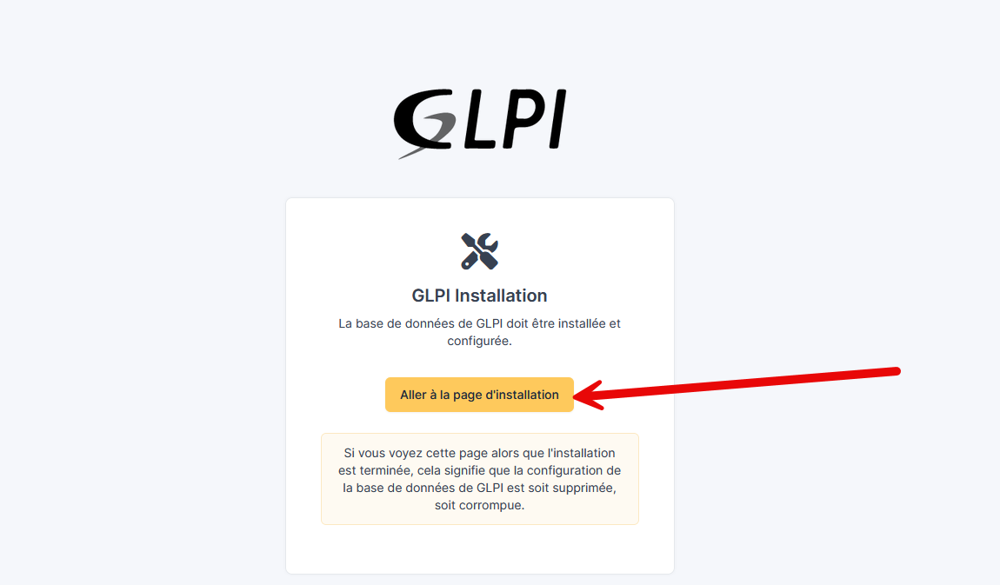

- Choisir la langue.


- Accepter le contrat de licence.

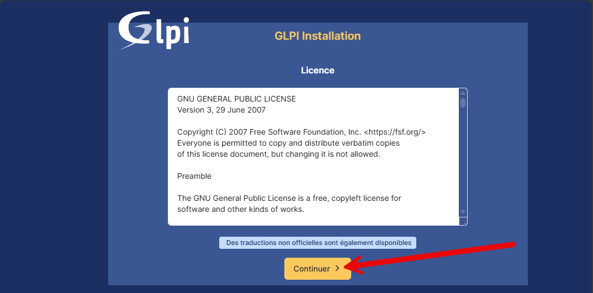

- Choisir `Installer` car il s'agie d'une nouvelle installation.

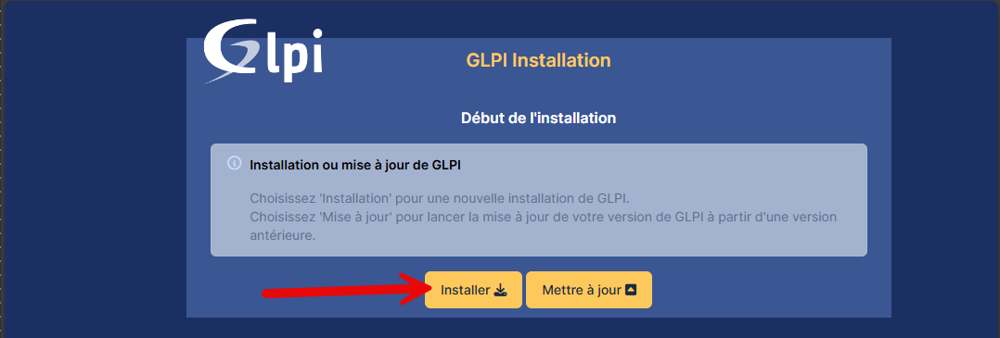

- Une vérification de la configuration du serveur est faite, si tout est bon, les résultats seront tous positifs.

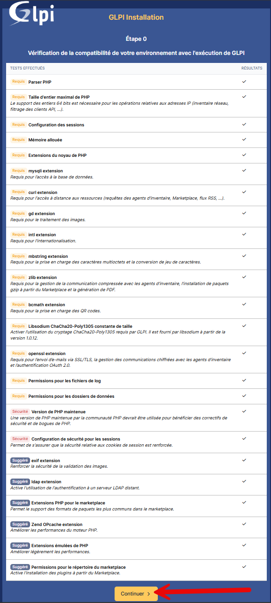

- Fournir les informations de connexion au moteur MariaDB pour que la base de données puisse être créé.
- Reprendre les infos de la requête de création de la base.

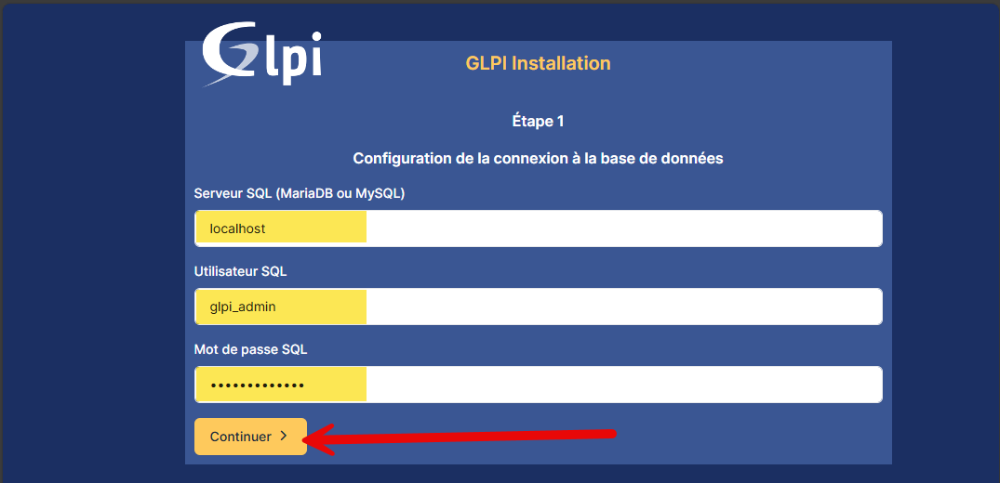

- Choisir ensuite la base de données que nous avons créé.

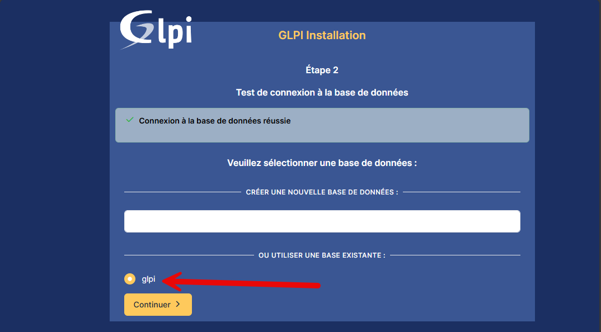

- L'installation se lance


- Une fois terminé, vous devez avoir un retour comme celui ci.

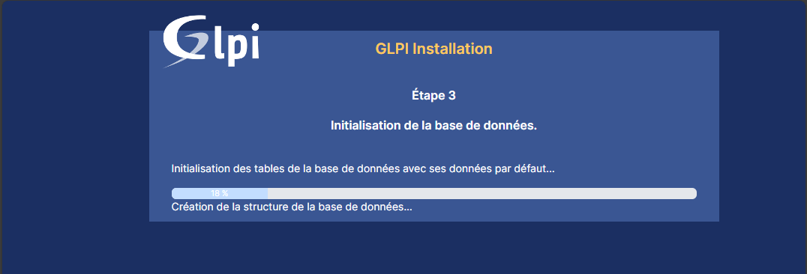

- Vous pouvez décocher l'envoi de statistiques d'usage.

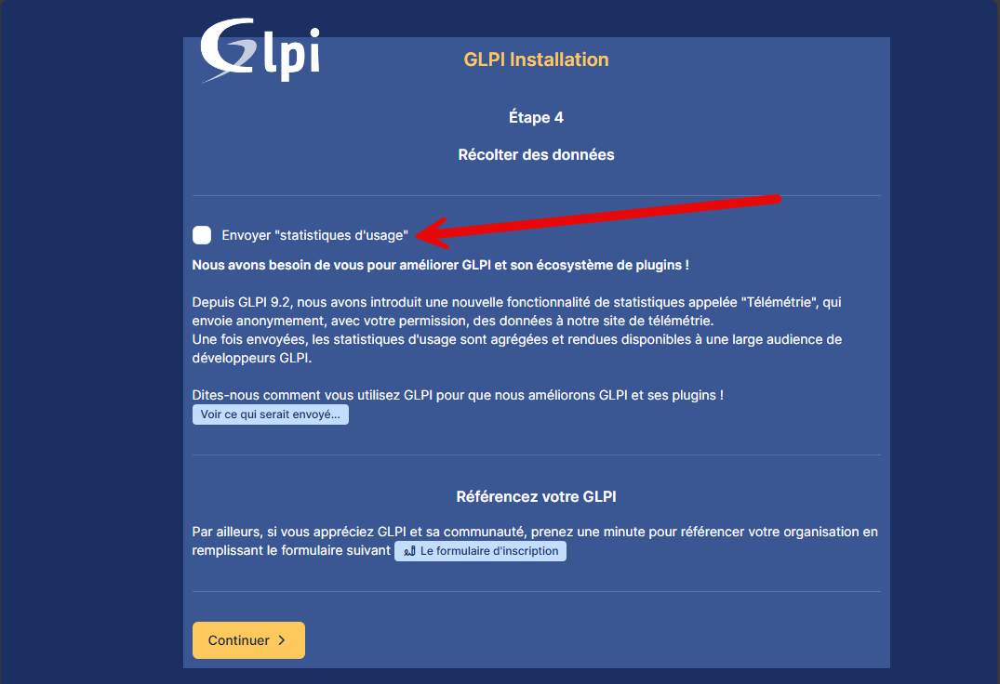

- Continuer

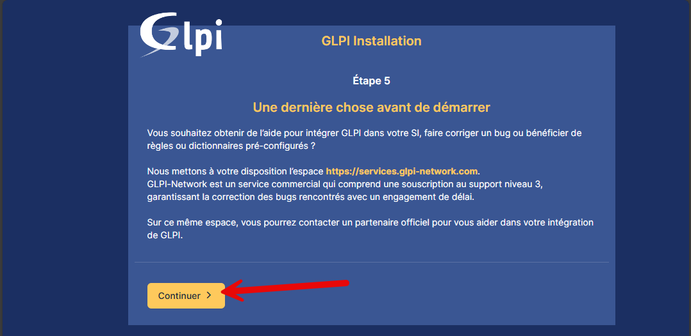

- Noter les utilisateurs par défaut ainsi que leur mot de passe.

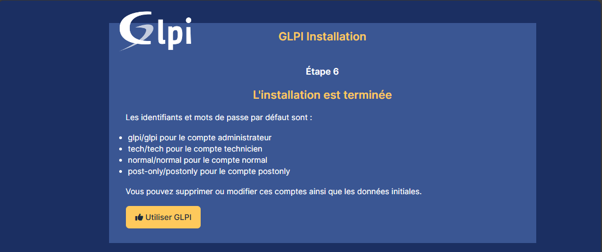

- Vous arrivez sur la page de login.
- L'administrateur de la base, est l'utilisateur glpi


- L'application contient un jeu de données de démonstration.
- Cliquer sur `Désactiver les données de démonstration`

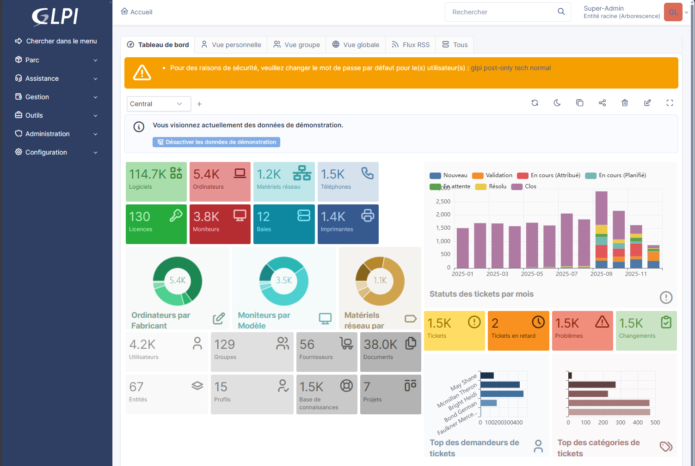

## 3- Configuration de GLPI

### 3.1 Sécurisation de GLPI

Il est essentiel de sécuriser GLPI car cet outil est très largement déployé dans les entreprises, les établissements scolaires et les collectivités, ce qui en fait une cible privilégiée pour les attaques informatiques. 

GLPI repose sur des technologies courantes comme PHP, MariaDB/MySQL et des serveurs web Apache ou Nginx, largement utilisées mais également connues pour leurs vulnérabilités potentielles lorsqu’elles sont mal configurées ou non mises à jour. 

Une faille dans l’un de ces composants, un mot de passe faible, un accès non chiffré ou des droits mal définis peuvent conduire à la compromission de données sensibles (inventaire du parc, comptes utilisateurs, tickets, informations internes). 

Sécuriser GLPI, c’est donc appliquer les bonnes pratiques : mises à jour régulières, chiffrement des communications, gestion stricte des comptes et des droits, afin de garantir la confidentialité, l’intégrité et la disponibilité des informations qu’il centralise.

Orange Cyber Défense a conçu un outil de test de vulnérabilités pour GLPI nommé GLPWNME et le publie sur [GitHub](https://github.com/Orange-Cyberdefense/glpwnme)

Glpwnme est open-source et écrit en Python.

#### Installation de GLPwnMe

```bash
apt install -y git python3 python3-pip pipx
pipx ensurepath
source ~/.bashrc
pipx install git+https://github.com/Orange-Cyberdefense/glpwnme
```

L'application est installée/

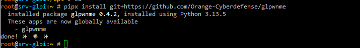

#### Lancer un scan complet

Lancer la commande suivante pour verifier les vulnérabilités.

```bash
root@srv-glpi:~ # glpwnme -t http://127.0.0.1 --check-all
```

Nous sommes sur une version recente de GLPI, il n'y a donc pas de faille (ou plutôt, pas de faille connue).

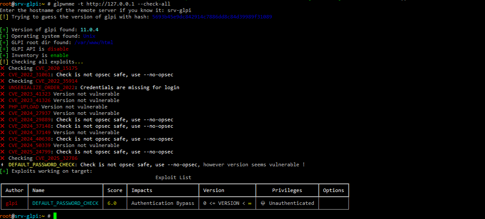

Nous sommes restés sur l'identifiant et le mot de passe par défaut.
Sans surprises, nous avons une alerte sur cette vulnérabilité.

Pour essayer d'exploiter cette vulnérabilité, vous pouvez lancer la commande :

```bash
root@srv-glpi:~ # glpwnme -t http://127.0.0.1 --run --exploit DEFAULT_PASSWORD_CHECK
```

Nous pouvons voir que les comptes standard ont été testés par l'outil et permettent une connexion.

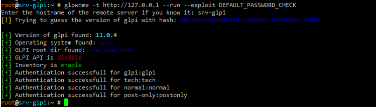

#### résoudre la faille

Modifier les mots de passe des utilisateurs concernés et lancer  à nouveau le test.

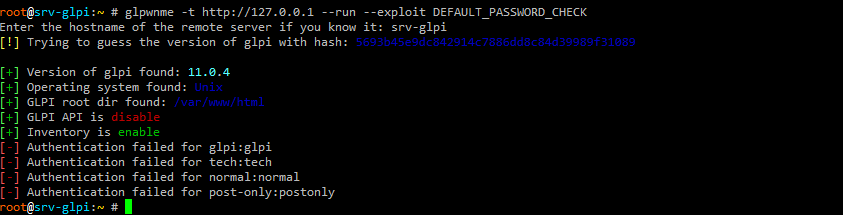

### 3.2 Connexion avec l'annuaire Active Directory

L'authentification LDAP de GLPI va permettre de se connecter à l'application à partir des comptes utilisateurs présents dans l'annuaire de l'organisation. Un utilisateur pourra se connecter avec son nom d'utilisateur et son mot de passe de session.

Il sera également possible de créer des tickets en leurs noms.

Depuis Windows Server 2025, l’authentification LDAP sécurisée (LDAPS) repose obligatoirement sur l’utilisation d’un certificat numérique valide installé sur le contrôleur de domaine Active Directory.

Contrairement aux versions plus anciennes où des configurations non sécurisées pouvaient encore fonctionner, les connexions LDAP chiffrées exigent désormais un certificat conforme (nom du serveur, période de validité, autorité de certification reconnue). 

En parallèle, il ne suffit plus que le certificat soit présent côté serveur Windows : il doit également être explicitement validé et approuvé sur le serveur de synchronisation (serveur Linux ou applicatif, comme GLPI). 

Cela implique l’import du certificat de l’autorité de certification dans le magasin de confiance du système. Sans cette chaîne de confiance complète, la connexion LDAPS est refusée, entraînant des erreurs d’authentification ou l’impossibilité de synchroniser les utilisateurs. 

Cette évolution renforce significativement la sécurité des échanges LDAP, mais impose une configuration rigoureuse des certificats des deux côtés.

#### Import du certificat Active Directory

Sur le serveur Active Directory, il va falloir [exporter le certificat de l'autorité de certification](https://kb.aktraizer.com/win2025-certificat/#exporter-le-certificat-de-lautorit%C3%A9-de-certificat-ca).

Puis l'importer sur le serveur Linux.
Créer un fichier `ad-root-ca.pem` dans le repertoire `/usr/local/share/ca-certificates/`

```bash
nano /usr/local/share/ca-certificates/ad-root-ca.crt
```

Coller le contenu du certificat serveur.

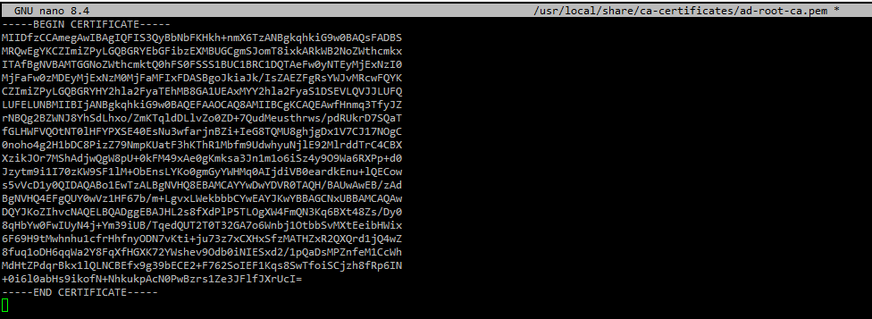

Puis mettre à jour les certificats et redémarrer les services Apache et PHP.

```bash
root@srv-glpi:/usr/local/share/ca-certificates # update-ca-certificates
root@srv-glpi:/usr/local/share/ca-certificates # systemctl restart apache2
root@srv-glpi:/usr/local/share/ca-certificates # systemctl restart php8.4-fpm.service
```

#### Configuration de l'annuaire Active Directory dans GLPI

Aller dans `Configuration > Authentification > Annuaire LDAP`

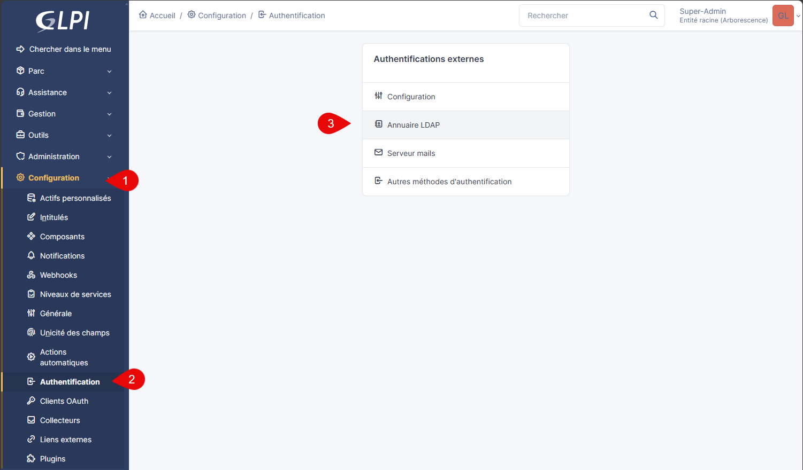

Ajouter un annuaire et renseigner les champs avec les informations suivantes :

Ensuite, mettre à jour le magasin de certificat.

```bash
update-ca-certificates
```

Nous voyons que le certificat est importé.

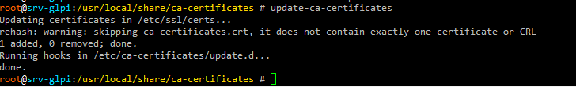

:::tip
Pour trouver la BaseDN de l'utilisateur, suivez la [procédure suivante](https://kb.aktraizer.com/win2025-dn/)
:::

- Nom : Active Directory
- Serveur par défaut : Oui
- Actif : Oui
- Serveur : ldaps:// + Nom complet du serveur (pour moi : CHEKARI-AP-AD.chekari.labo)
- Port : 636
- Filtre de connexion : (&(objectClass=user)(objectCategory=person)(!(userAccountControl:1.2.840.113556.1.4.803:=2)))
- BaseDN : OU=Users,OU=ACME,DC=chekari,DC=labo
- Utiliser bind : Oui
- DN du compte : CN=Administrateur,CN=Users,DC=chekari,DC=labo
- Mot de passe du compte : Mot de passe du compte Administrateur
- Champ de l'identifiant : userprincipalname
- Champ de synchronisation : objectguid

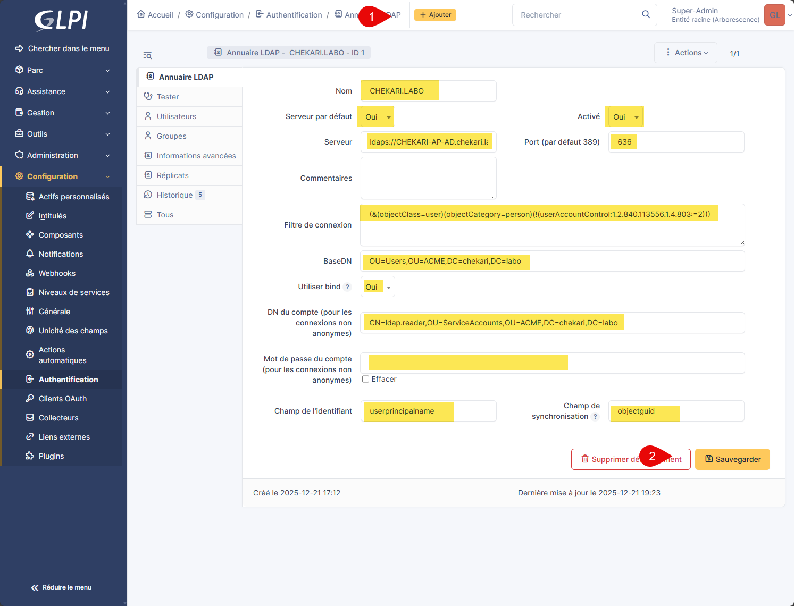

Dans `Tester`la connexion doit être réussite

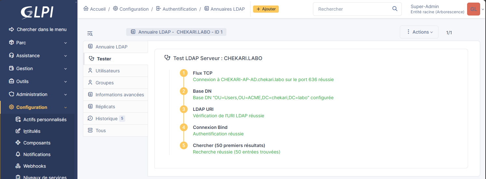

#### Import des utilisateurs

La connexion étant opérationnelle, il faut aller maintenant dans la gestion des utilisateurs.

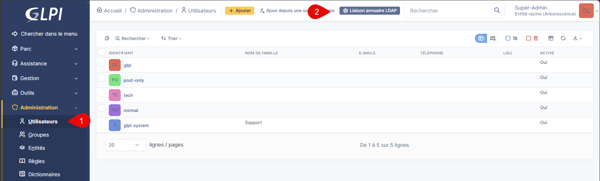

Nous allons ensuite Ìmporter des nouveau utilisateurs`.

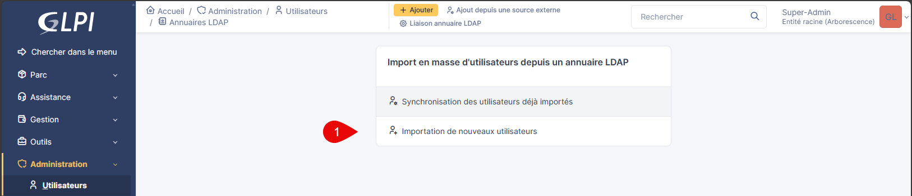

Cliquer sur Rechercher puis séléctionner les utilisateurs à importer.

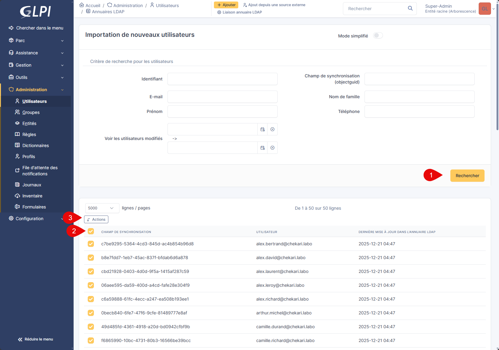

Dans le menu action, choisir Ìmporter`.

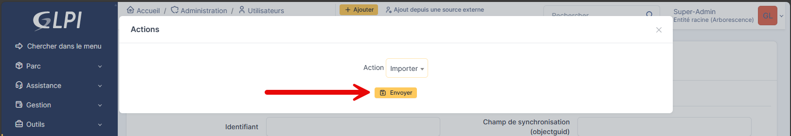

Les utilisateurs sont maintenant importés.

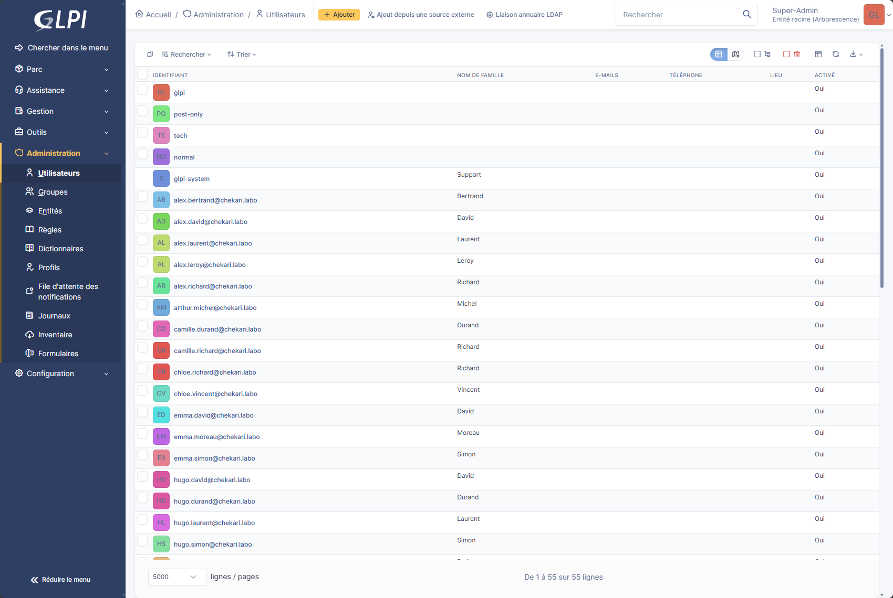

Il est possible de rajouter des habilitations aux utilisateurs mais par défaut, ils ont accès au portail "libre service".

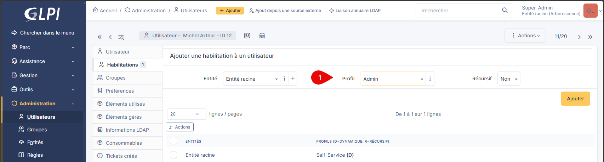

L'utilisateur peut se connecter à l'application.

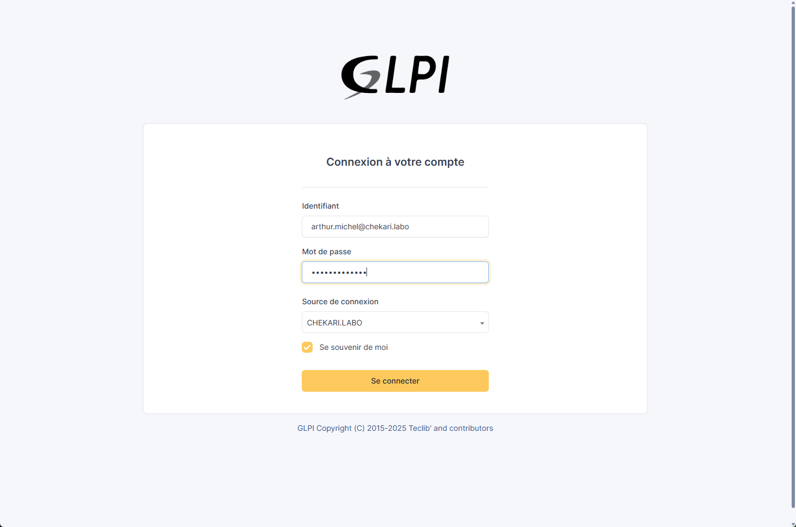

Dans le portail `Libre Service`, il est possible de créer des tickets.


### 3.3 Installation de l'agent GLPI

L’agent GLPI est un composant essentiel qui permet d’automatiser l’inventaire des postes de travail et des serveurs rattachés à GLPI. 

Installé sur les machines (Windows, Linux ou macOS), il collecte de manière régulière et sécurisée des informations détaillées sur le matériel (processeur, mémoire, disques, périphériques) et les logiciels (système d’exploitation, applications installées, versions, licences). 

Ces données sont ensuite transmises au serveur GLPI, offrant une vision centralisée et à jour du parc informatique sans intervention manuelle. 

L’agent GLPI est particulièrement utile dans un contexte professionnel, car il garantit la fiabilité des informations d’inventaire, facilite le suivi du parc, la gestion des licences et constitue une base solide pour le support, la maintenance et l’analyse des incidents.

L'objectif de l'agent est de faire un inventaire.

Activer l'inventaire dans GLPI.

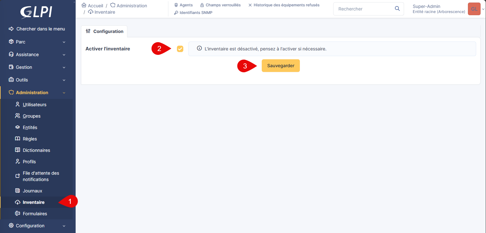

Il faut ensuite sélectionner les informations à inventorier.

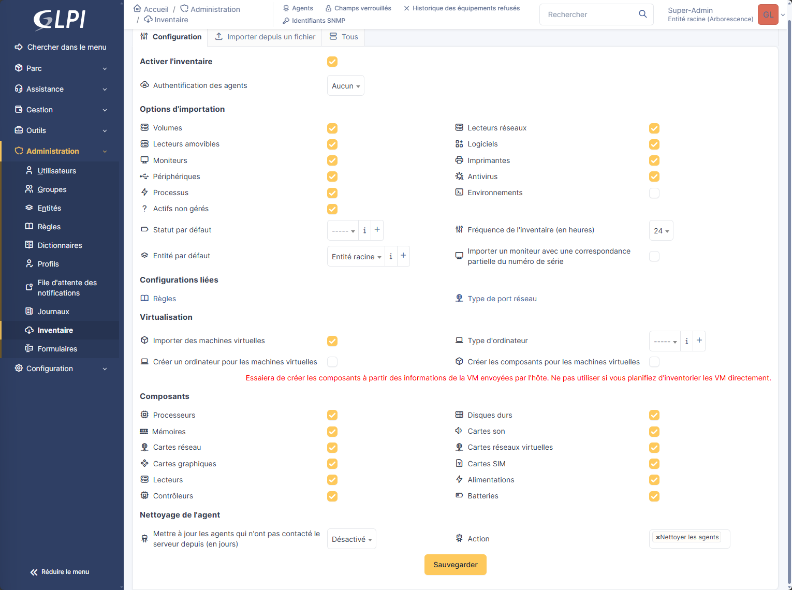

[Documentation officiel de l'agent](https://glpi-agent.readthedocs.io/en/latest/installation/index.html#gnu-linux)

[Github de l'agent](https://github.com/glpi-project/glpi-agent/releases)

:::note
Actuellement, le dernière version de l'agent GLPI est la version 1.15.
:::

#### Installation de l'agent sur un système Linux


Télécharger la dernière version du GPLI Agent pour linux

```bash
wget https://github.com/glpi-project/glpi-agent/releases/download/1.15/glpi-agent-1.15-linux-installer.pl
```

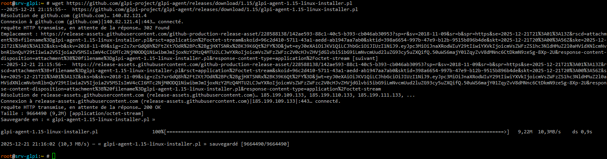

```bash
root@srv-glpi:~ # perl glpi-agent-1.15-linux-installer.pl
```

Préciser :

- L'adresse du serveur.
- Le repertoire local.
- le Tag (nom).

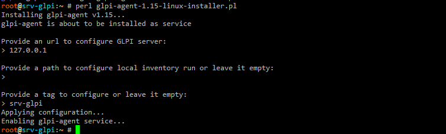

Une fois l'inventaire réalisé, il suffit de lancer la commande `glpi-agent` pour lancer l'inventaire.

L'ordinateur apparait sur le serveur.

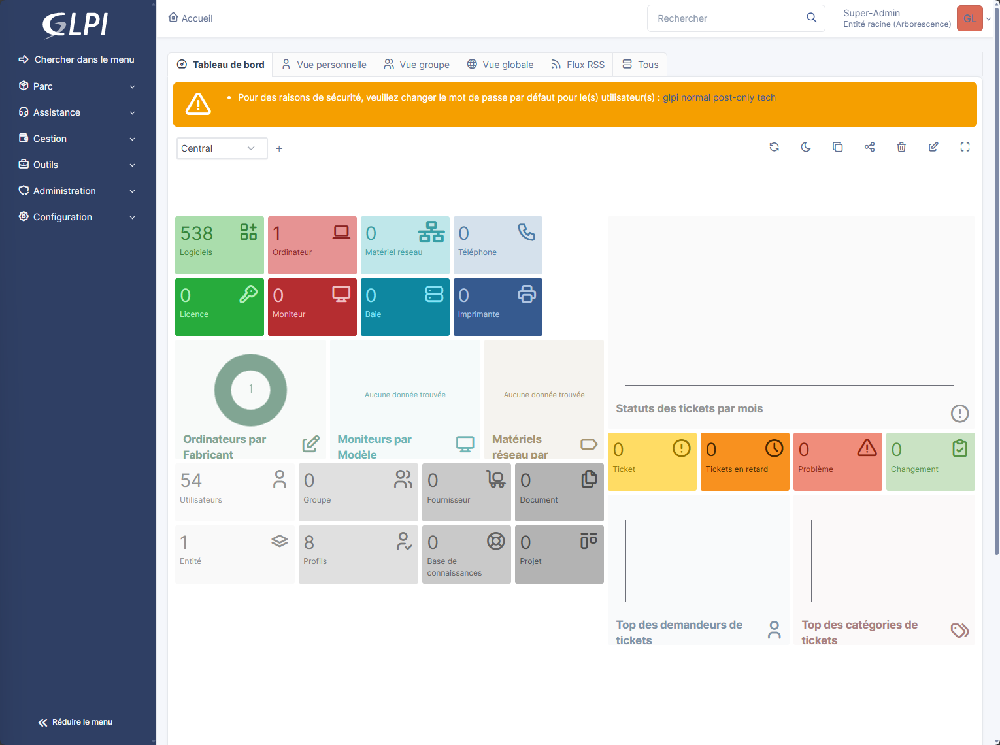
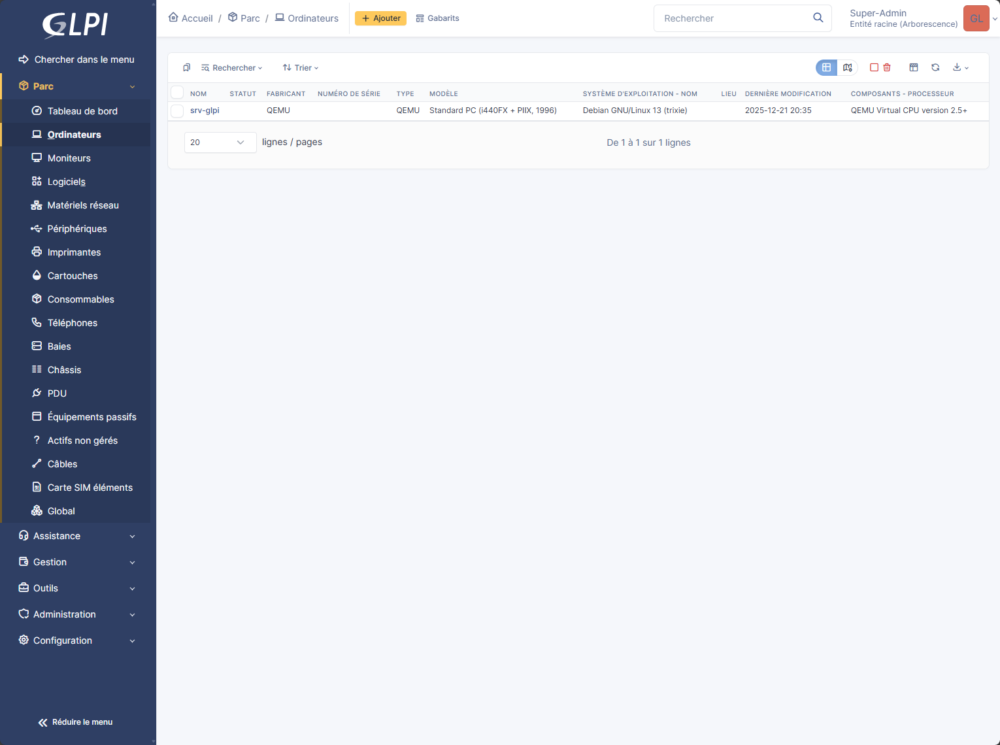

#### Installation de l'agent sur un système Windows

Télécharger le fichier d'installation de GLPI Agent

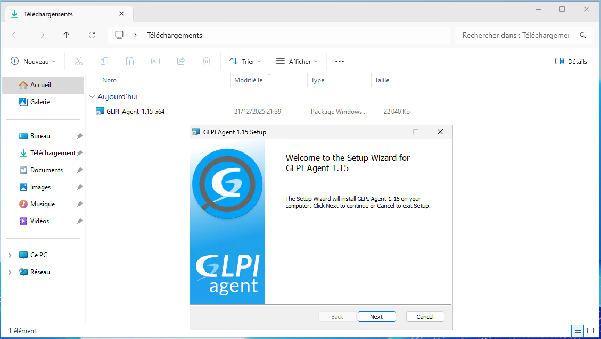

Accepter le contrat de licence.


Sélectionner l'emplacement d'installation.

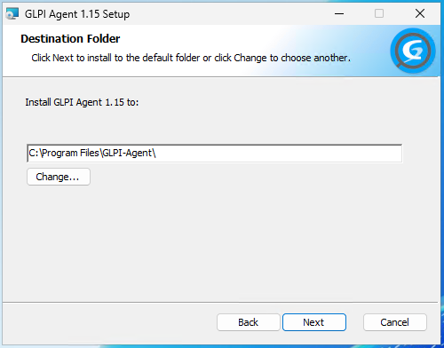

Choisir une installation typique.

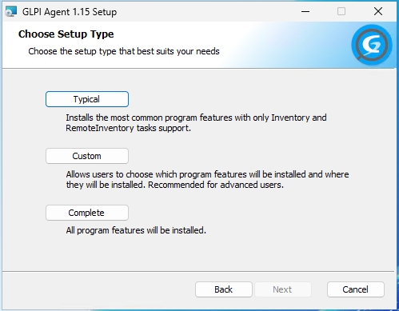

Renseigner l’URL de son serveur GLPI suivi de `/front/inventory.php`

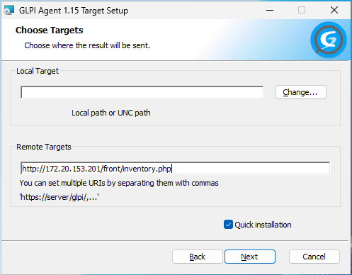

Puis, lancer l'installation.

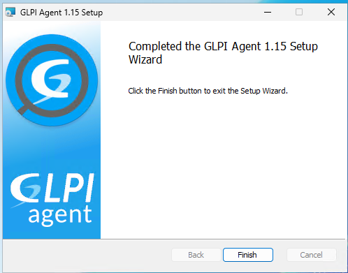

Il est possible de lancer l'inventaire manuellement en allant à l'adresse `http://localhost:62354/now`

GLPI à bien la remontée de l'ordinateur.

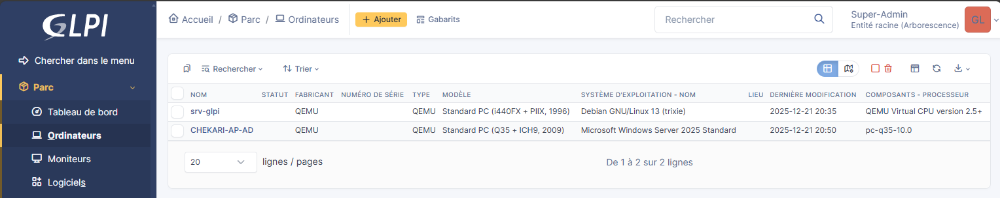