## Prérequis

```bash
apt update && apt upgrade -y
apt install -y curl openssh-server ca-certificates tzdata perl
apt install -y postfix
```
## Installation de GIT

```bash
curl https://packages.gitlab.com/install/repositories/gitlab/gitlab-ce/script.deb.sh | bash
EXTERNAL_URL="http://git.sio-carriat.com" apt install gitlab-ce
```
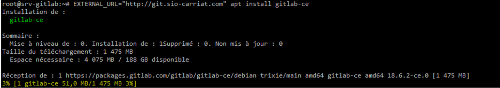

Une fois l'installation terminée, vous avez un message qui vous précise où est stocké le mot de passe root.

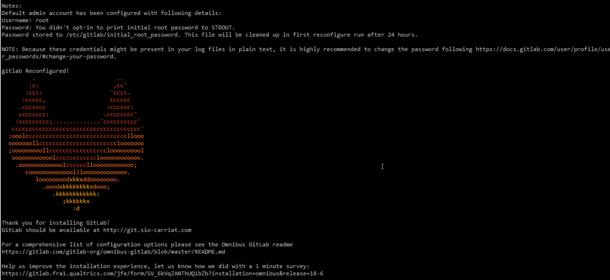
```bash
root@srv-gitlab:~# cat /etc/gitlab/initial_root_password
```
L'interface web de connexion est disponible.

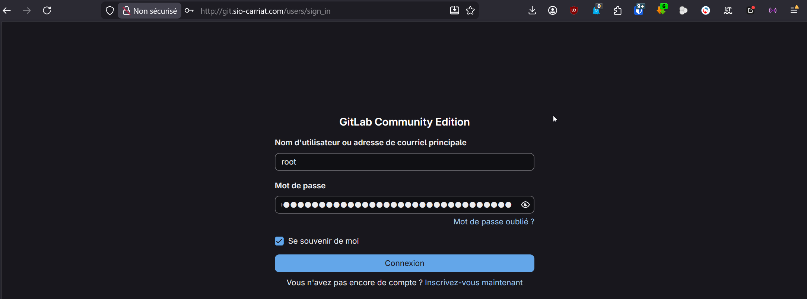

## Configuration de Gitlab

### Passer en français

Pour un utilisateur :
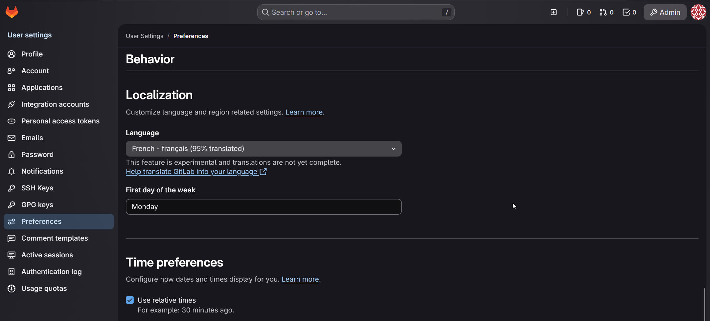

Pour tout le monde :
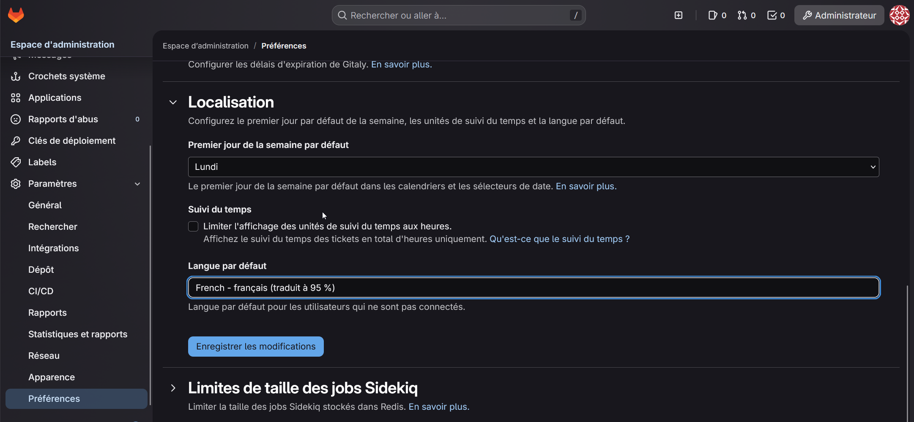

### Désactiver l'inscription libre
Par défaut, l’inscription de nouveaux utilisateurs est activée.
Désactivez cette fonctionnalité pour éviter d’avoir des demandes d’inscription non-désirées.
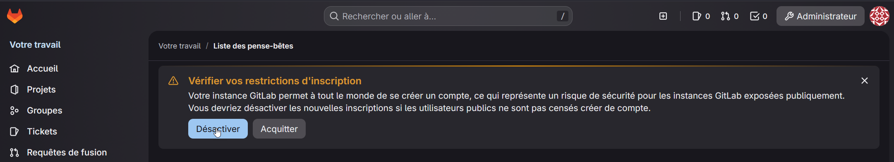

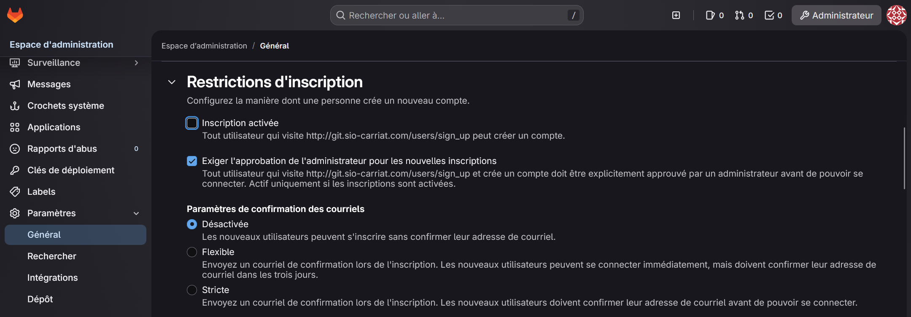

### Configuration des envois de mail

Modifier le fichier Gitlab.rb pour 

```bash
nano /etc/gitlab/gitlab.rb

gitlab_rails['smtp_enable'] = true
gitlab_rails['smtp_address'] = "smtp.gmail.com"
gitlab_rails['smtp_port'] = 587
gitlab_rails['smtp_user_name'] = "chekari@gmail.com"
gitlab_rails['smtp_password'] = "xxxxxxxxxxxxxxxx"
gitlab_rails['smtp_domain'] = "gmail.com"
gitlab_rails['smtp_authentication'] = "login"
gitlab_rails['smtp_enable_starttls_auto'] = true
gitlab_rails['gitlab_email_from'] = "chekari@gmail.com"
gitlab_rails['gitlab_email_reply_to'] = "chekari@gmail.com"
gitlab_rails['gitlab_email_display_name'] = "GitLab | SIO-Carriat"
```

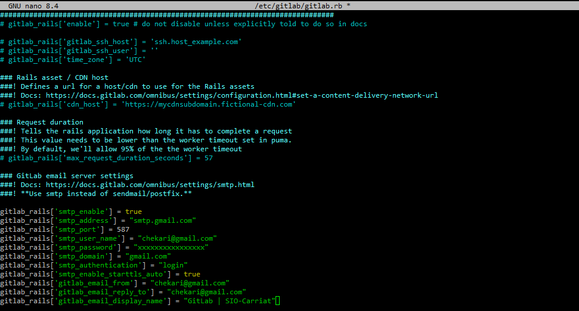

Il faut ensuite relancer la configuration de Gitlab et le redémarrer.
```bash
gitlab-ctl reconfigure
gitlab-ctl restart
```

Pour tester l'envoi d'un mail :
Lancer la console gitlab-rails
```bash
gitlab-rails console
```
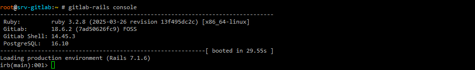
Puis lancer la commande d'envoi de mail, par exemple :
```bash
Notify.test_email("chekari@hotmail.fr", "Test GitLab", "Ce mail fonctionne !").deliver_now

quit
```
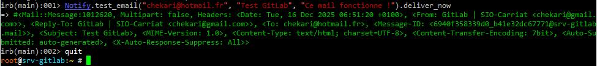
Le mail est bien envoyé
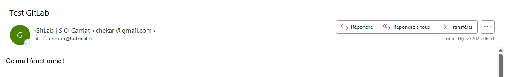

### Création d'un utilisateur
Aller dans **Administrateur** > **Utilisateurs** > **Nouvel utilisateur**
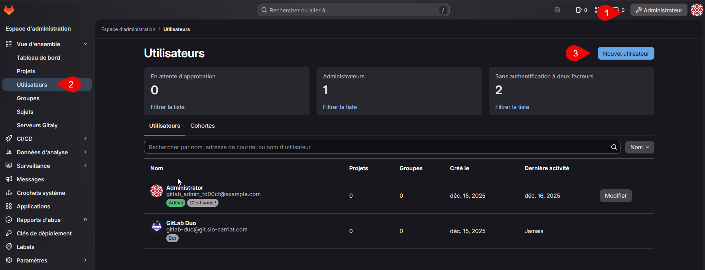
Renseigner les champs nom, nom d'utilisateur, courriel et le passer administrateur si vous le souhaitez.
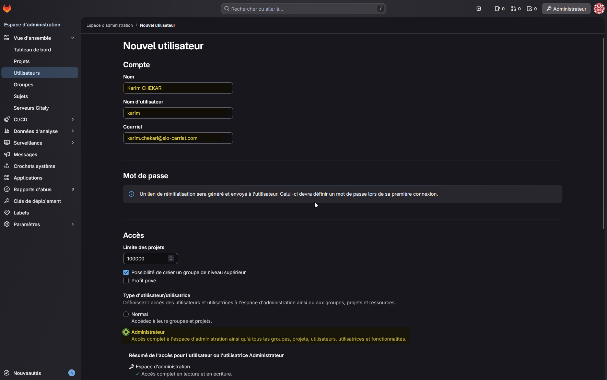
L'utilisateur recevera un lien par mail pour initialiser son mot de passe.
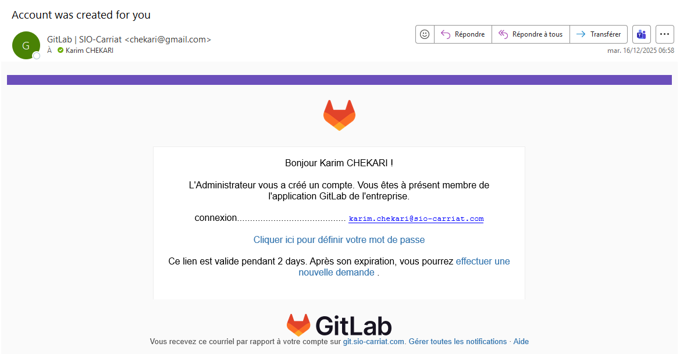

