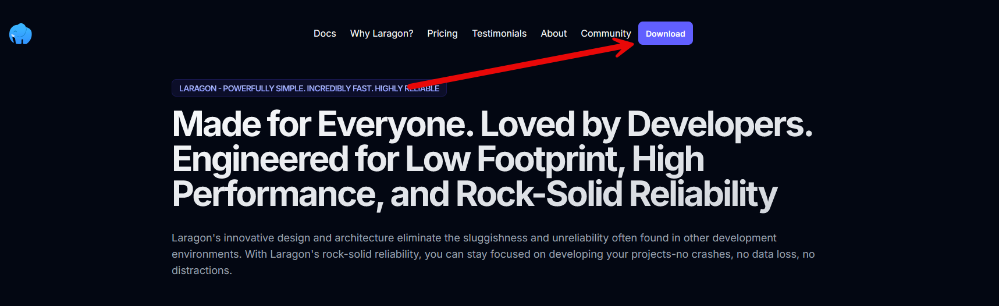
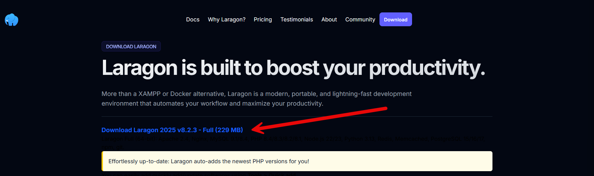
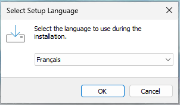
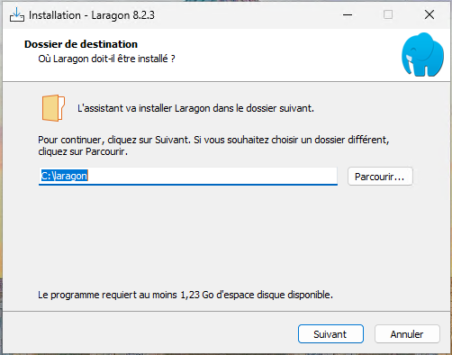
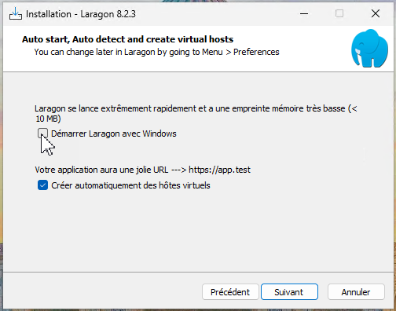
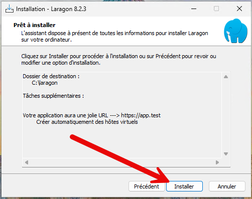
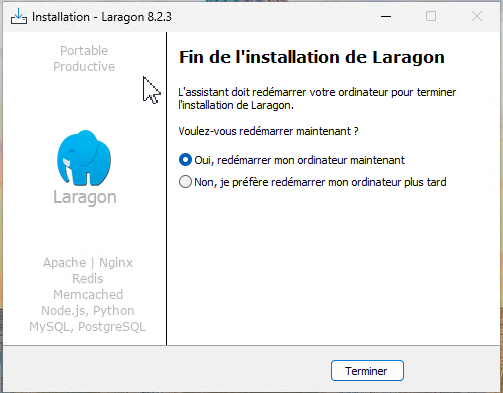
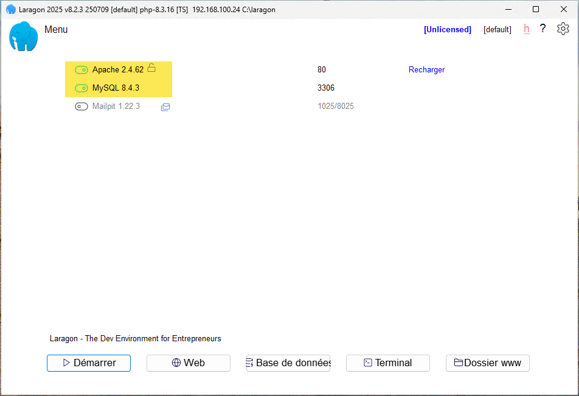
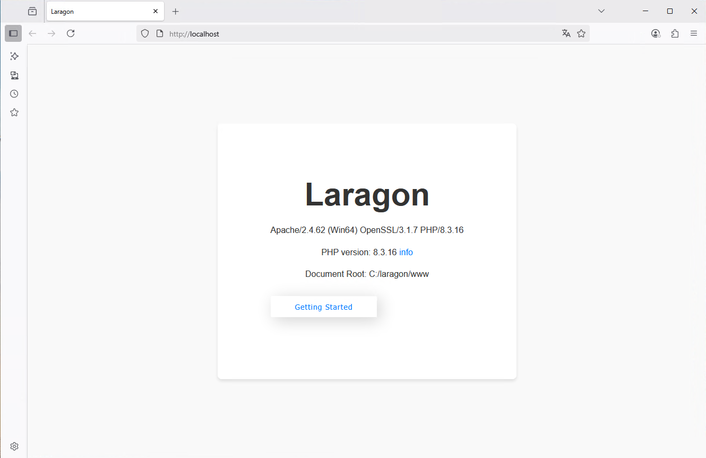

[https://laragon.org](https://laragon.org)

Laragon est un environnement de développement local léger, rapide et entièrement portable pour Windows. Il permet de créer facilement des serveurs web complets grâce à une pile logicielle modulaire incluant Apache ou Nginx, PHP, MySQL/MariaDB, et bien d’autres outils comme Node.js ou Composer. Conçu pour la performance et la simplicité, Laragon facilite le développement d’applications web modernes (PHP, Laravel, Symfony, etc.) avec une configuration minimale. Grâce à ses fonctionnalités avancées (domaines locaux automatiques, gestion de versions, terminal intégré), il s’impose comme une solution idéale pour les développeurs recherchant flexibilité et efficacité sous Windows.

Rendez-vous sur le site officiel pour télécharger la version complète (Full).

Cliquer en haut à droite sur **Download**.

Puis télécharger la version Full

### Installation

Lancer le fichier laragon-wamp.exe pour lancer l’installation puis choisir la langue **Français**.

Choisir le répertoire d’installation.

Le logiciel étant portable, il est possible de l’installer dans un dossier personnel pour avoir un répertoire par étudiant.

Décocher le démarrage automatique de Laragon avec Windows.

Puis, lancer l’installation.

À la fin de l’installation, il faut redémarrer l’ordinateur.

Une icône est rajoutée sur votre bureau.
Lancer l’application.
Vous avez des boutons pour démarrer votre serveur web.

En cliquant sur Web, vous accédez à votre serveur.

