e BTS SIO dispose d’un abonnement Microsoft 365 qui contient de nombreux services que nous découvrirons et utiliserons tout au long de votre formation.

Commencez par vous rendre à l’adresse :

https://portal.office.com

Dans la fenêtre de connexion, saisir votre identifiant (sous la forme prenom.nom@sio-carriat.com) fournit par votre enseignant.
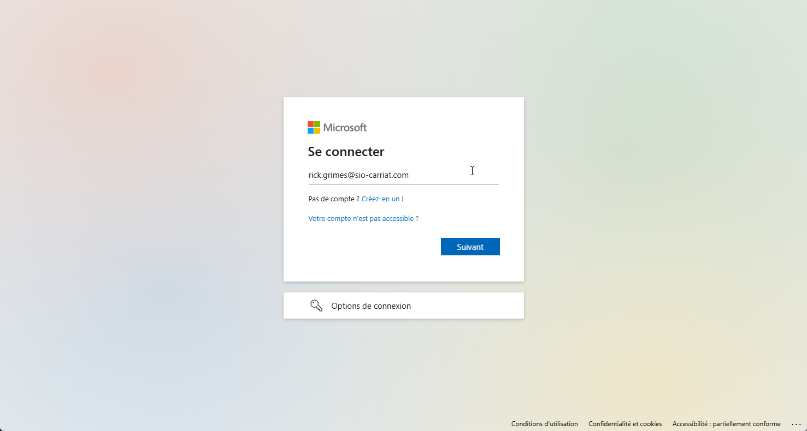
Dans la fenêtre suivante, saisir votre mot de passe.
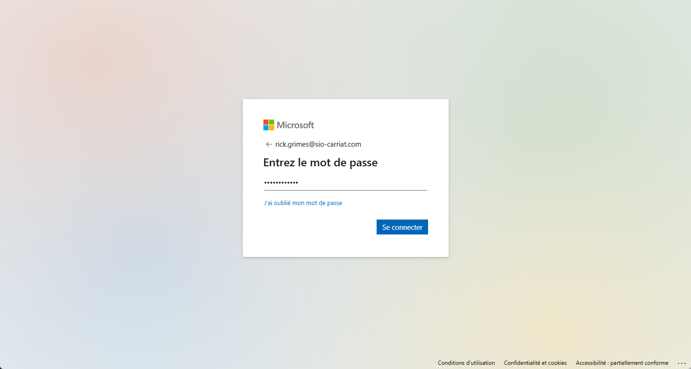
Microsoft 365 impose une authentification MFA (Multi Facteur Authentification) afin de sécuriser votre compte. Il vous faudra un téléphone portable pour valider votre compte.

Cliquez sur Suivant
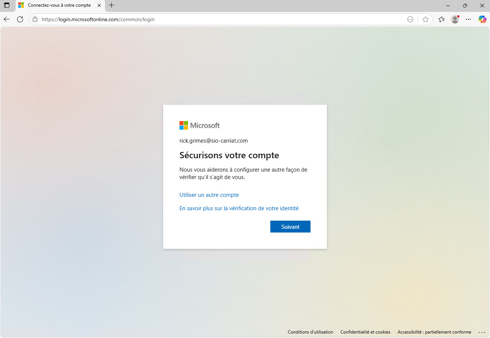
Vous devez installer l’application Microsoft Authentificator sur votre téléphone portable puis cliquer sur suivant.
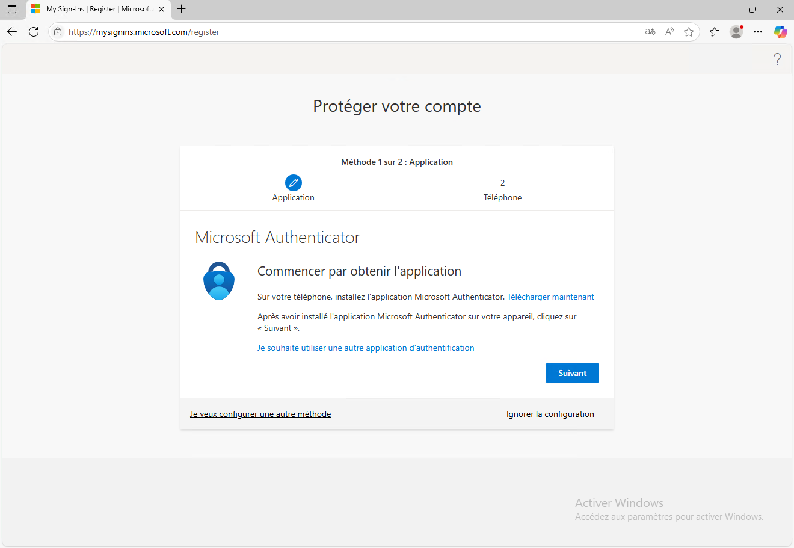
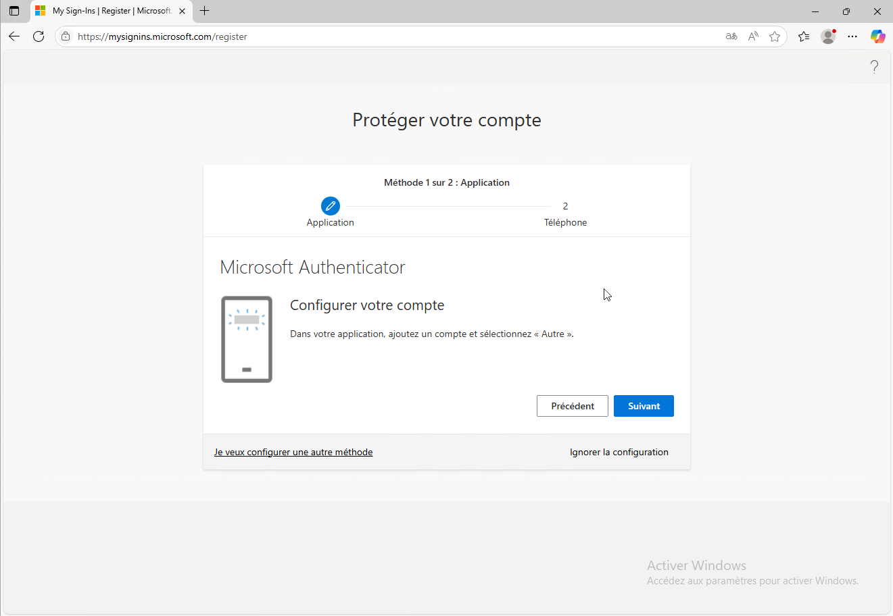
Numériser le QR Code
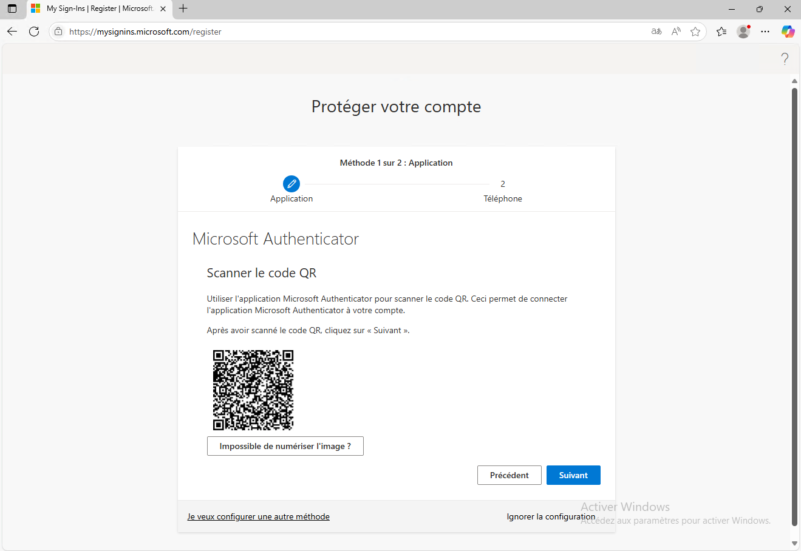
Sur le téléphone
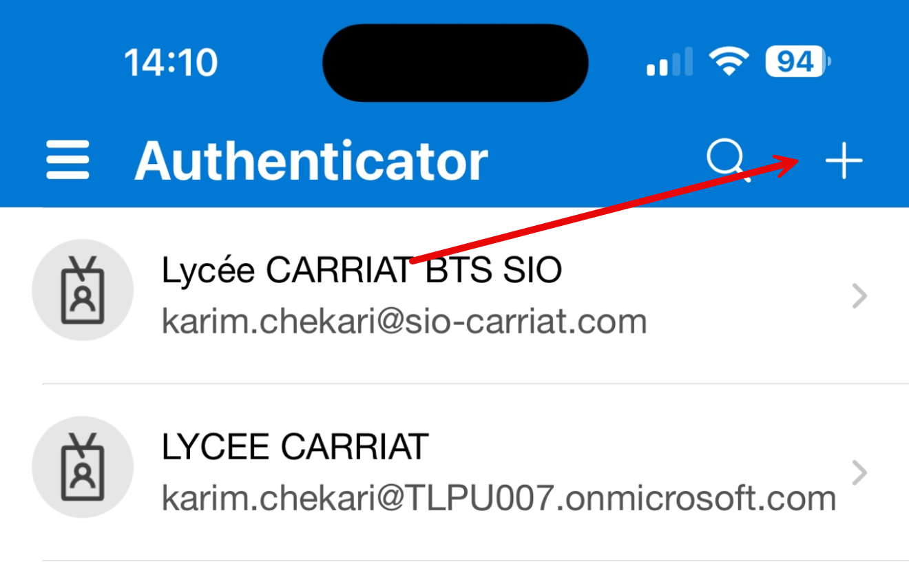
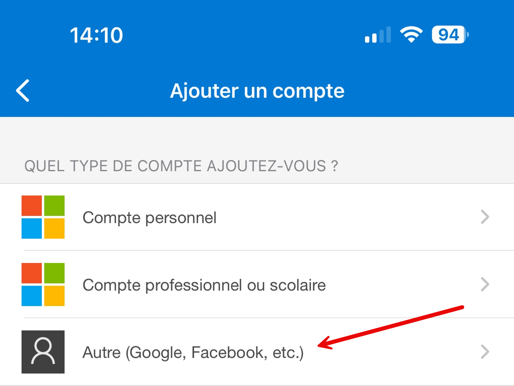
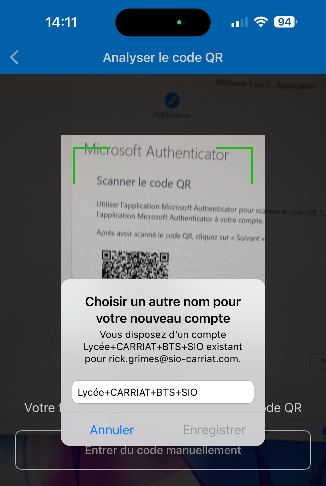
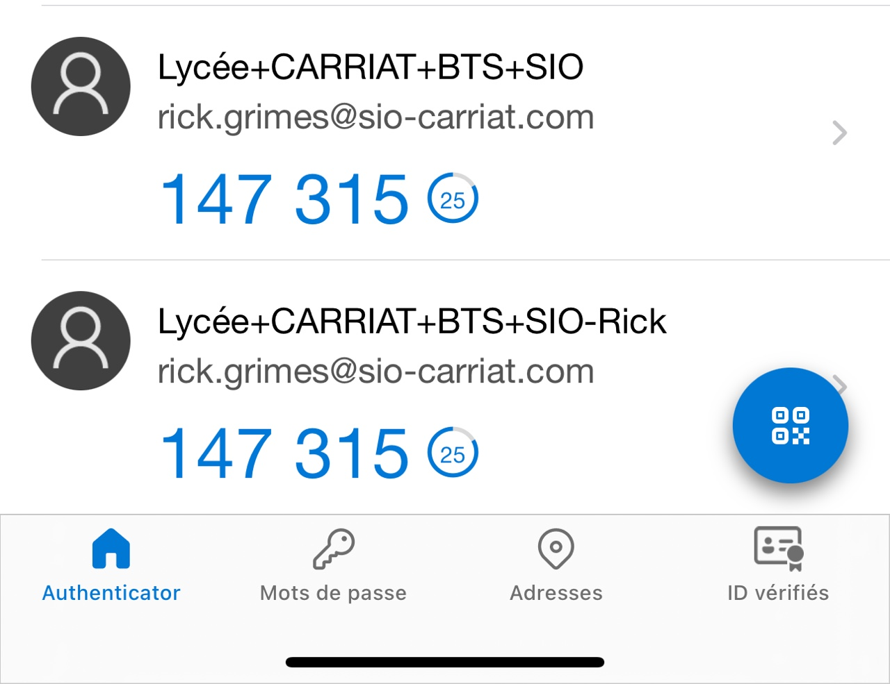
Saisir le code dans le navigateur.
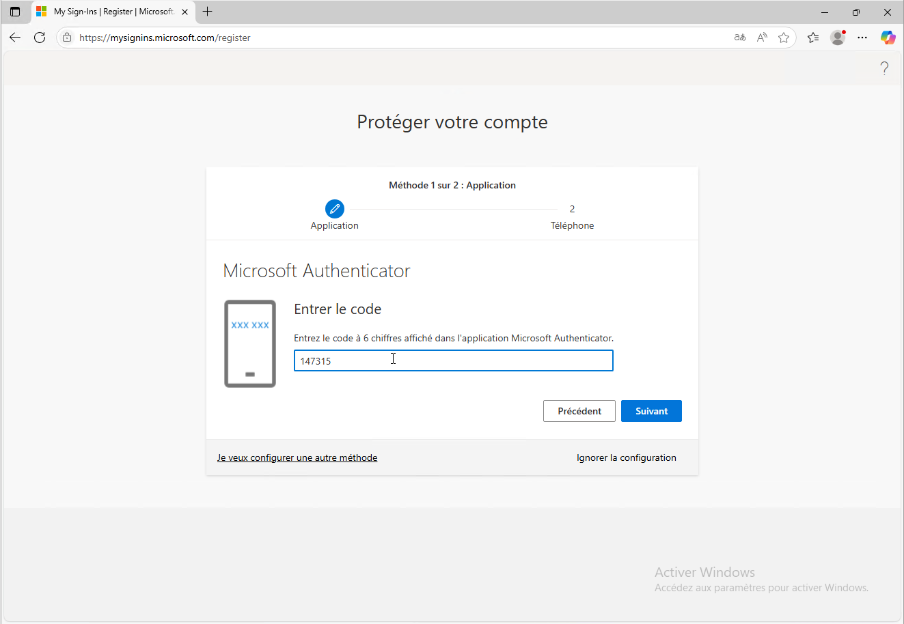
Nous allons également sécurisé le compte à l’aide d’un numéro de téléphone.
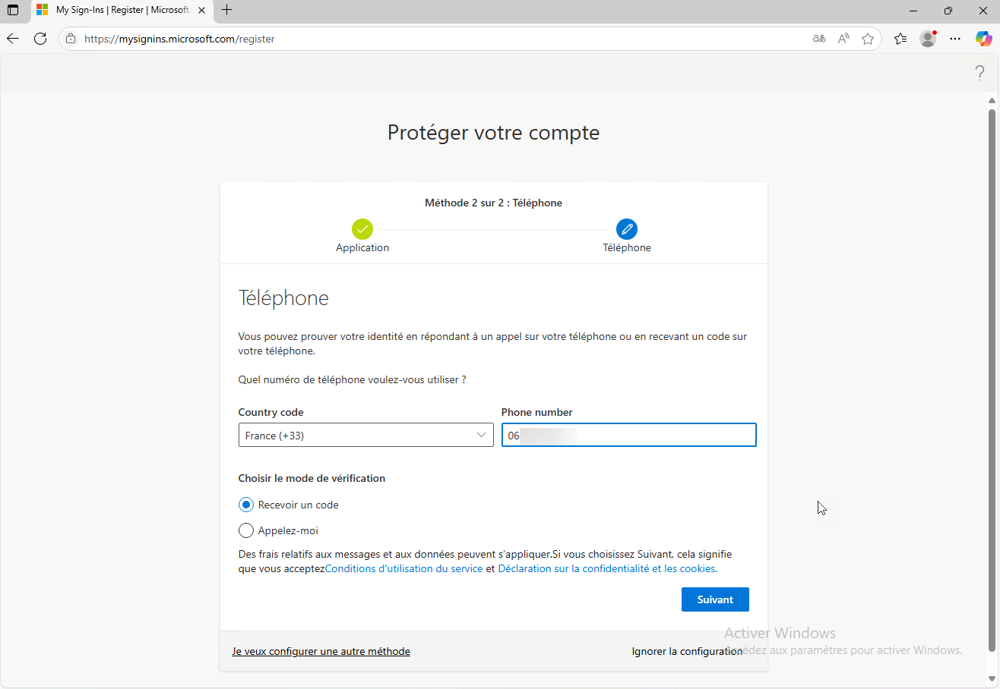
Saisir le code que vous avez reçu par sms sur votre téléphone.
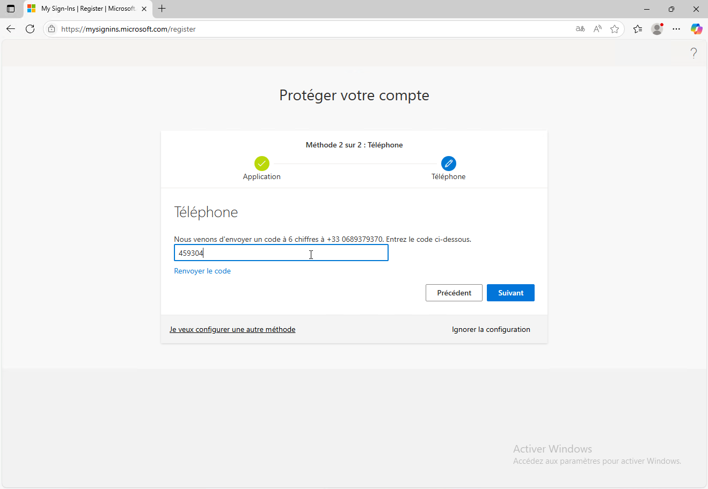
La sécurisation de votre compte est faite via deux méthodes, Microsoft Authentificator et Numéro de téléphone.
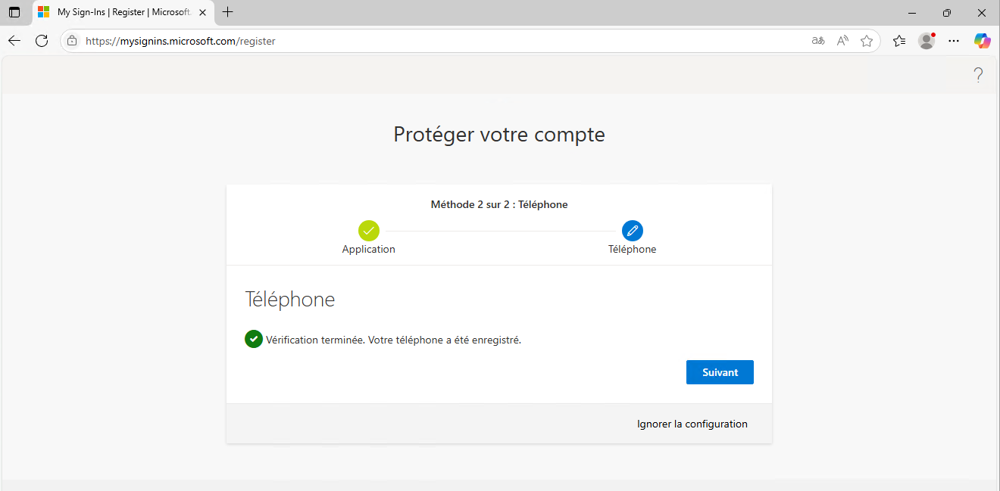
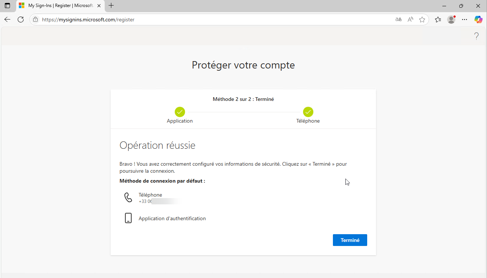
Vous arrivez sur le portail de Microsoft.
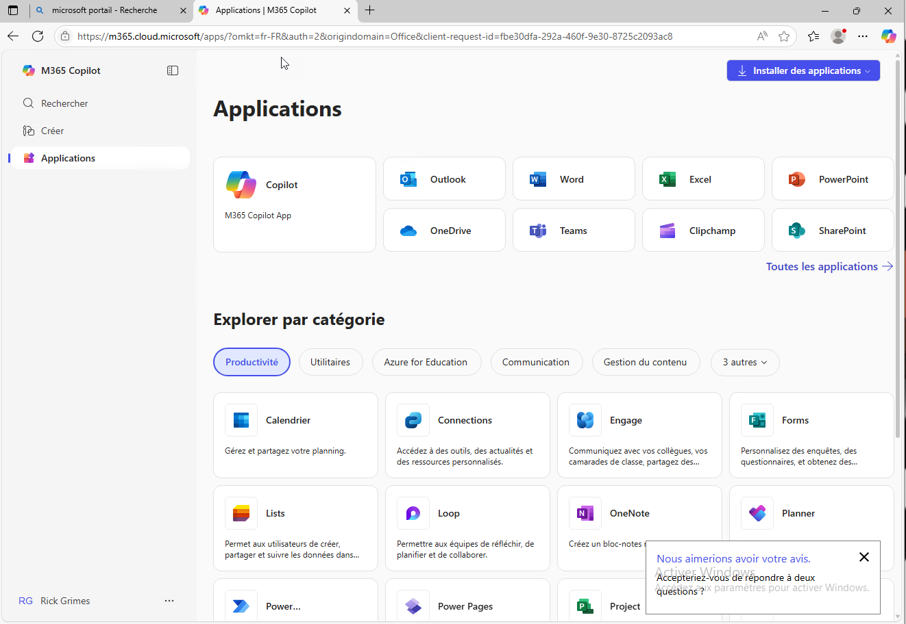