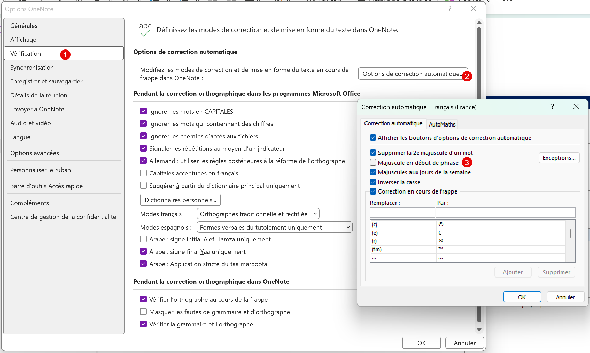

Dans Microsoft Onenote, quand l'installation vient juste d'être faite. Automatiquement, quand on écrit une phrase, il y a la première lettre qui passe en majuscule. Très agaçant pour ceux qui n'en ont pas besoin.

Pour désactiver cette fonctionnalité, il faut aller dans le menu **Fichier** en haut à gauche, puis dans **Options**.

Dans l'onglet **Vérification**, cliquer sur le bouton **Options de correction automatique ...**. Puis, décocher **Majuscule en début de phrase**.

