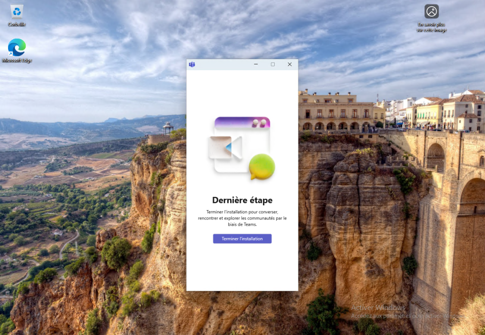
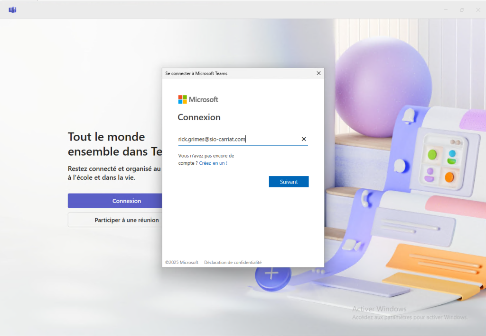
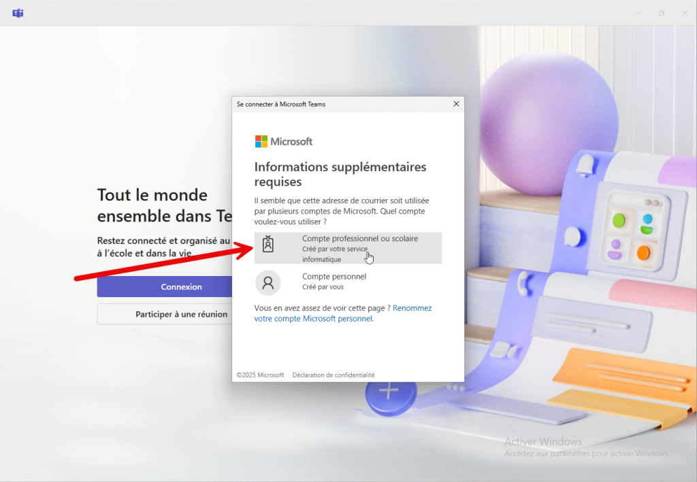
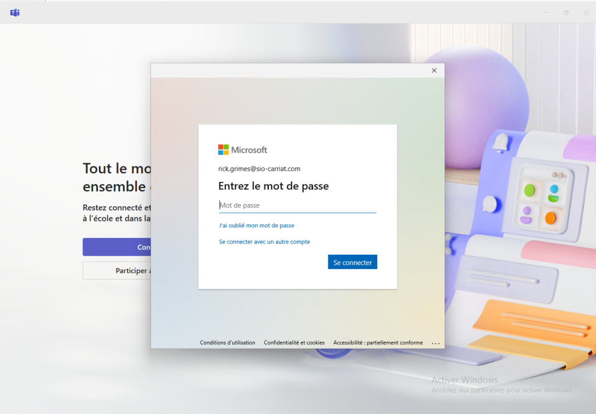
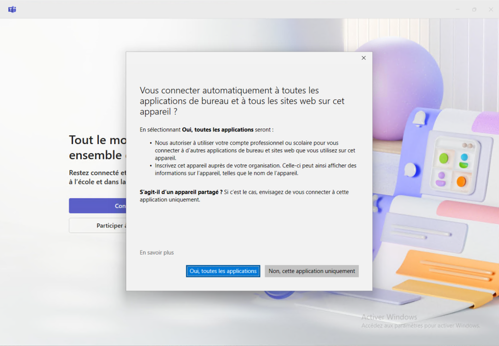
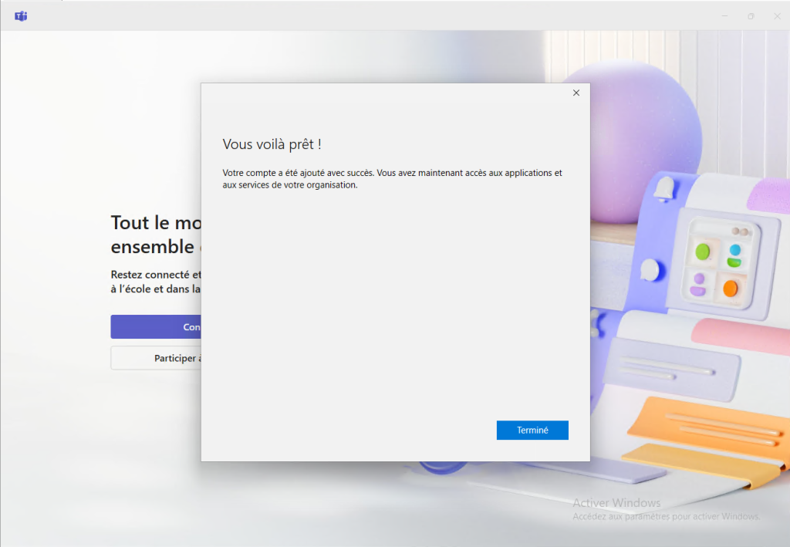

Microsoft Teams est disponible depuis votre navigateur à l’adresse :

https://teams.microsoft.com

Nous vous conseillons d’utiliser l’application PC ou mobile (iOS ou Android).
Connexion

Sur l’ordinateur :

Lancer l’application Microsoft Teams

La fenêtre Teams se lance et vous demande de vous connecter.

Saisir votre compte Microsoft 365 (prenom.nom@sio-carriat.com).

Choisir un Compte professionnel ou scolaire

Puis, le mot de passe

Vous pouvez répondre « Oui, toutes les applications » afin d’unifier les connexions aux applications Microsoft.

C’est prêt !
