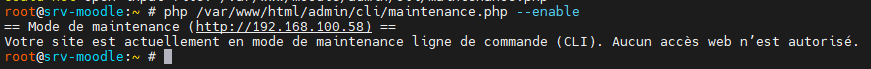
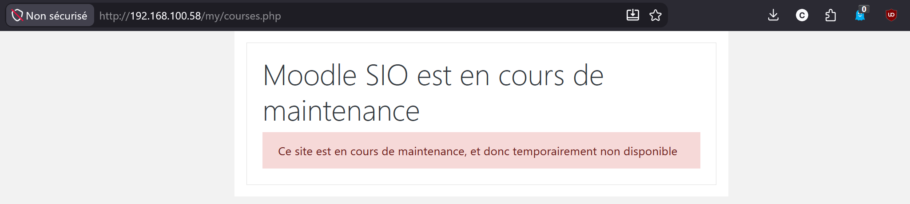
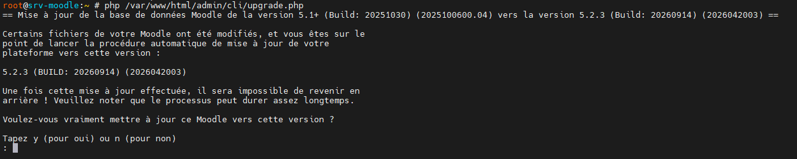
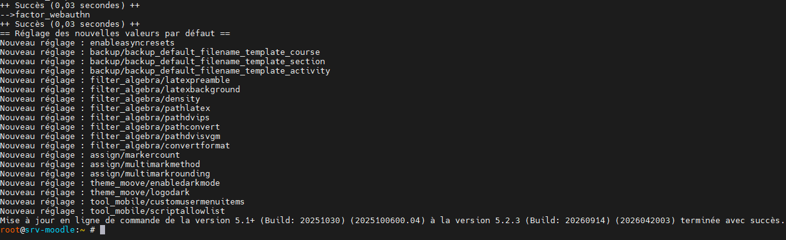

Vérification des prérequis pour la mise à jour de Moodle 5.1 vers 5.2 :
Il faut vérifier que les paquets sodium et exif sont installés sur le serveuret que le paramètre php max_input_vars est correctement configuré. Pour cela, vous pouvez exécuter les commandes suivantes dans le terminal :

```bash
php -m | grep -E 'sodium|exif'
php -i | grep max_input_vars
```

Dans mon cas, le paramètre max_input_vars était à 1000, ce qui est insuffisant pour la mise à jour. Il faut le passer à 5000. Pour cela, vous pouvez modifier le fichier php.ini correspondant à votre version de PHP (par exemple `/etc/php/8.4/apache2/php.ini`) et changer la valeur de max_input_vars :

On va ensuite faire une sauvegarde de la base de données et des fichiers de Moodle avant de procéder à la mise à jour.

Ensuite, on va passer le mode maintenance à ON pour éviter que les utilisateurs ne se connectent pendant la mise à jour. Pour cela, vous pouvez exécuter la commande suivante dans le terminal :

```bash
php /var/www/moodle/admin/cli/maintenance.php --enable
```





L'installation n'a pas été faite avec Git, donc on va télécharger la dernière version de Moodle 5.2 depuis le site officiel et la décompresser dans le répertoire `/var/www/html`. Pour cela, vous pouvez exécuter les commandes suivantes dans le terminal :

[https://download.moodle.org/releases/latest/](https://download.moodle.org/releases/latest/)

```bash
wget https://download.moodle.org/download.php/direct/stable502/moodle-5.2.3.tgz
```

On va ensuite décompresser l'archive téléchargée :

```bash
tar -xzf /root/moodle-5.2.3.tgz
```

J'ai donc un dossier moodle dans le repertoire /root/moodle.

Nous allons renommer le dossier moodle actuel (celui de la version 5.1) en moodle_old et déplacer le nouveau dossier moodle (version 5.2) dans le répertoire `/var/www/html`. Pour cela, vous pouvez exécuter les commandes suivantes dans le terminal :

```bash
mv /var/www/html /var/www/html5.1
mv /root/moodle /var/www/html
```

Nous allons ensuite copier le fichier config.php du dossier `html-5.1` vers le nouveau dossier moodle. Pour cela, vous pouvez exécuter la commande suivante dans le terminal :

```bash
cp /var/www/html-5.1/config.php /var/www/html/config.php
```

Puis, nous allons changer les permissions du dossier moodle pour que le serveur web puisse y accéder correctement. Pour cela, vous pouvez exécuter les commandes suivantes dans le terminal :

```bash
chown -R root:www-data /var/www/html
find /var/www/html -type d -exec chmod 755 {} \;
find /var/www/html -type f -exec chmod 644 {} \;
chown root:www-data /var/www/html/config.php
chmod 640 /var/www/html/config.php
```

:::warning
Avant la mise à jour, il est necessaire de copier les thèmes et les plugins personnalisés du dossier moodle-5.1 vers le nouveau dossier moodle-5.2. Dans mon cas, j'ai le thème et deux plugins. Il faut vérifier que les plugins sont compatibles avec la version 5.2 de Moodle avant de les copier.

```bash
root@srv-moodle:~ # cat /var/www/html-5.1/public/lib/editor/tiny/plugins/fontcolor/version.php
<?php
// This file is part of Moodle - https://moodle.org/
//
// Moodle is free software: you can redistribute it and/or modify
// it under the terms of the GNU General Public License as published by
// the Free Software Foundation, either version 3 of the License, or
// (at your option) any later version.
//
// Moodle is distributed in the hope that it will be useful,
// but WITHOUT ANY WARRANTY; without even the implied warranty of
// MERCHANTABILITY or FITNESS FOR A PARTICULAR PURPOSE.  See the
// GNU General Public License for more details.
//
// You should have received a copy of the GNU General Public License
// along with Moodle.  If not, see <https://www.gnu.org/licenses/>.

/**
 * Plugin version and other meta-data are defined here.
 *
 * @package     tiny_fontcolor
 * @copyright   2023 Luca Bösch <luca.boesch@bfh.ch>
 * @license     https://www.gnu.org/copyleft/gpl.html GNU GPL v3 or later
 */

defined('MOODLE_INTERNAL') || die();

$plugin->component = 'tiny_fontcolor';
$plugin->release = '1.4';
$plugin->version = 2026071200;
$plugin->requires = 2024100700;
$plugin->maturity = MATURITY_STABLE;
$plugin->supported = [405, 502];
```

Si la version est compatible, on peut copier le plugin dans le nouveau dossier moodle-5.2. Sinon, il faut attendre la mise à jour du plugin par l'auteur.

```bash
cp -a /var/www/html-5.1/public/lib/editor/tiny/plugins/siocodesample /var/www/html/public/lib/editor/tiny/plugins/
chown -R root:www-data /var/www/html/public/lib/editor/tiny/plugins/siocodesample
```

Si les plugins ne sont pas compatibles, il faut télécharger la version compatible depuis le site officiel de Moodle et l'installer dans le nouveau dossier moodle-5.2.

Une fois que c'est fait, on peut lancer la mise à jour de Moodle en exécutant la commande suivante dans le terminal :

```bash
php /var/www/html/admin/cli/upgrade.php
```





Vous pouvez maintenant désactiver le mode maintenance en exécutant la commande suivante dans le terminal :

```bash
php /var/www/html/admin/cli/maintenance.php --disable
```

Verifier la mise à jour en vous connectant à votre site Moodle et en vérifiant que la version est bien passée à 5.2.