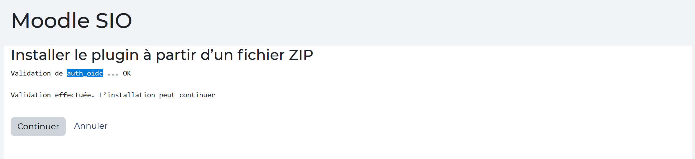

Moodle permet de synchroniser les utilisateurs et les groupes depuis Entra ID (anciennement Azure AD) vers Moodle. Cette synchronisation est particulièrement utile pour les établissements qui utilisent Microsoft 365, car elle permet de gérer les comptes utilisateurs de manière centralisée.

La solution Microsoft repose principalement sur deux plugins :

- auth_oidc [OpenID Connect Authentication](https://marketplace.moodle.com/plugins/auth_oidc) ;
- local_o365 → synchronisation Entra ID / Microsoft 365.

### Installation de OpenID Connect Authentication

Aller dans Administration du site > Plugins > Authentification > Installer un plugin. Rechercher le plugin OpenID Connect Authentication et cliquer sur Installer maintenant.

