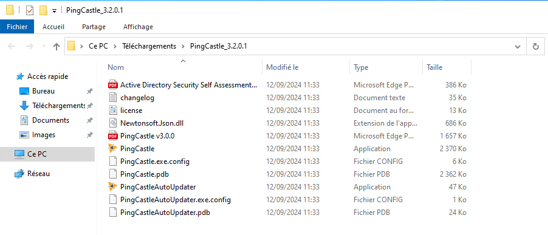
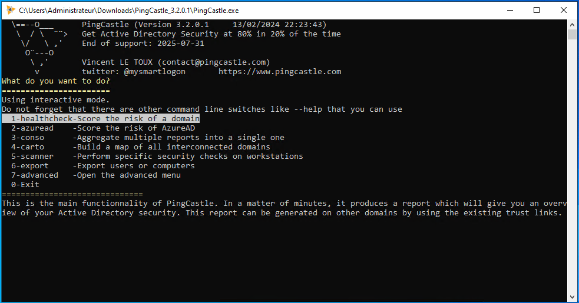
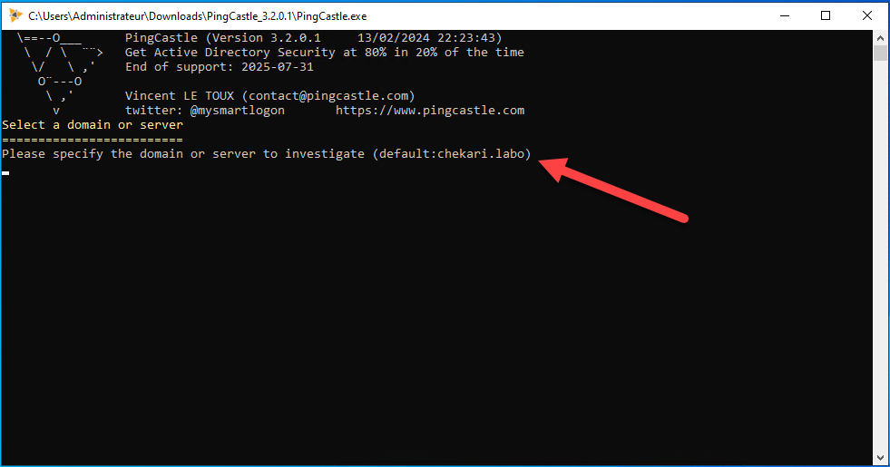
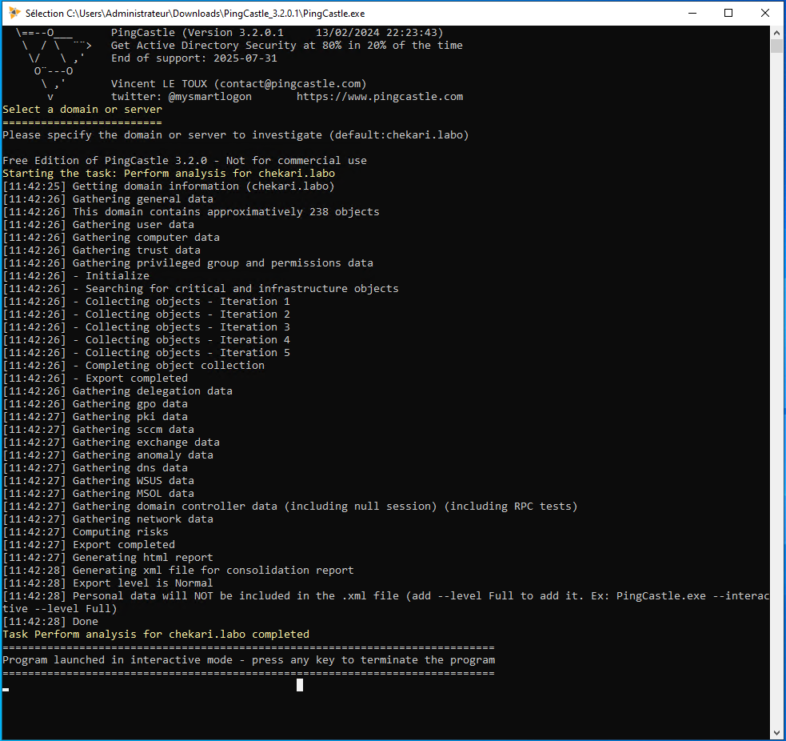
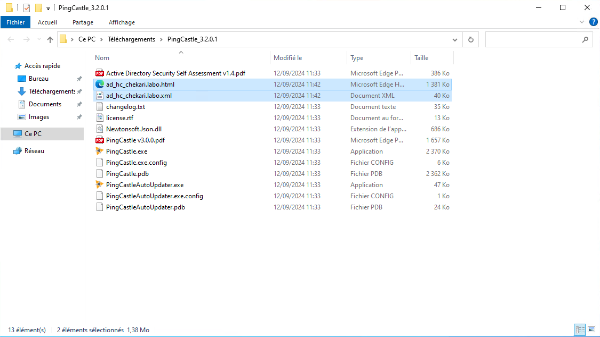
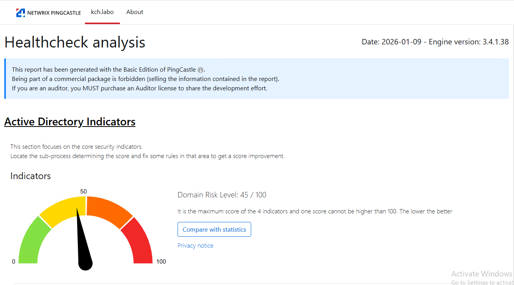
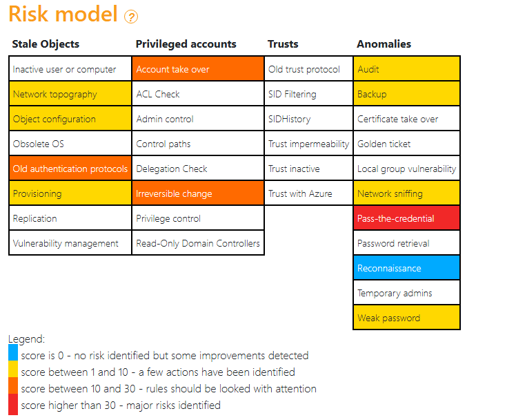
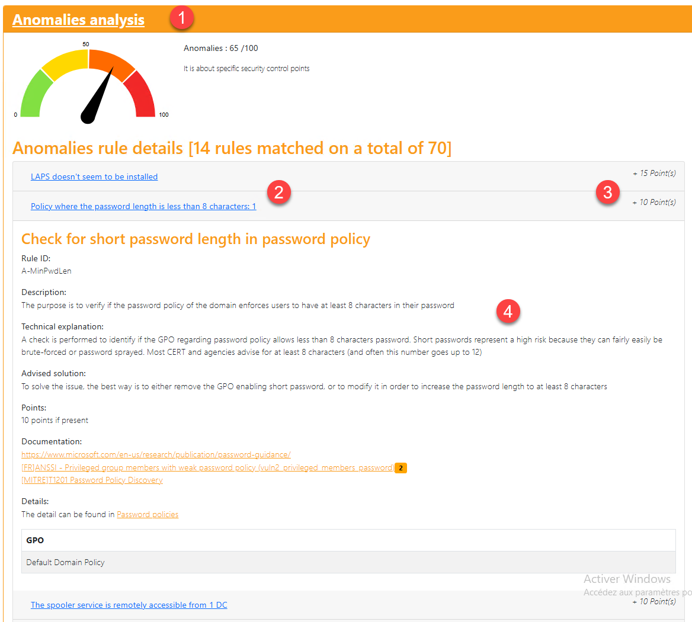

[Site Officiel de PingCastle](https://www.pingcastle.com)

:::note
Testé avec la version 3.5.0.44 au 19/08/2026
:::

PingCastle permet de faire un audit de votre Active Directory.

Le logiciel va faire une analyse de votre AD et vous donner un score qui permet d’évaluer le niveau de sécurité de votre infrastructure.

Il va également vous suggérer des actions à mener afin de renforcer la sécurité de votre Active Directory.

## Installation de PingCastle

PingCastle est disponible en version gratuite depuis le site de l’éditeur.

C’est un fichier compressé au format zip. Une fois extrait, vous devez avoir une structure similaire :

## Création de votre premier rapport

Lancer l’exécutable PingCastle.exe

Dans la première fenêtre, sélectionner l’option 1 – healthscore-Score the risk of a domain

L’outil nous demande ensuite quel est le domaine à auditer si jamais il est différent de celui spécifié.

Sur un Active Directory avec peu de comptes, l’analyse devrait être très rapide.

Il faut ensuite appuyer sur une touche pour fermer la fenêtre.

## Analyse du rapport

Dans votre répertoire PingCastle, deux nouveaux fichiers qui représentent le rapport d’audit.

Ouvrez le fichier HTML avec votre navigateur, par défaut, j’ai eu un score de 65/100, sachant que la meilleure note est 0.

Le score est en réalité le score le plus élevé d’une des catégories.

Plus bas, vous avez le « Risk Model » qui identifie les failles qui nécessitent votre attention (principalement les oranges et rouges).

Ensuite, chaque catégorie est affichée (1) :
- Avec les listes des risques (2)
- Le nombre de points à « gagner » (3)
- les conseils pour résoudre l’anomalie (4).

