:::note
Fonctionnalité testé avec Debian 13 et Veeam Agent for Linux 13.0
:::
:::caution
Seule la version nosnap de Veeam Agent for Linux est compatible avec les systèmes de fichiers LVM et les disques en mode bloc. La version standard avec snapshot peut rencontrer des problèmes lors de la sauvegarde de ces types de volumes.
:::
## Prérequis :
Nous allons mettre en place une sauvegarde niveau bloc avec le logiciel spécialisé Veeam Agent. L’objectif est de sauvegarder un disque complet et de restaurer l’OS sur un autre VM.
Pour cela, nous allons utiliser la version gratuite de Veeam Agent for Linux, téléchargeable à l’adresse suivante :
https://www.veeam.com/fr/products/free/linux.html?ad=downloads

Les prérequis ci-dessous sont adaptés à notre environnement de test et s’appuient sur les recommandations officielles du centre d’assistance et du Guide de l'utilisateur Veeam Agent for Linux
Rappel : Le protocole SMB est un protocole propriétaire Microsoft, mais des outils sont compatibles sous linux (samba). Le protocole SMB est aussi nommé CIFS ou SMB/CIFS. 
Nous allons vérifier l’accès au partage SMB. Pour cela, nous aurons besoin des outils cifs-utils et smbclient

```bash
apt update
apt upgrade
apt install cifs-utils smbclient -y
apt install -y \
  dkms gcc make perl \
  linux-headers-$(uname -r) linux-headers-amd64 \
  libudev1 libudev-dev \
  libacl1 libacl1-dev \
  libattr1 libattr1-dev \
  lvm2 libfuse2 \
  libncurses6 \
  dmidecode \
  default-libmysqlclient-dev libpq5 \
  python3 btrfs-progs \
  efibootmgr isolinux squashfs-tools xorriso \
  wget tar gzip
```
```bash
smbclient -L '\\IP_SMB' -U root
```
Remplacez IP_SMB par l’adresse IP du serveur SMB. Si la connexion est réussie, vous verrez la liste des partages disponibles sur le serveur SMB.

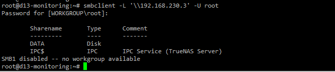

## Installation de Veeam Agent for Linux
Installation des paquerets nécessaires pour Veeam Agent for Linux

```bash
apt install -y dkms linux-headers-$(uname -r) lvm2 nfs-common
```
Téléchargement et installation de Veeam Agent for Linux

```bash
wget https://download2.veeam.com/VAL/v13/veeam-release-deb_13.0.1_amd64.deb
dpkg -i veeam-release-deb_13.0.1_amd64.deb
apt update
apt install veeam-nosnap -y
```

Vérification de l’installation

```bash
veeamservice status
```

Lancer la commande `veeam` pour initialiser Veeam Agent for Linux

```bash
veeam
```
Accepter le contrat de licence (**Touche ESPACE**)
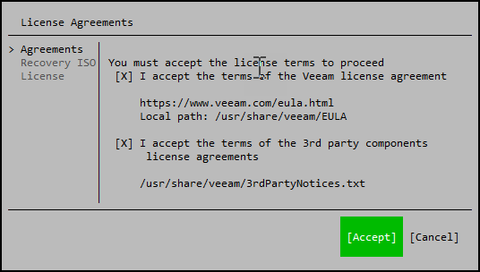
::: caution
Créer le média de restauration personnalisée :
À savoir ! Le média de récupération Veeam peut être téléchargé directement sur leur site.
À cette étape, Veeam Agent vous propose de créer une version personnalisée qui intégrera les drivers spécifiques de la machine sauvegardée.
Cela permet d’assurer une meilleure compatibilité lors de la restauration sur du matériel différent.
:::
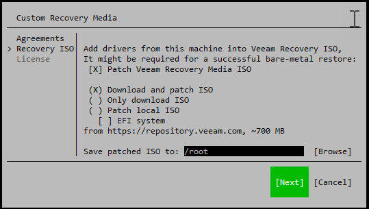
Choisir de le sauvegarder dans le dossier `/root`

Terminer par accepter la licence
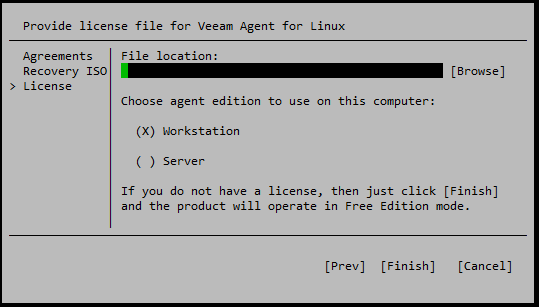
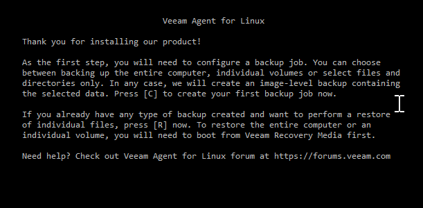
Récupérer l'ISO de Veeam Recovery
Patienter le temps de la création de l’ISO

## Création du job de sauvegarde
Lancer l’outil Veeam Agent for Linux avec la commande **veeam** puis appuyer sur la touche **C** pour CONFIGURE :
Nommer le job
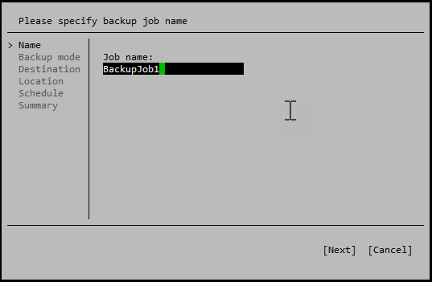
Choisir les données à sauvegarder
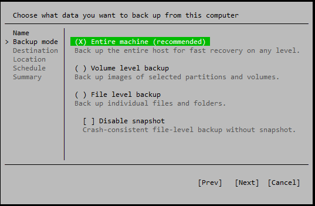
Choisir la destination
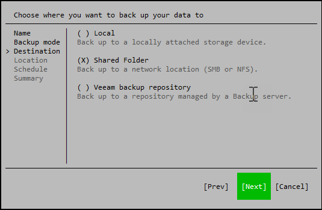
Nous allons utiliser un partage SMB
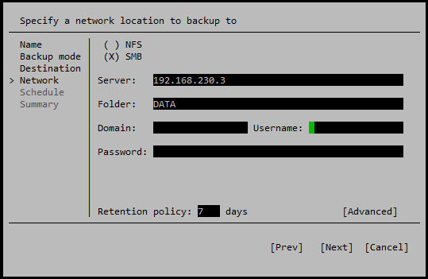
Dans "Advanced", il est possible de définir une fréquence pour les backup full (par exemple tous les dimanches).
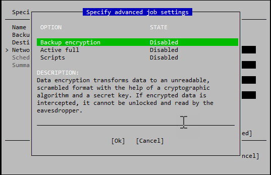
On planifie ensuite la sauvegarde
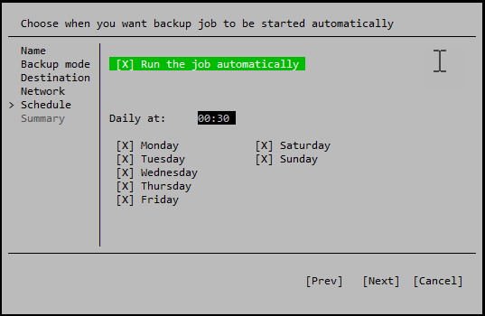
On exécute le job.
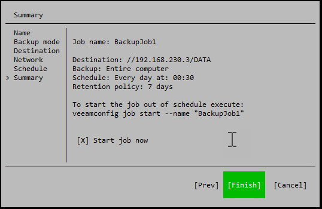
Le job se lance
```bash
 veeamconfig job start --name "BackupJob1"
```
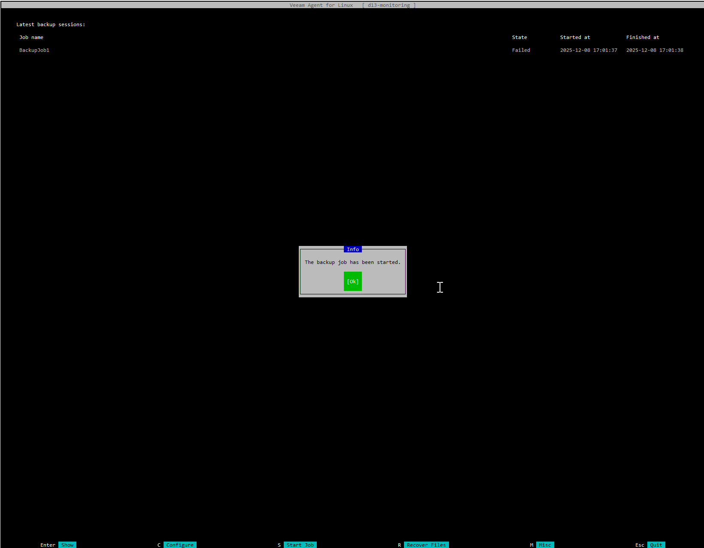
Il est possible de voir le job réussi

Les fichiers ont bien été sauvegardés sur le NAS.

## Récupération de fichiers spécifiques
Pour récupérer des fichiers spécifiques, nous allons utiliser l’outil Veeam Agent for Linux.

## Restauration du système
Pour restaurer le système, nous allons démarrer la machine à restaurer avec le média de récupération Veeam.
Une fois dans l’environnement de récupération, nous allons sélectionner l’option de