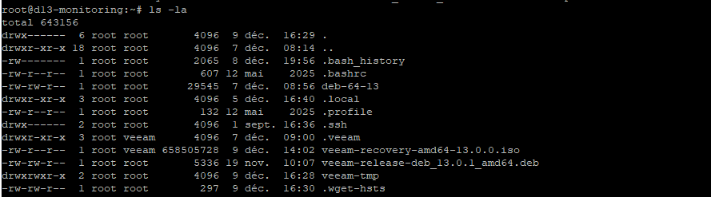

La commande `veeamconfig configiso` permet de créer une images/image ISO bootable contenant Veeam Agent for Linux. Cette images/image peut être utilisée pour démarrer un système et effectuer des opérations de sauvegarde ou de restauration.

```bash
veeamconfig downloadIso
```
Veeam à besoin d'une place de stockage temporaire pour créer l'ISO. Par défaut, il utilise le répertoire `/tmp`. Si l'espace disponible dans `/tmp` est insuffisant, vous pouvez spécifier un autre répertoire avec l'option `--temp-dir`.

### Exemple de création d'une images/image ISO avec Veeam Agent for Linux

```bash
mkdir -p /root/veeam-tmp
export TMPDIR=/root/veeam-tmp
veeamconfig downloadIso
```

Une fois la commande exécutée, vous trouverez l'images/image ISO bootable de Veeam Agent for Linux à l'emplacement spécifié. Vous pouvez utiliser cette images/image pour démarrer un système et effectuer des opérations de sauvegarde ou de restauration selon vos besoins.
