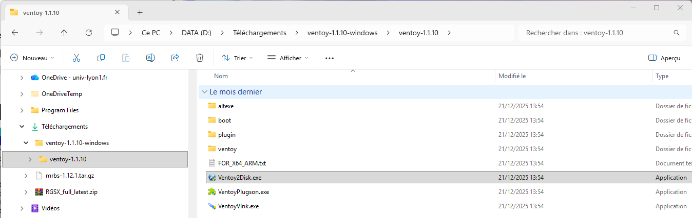
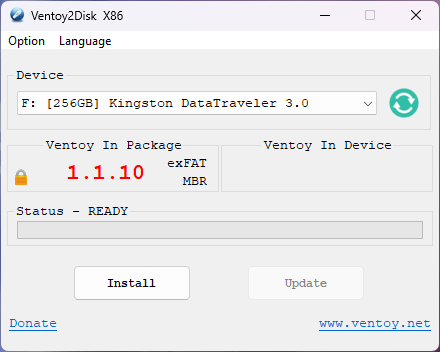
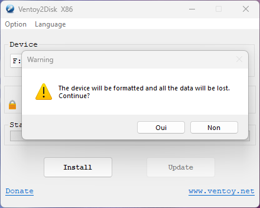
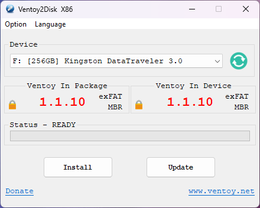
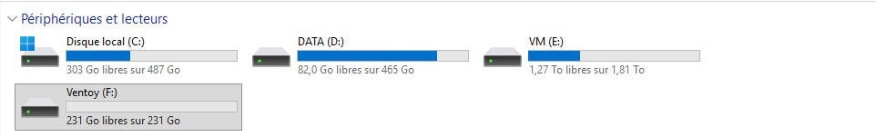

Ventoy est un outil open-source qui permet de créer des clés USB bootables de manière simple et efficace. Contrairement aux méthodes traditionnelles, Ventoy permet de copier plusieurs fichiers ISO sur une seule clé USB sans avoir à les formater à chaque fois.

:::caution
L'utilisation de Ventoy effacera toutes les données présentes sur la clé USB. Assurez-vous de sauvegarder vos données avant de procéder.
:::

## Installation de Ventoy
Vous pouvez télécharger Ventoy depuis son [site officiel](https://www.ventoy.net/en/download.html).

### Sur Windows

1. Téléchargez le fichier ZIP de Ventoy.
2. Extrayez le contenu du fichier ZIP.
3. Exécutez `Ventoy2Disk.exe` en tant qu'administrateur.

4. Sélectionnez votre clé USB et cliquez sur "Install".

5. Confirmez l'installation. **install**

6. Validez que les données seront effacées en cliquant sur "Yes" (deux fois).

Ventoy est maintenant installé sur votre clé USB.

Il apparaît dans l'explorateur de fichiers comme une clé USB normale.

Vous pouvez maintenant copier vos fichiers ISO directement sur la clé USB.