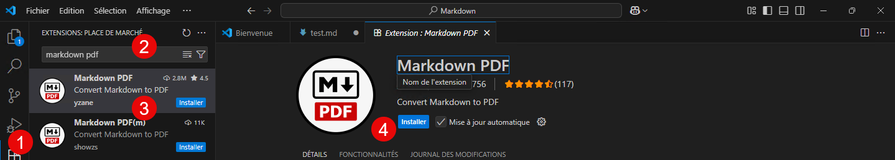
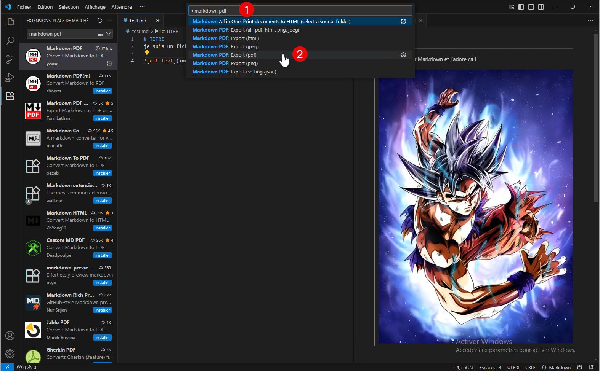
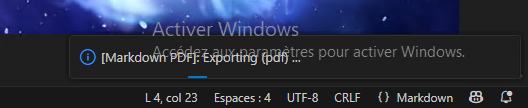
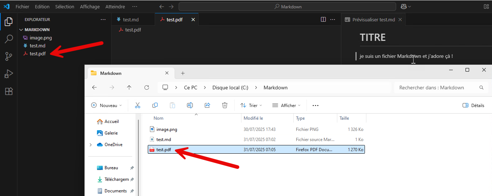
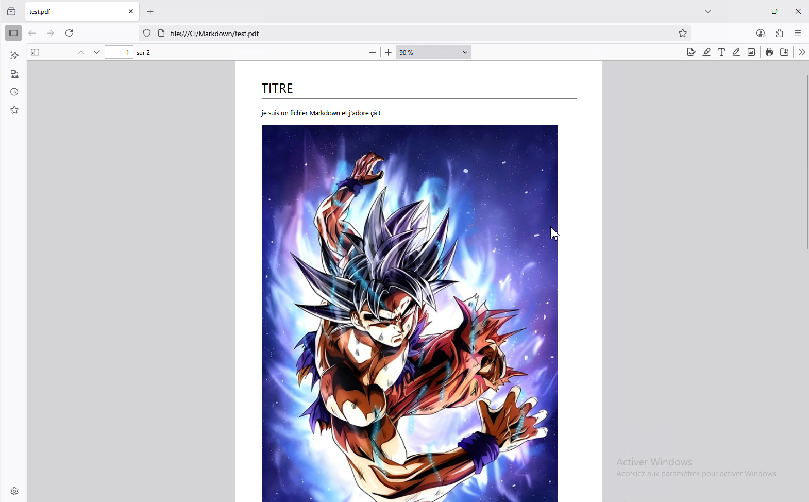

Le Markdown c’est génial, mais pour lire les fichiers .md, il faut un serveur. Pour vos rapports, le plus simple est de générer un PDF.

Pour cela, il faut installer l’extension [Markdown PDF](https://marketplace.visualstudio.com/items?itemName=yzane.markdown-pdf).

On approuve l’éditeur.

Une fois installé, lorsqu’on est sur le fichier .md,

On fait F1, puis dans la barre de recherche, on tape **Markdown PDF** puis on sélectionne l’option **Export (PDF)**.

On peut voir que le fichier est en cours de génération.

Une fois créé, il sera disponible dans le dossier de votre fichier .md et vous pouvez l’ouvrir.

