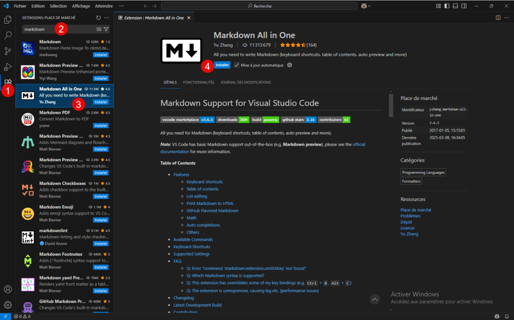
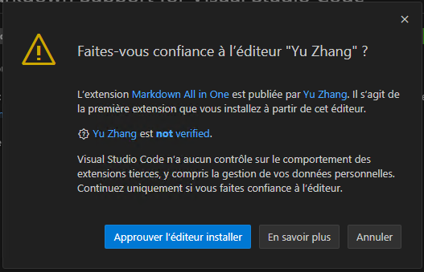
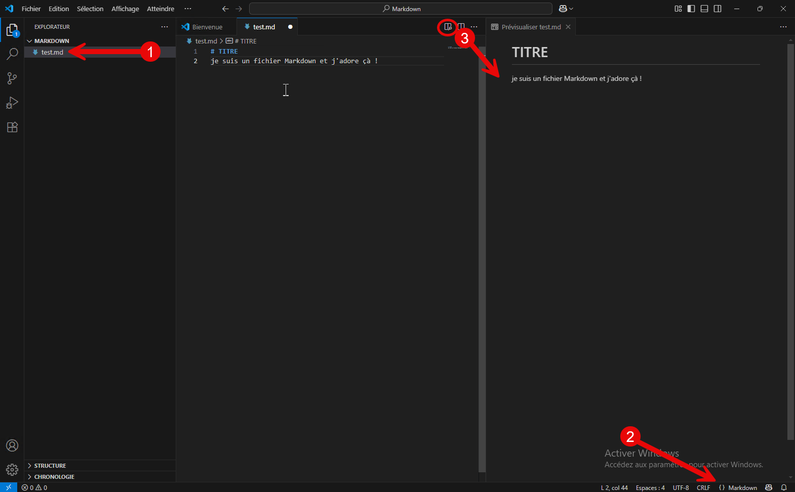

L’extension [Markdown All in One](https://marketplace.visualstudio.com/items?itemName=yzhang.markdown-all-in-one) fournit tous les outils pour pouvoir utiliser ce langage.

Vous devez approuver l’éditeur.

Lorsque vous avez un fichier avec l’extension .md (1), il est automatiquement détecté comme du Markdown (2) et vous pouvez prévisualiser votre document final (3).

