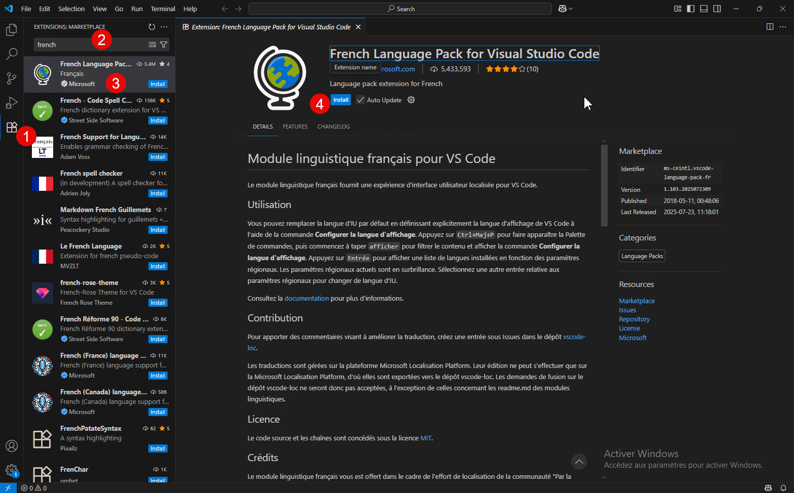
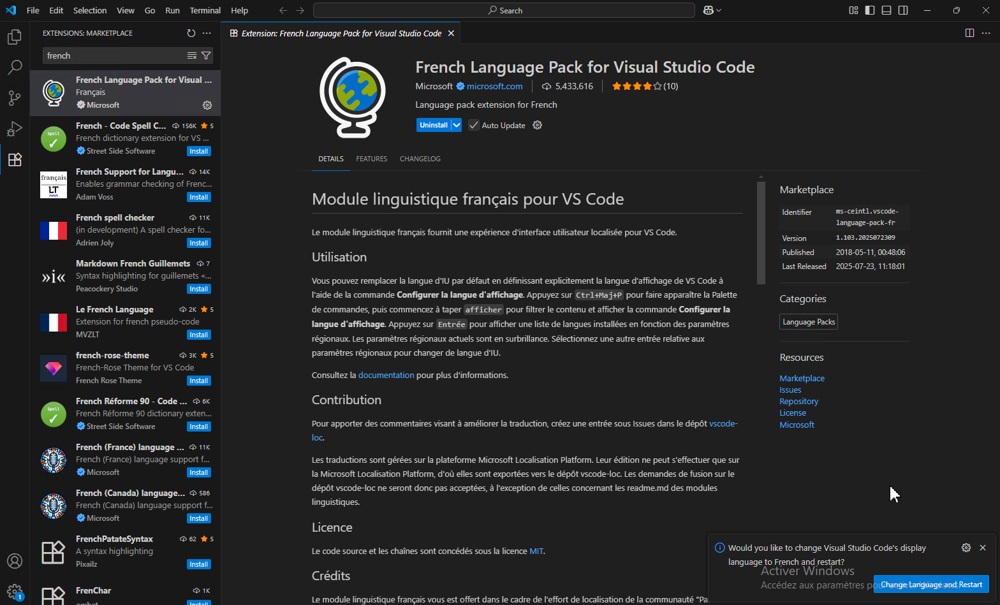
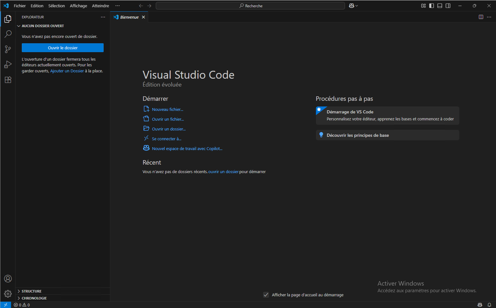

Pour passer Visual Studio Code en français, il faut simplement installer une extension [French Language Pack for Visual Studio Code](https://marketplace.visualstudio.com/items?itemName=MS-CEINTL.vscode-language-pack-fr)

Aller dans **Extensions > Rechercher « French » > Installer le package**

Une fois installé, il faut lancer cliquer sur "Change Language et Restart".

VS Code est maintenant en français.

