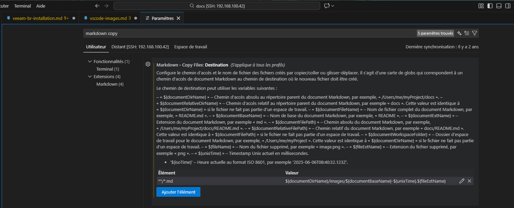

Je voulais que les images collées dans VSCode se stocke dans un dossier image plutot que dans le dossier du fichier afin de gagner en lisibilité.

Aller dans les paramètres de VS Code :
```
CTRL + ,
```
Dans les paramètres, rechercher **Markdown › Copy Files**

Ajouter le paramètre

```
**/*.md : ${documentDirName}/images/${documentBaseName}-${unixTime}.${fileExtName}
```

