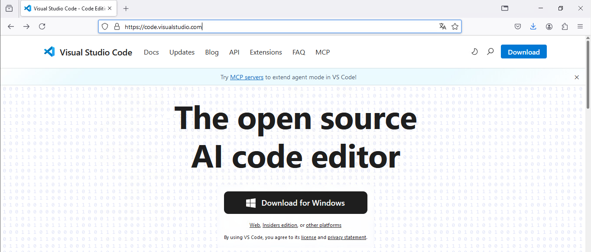
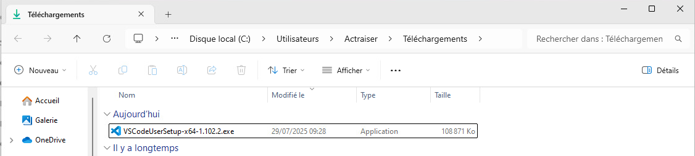
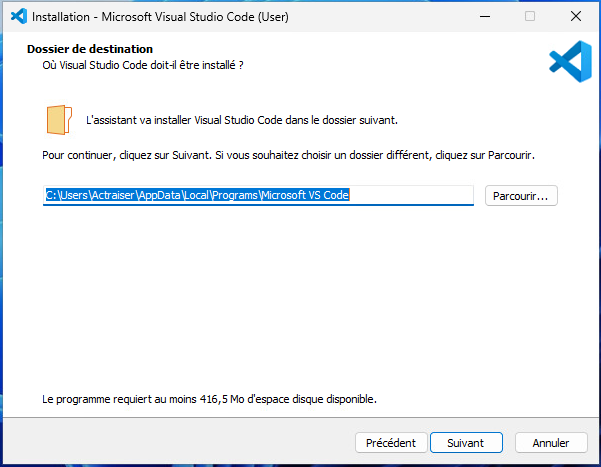
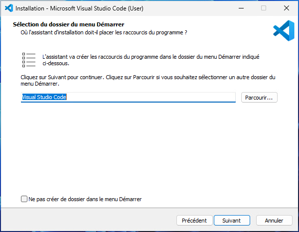
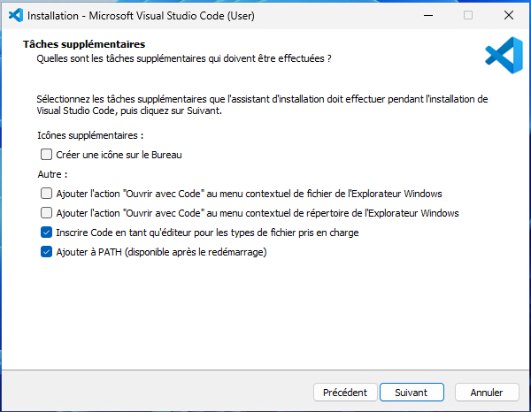
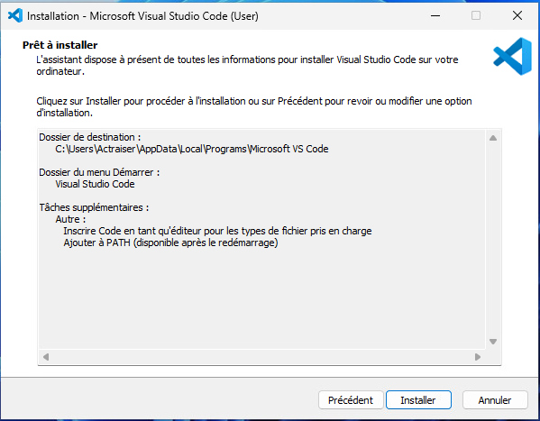
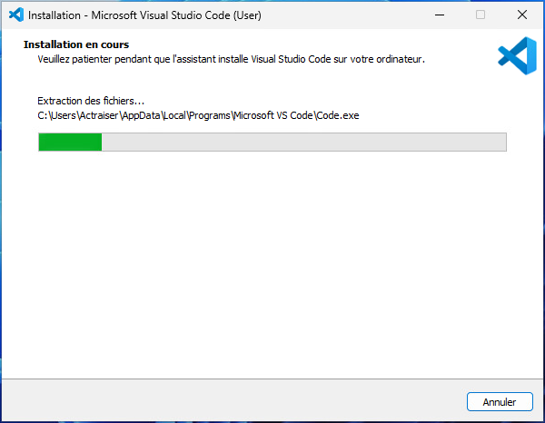
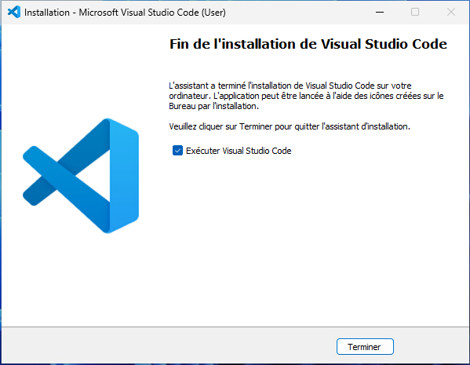
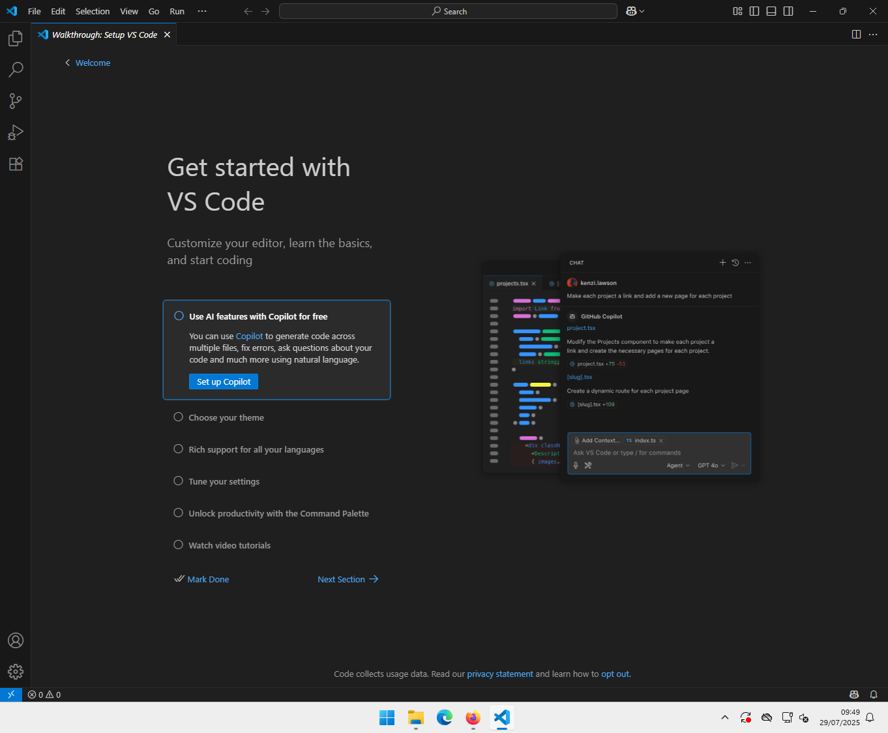

Visual Studio Code est un éditeur de code extensible développé par Microsoft.

Vous pouvez le télécharger à l’adresse :

[https://code.visualstudio.com](https://code.visualstudio.com)

Cliquez sur les boutons de téléchargement (Download)

Le téléchargement se lance automatiquement.

Exécutez le fichier VSCodeUserSetup-x64-…….exe.

On accepte la licence
Visual Studio Code s’installe dans votre répertoire personnel, laissez l’emplacement par défaut :

Valider ensuite les étapes suivantes.

Une fois l’installation terminée, vous pouvez lancer le programme.

On arrive sur l’interface de VS Code.

Il est possible d’installer de nombreuses extensions.