:::note
Installation version 4.6.0
:::
Wireshark est un logiciel d’analyse de paquets réseau (ou sniffer). Il permet de capturer, visualiser et interpréter les trames échangées entre les différents équipements d’un réseau. Chaque trame correspond à un ensemble d’informations envoyées ou reçues par une machine (adresse IP, port, protocole, contenu, etc.).
Grâce à Wireshark, on peut observer le fonctionnement des protocoles réseau (comme ICMP, TCP, HTTP, SMTP, POP, DNS…), comprendre comment les données sont encapsulées dans les différentes couches du modèle OSI, et repérer d’éventuels problèmes ou failles de sécurité (comme un mot de passe envoyé en clair)

[Wireshark • Go Deep | Download](https://www.wireshark.org/download.html)

L’installation est relativement basique.
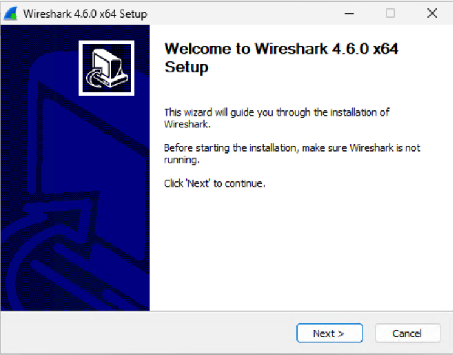
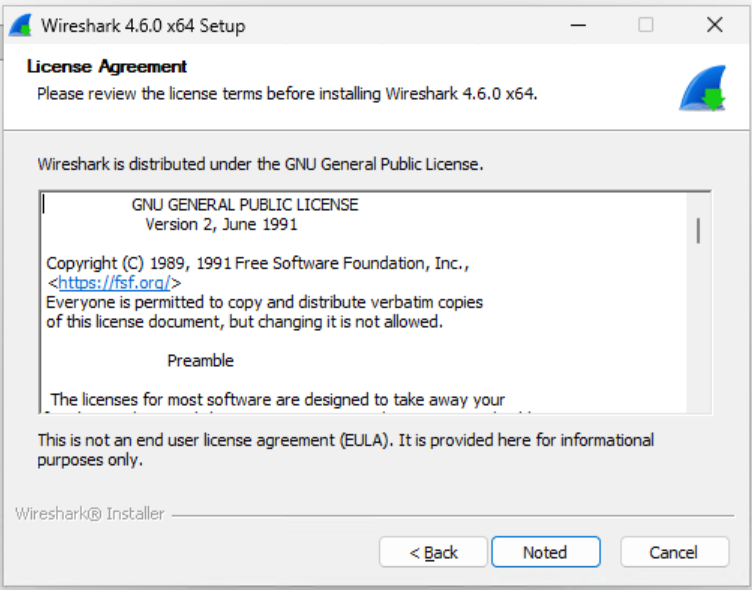
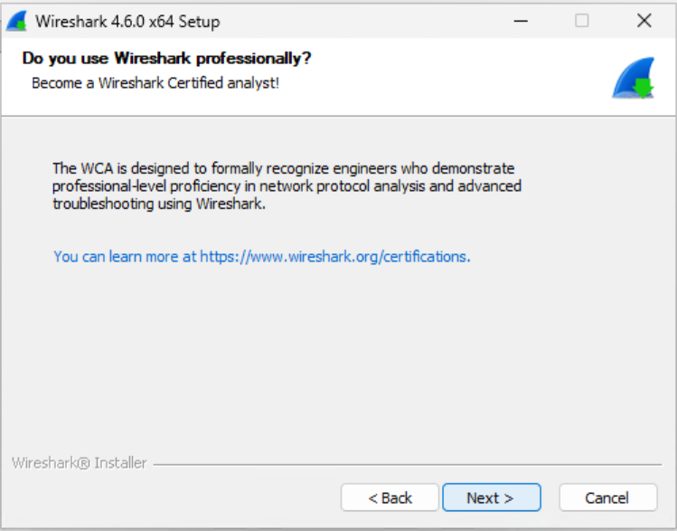
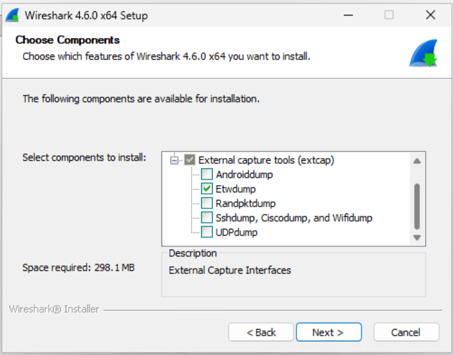
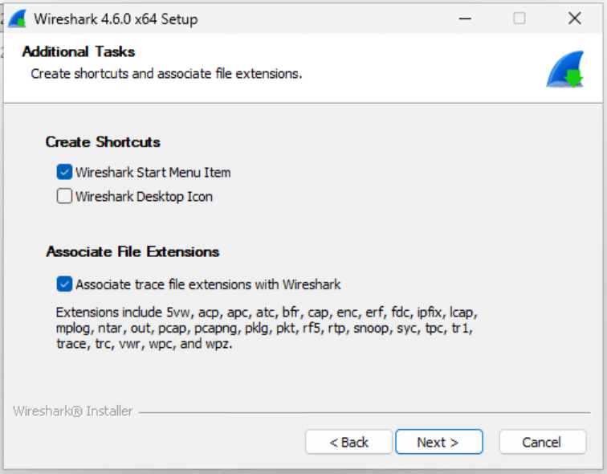
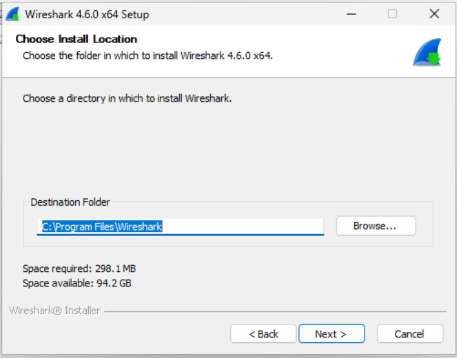
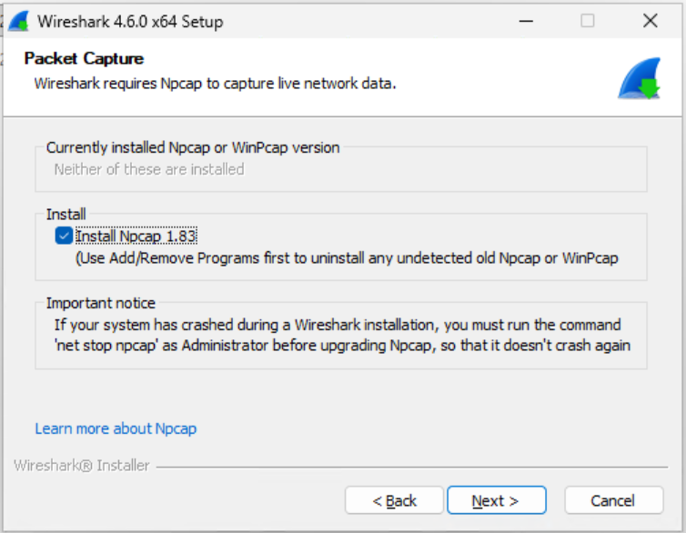
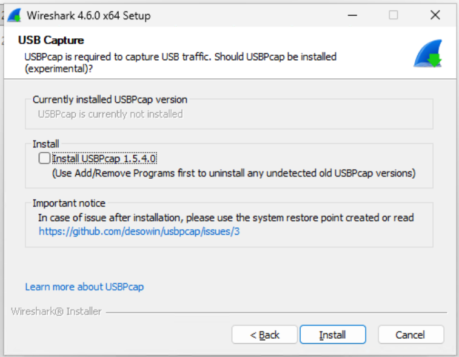
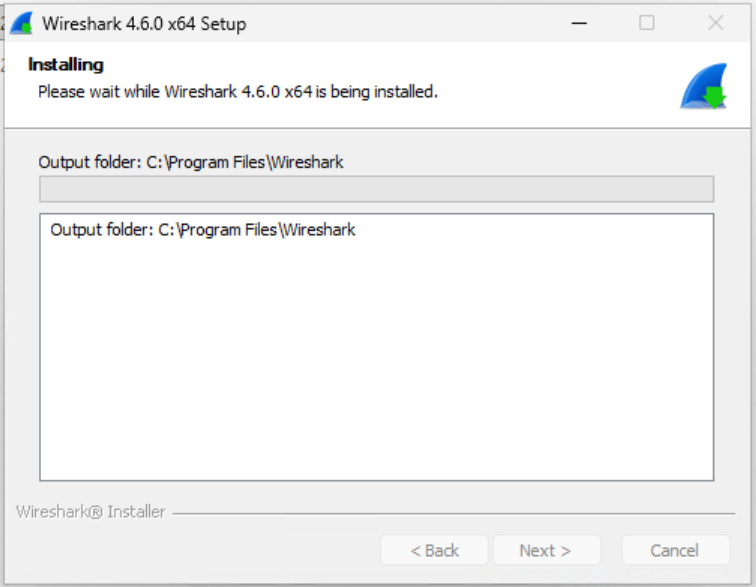
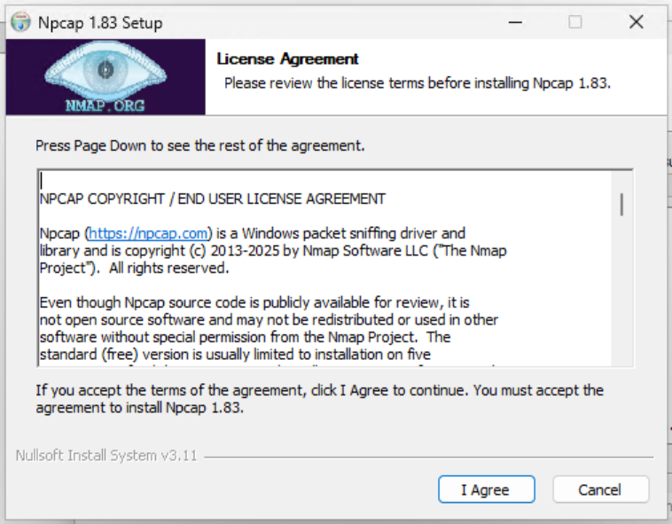
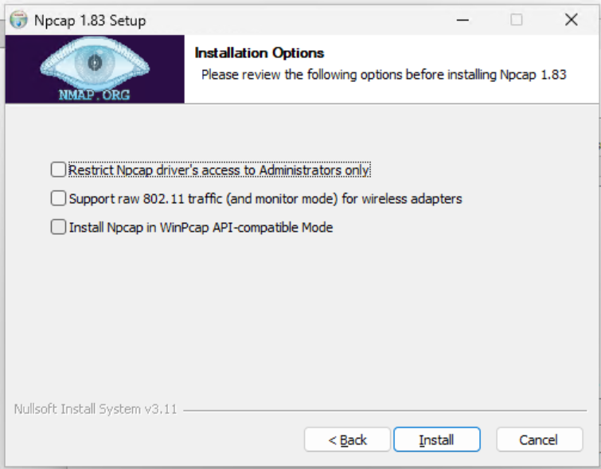
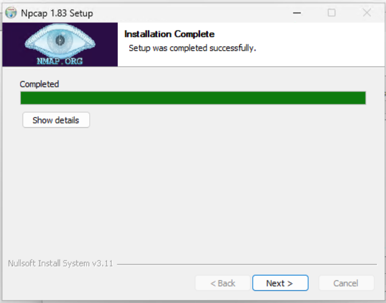
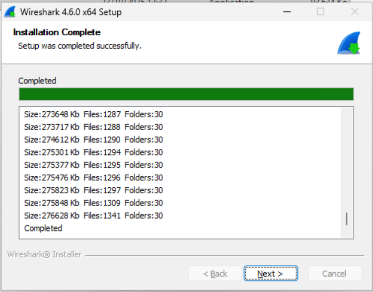
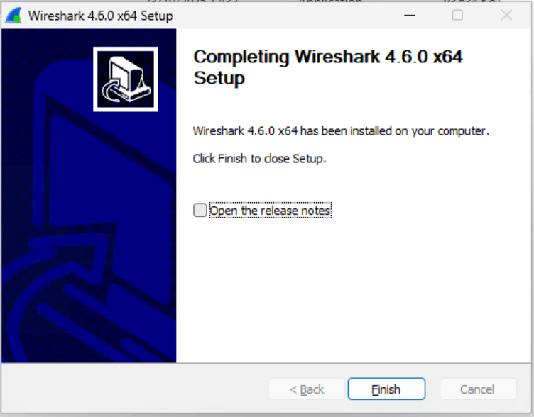