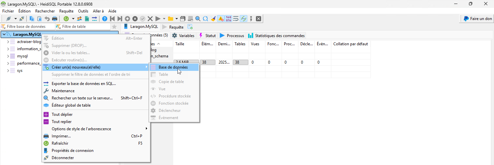
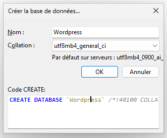
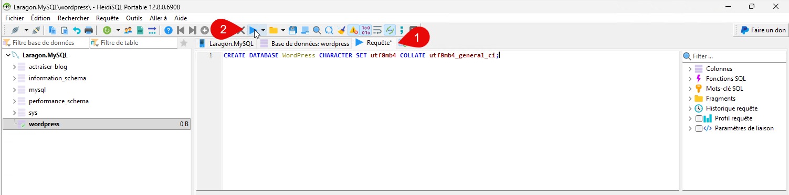

## Par interface graphique (HeidiSQL)



Choisir l’encodage en fonction du besoin, sinon laissez par défaut.



## Par ligne de commande (MySQL/MariaDB)

```sql
CREATE DATABASE nom_de_la_base_de_donnees CHARACTER SET utf8mb4 COLLATE utf8mb4_general_ci;
```
Remplacez `nom_de_la_base_de_donnees` par le nom que vous souhaitez donner à votre base de données.
Vous pouvez également spécifier un autre jeu de caractères et une autre collation si nécessaire.
Assurez-vous d'avoir les privilèges nécessaires pour créer une base de données.



Après avoir créé la base de données, vous pouvez vérifier qu'elle a été créée avec succès en utilisant la commande suivante :

```sql
SHOW DATABASES;
```
Cela affichera une liste de toutes les bases de données disponibles sur le serveur, y compris celle que vous venez de créer.