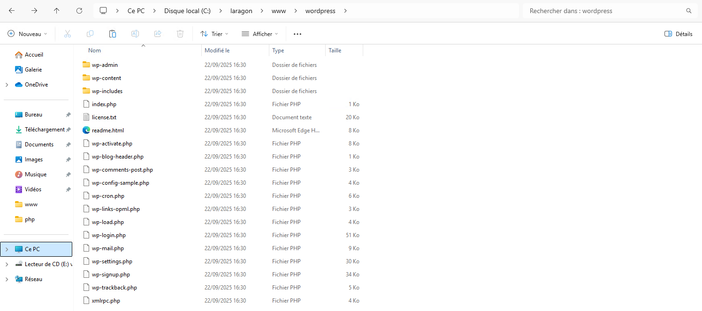
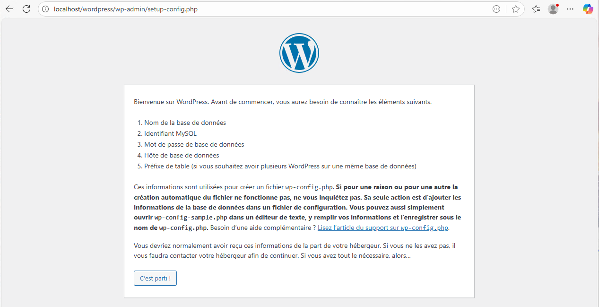
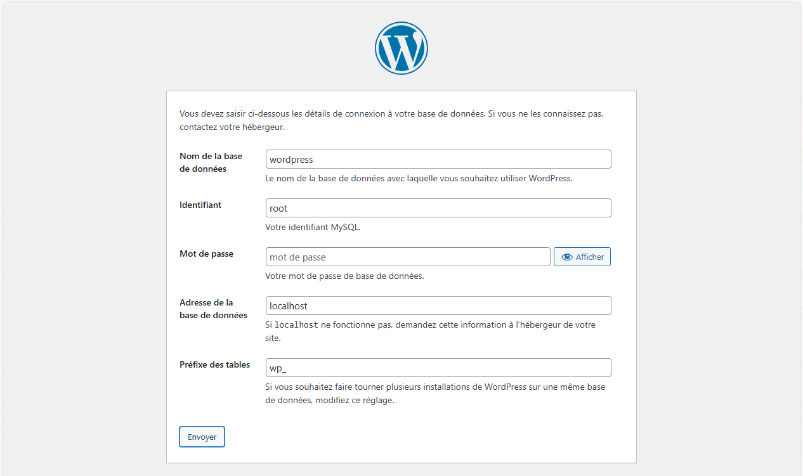
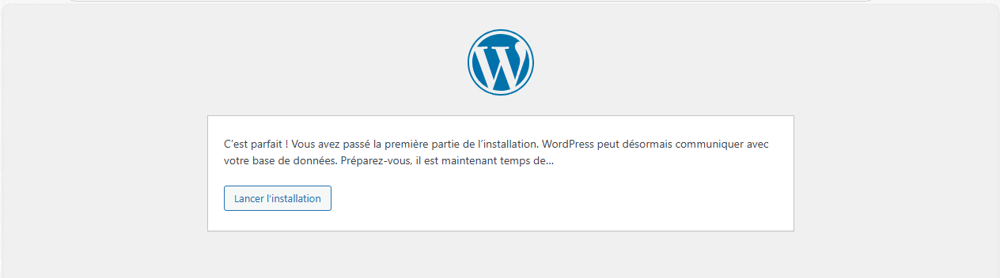
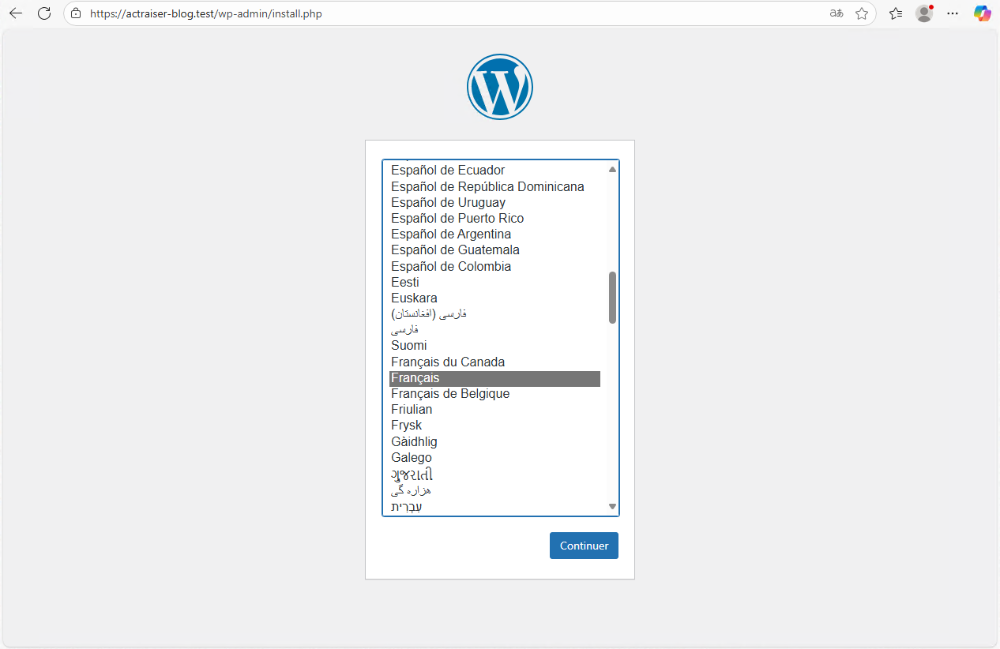
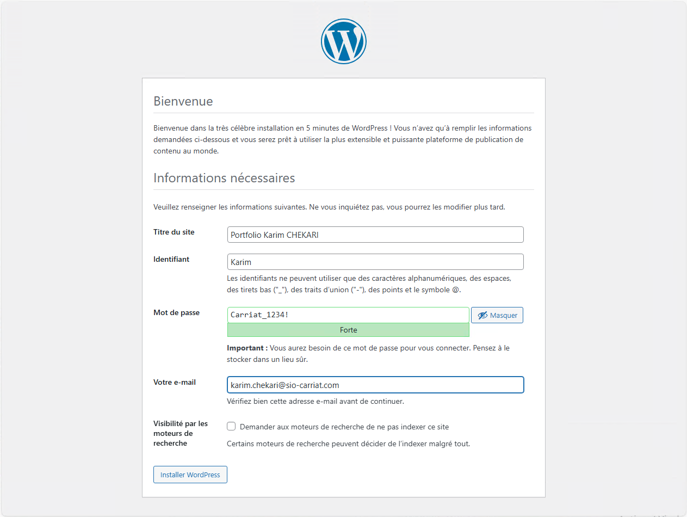
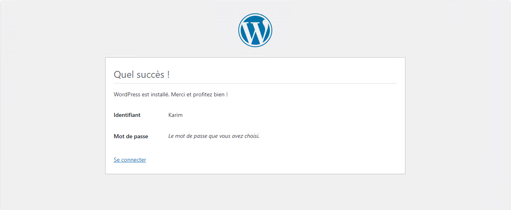
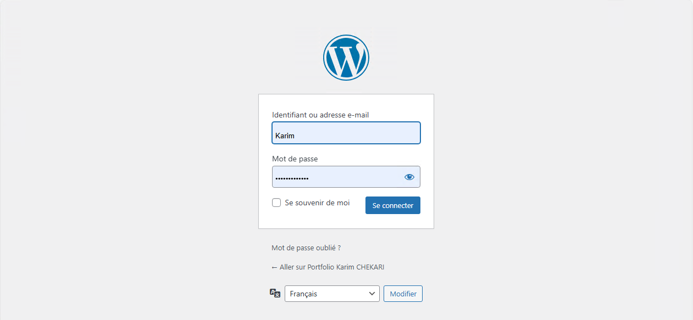
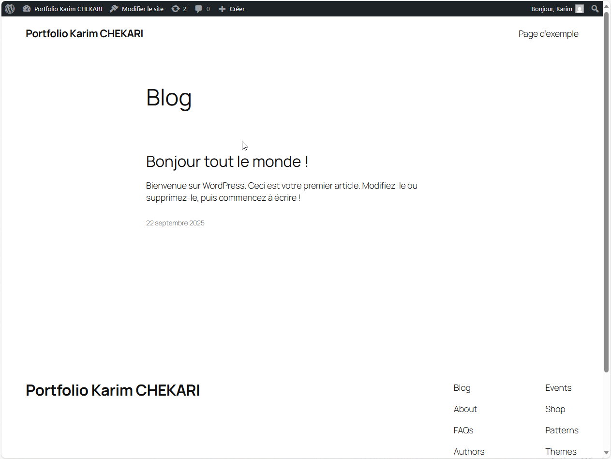

:::note
Installation sous Debian 12/13
:::


WordPress est un système de gestion de contenu (CMS – Content Management System) qui permet de créer facilement des sites web sans avoir besoin de coder en profondeur. Il est aujourd’hui le CMS le plus utilisé au monde, notamment pour les blogs, les sites vitrines et même des boutiques en ligne grâce à l’extension WooCommerce. Son principal avantage est sa simplicité : une fois installé, il suffit d’un navigateur pour gérer les pages, les articles, le design et les extensions qui ajoutent des fonctionnalités. Dans un cadre pédagogique, WordPress est particulièrement intéressant car il permet aux étudiants de comprendre le fonctionnement concret d’un site dynamique (PHP + base de données MySQL), tout en se concentrant sur la logique de gestion de contenu plutôt que sur la programmation brute. Avec Laragon, l’installation est rapide et automatisée, ce qui permet de tester WordPress en local et de se familiariser avec son interface avant de déployer un site sur un vrai serveur.

## Installation de WordPress

### Pré-requis
- Un serveur web avec PHP et une base de données MySQL/MariaDB (ex : LAMP, WAMP, XAMPP, Laragon).
- Accès au serveur pour copier les fichiers WordPress.

### Mise en place des binaires
- Rendez-vous sur le site officiel : https://fr.wordpress.org/download/
- Téléchargez l’archive .zip de WordPress.
- Décompressez le dossier et copiez le dans le dossier de votre serveur web.



### Configuration de la base de données

Vous devez avoir une base de données WordPress disponible sur votre serveur.
- Connectez-vous à votre interface de gestion de base de données (ex : phpMyAdmin).
- Créez une nouvelle base de données pour WordPress (ex : wordpress_db).
- Créez un utilisateur avec tous les privilèges sur cette base de données. 

```mysql
# Création d'une base de données
CREATE DATABASE WordPress CHARACTER SET utf8mb4 COLLATE utf8mb4_general_ci;
 
# (facultatif) Création d'un utilisateur administrateur de la base
GRANT ALL ON [USER].* TO '[USER]'@'%' IDENTIFIED BY '[PASSWORD]';
FLUSH PRIVILEGES;
EXIT;
```
### Lancement de l’installation

Si le fichier wp-config.php n’est pas paramétré, il faudra ajouter les informations de connexion à la base de données.

- Ouvrez votre navigateur web et accédez à l’URL où vous avez copié les fichiers WordPress (ex : http://localhost/wordpress).


Saisir les éléments nécessaires :
- Nom de la base de données : WordPress
- Identifiant : Login de connexion à la base de données
- Mot de passe : Mot de passe de l’utilisateur de la base de données.
- Serveur de base de données : mettre localhost


Une fois que tout est bon, on peut lancer l’installation.

Une fois la partie serveur configurée, lorsque vous accéder à l’URL de votre serveur, vous arrivez sur la page de configuration.
Choisir la langue Français

- Suivez les instructions à l’écran pour configurer WordPress.
- Renseignez les informations de connexion à la base de données que vous avez créées précédemment.
- Choisissez un nom pour votre site, un nom
    d’utilisateur administrateur, un mot de passe et une adresse e-mail.
- Cliquez sur "Installer WordPress".


L’installation est terminée.

Il est possible de se connecter.

A vous de jouer !
