Axigen Mail Server est un serveur de messagerie professionnel complet, compatible Windows et Linux, qui intègre l’ensemble des services nécessaires à la gestion d’un système de courrier électronique : SMTP pour l’envoi des messages, POP3 et IMAP pour leur réception, ainsi qu’une interface WebMail et une console d’administration Web. Il permet de créer et gérer des domaines, des comptes utilisateurs, des règles de sécurité et des certificats SSL/TLS. Sa version gratuite, limitée à cinq utilisateurs, est idéale pour un usage éducatif ou de test. Axigen se distingue par sa facilité de configuration, sa stabilité, et son respect des standards de sécurité.

https://www.axigen.com
## Installation 
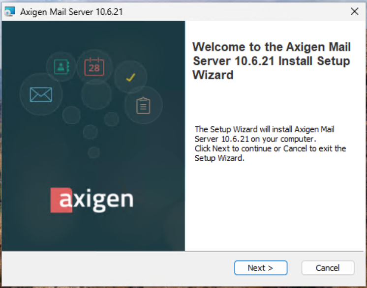
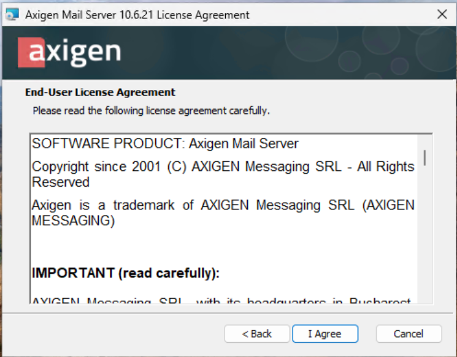
On accepte le contrat de licence.
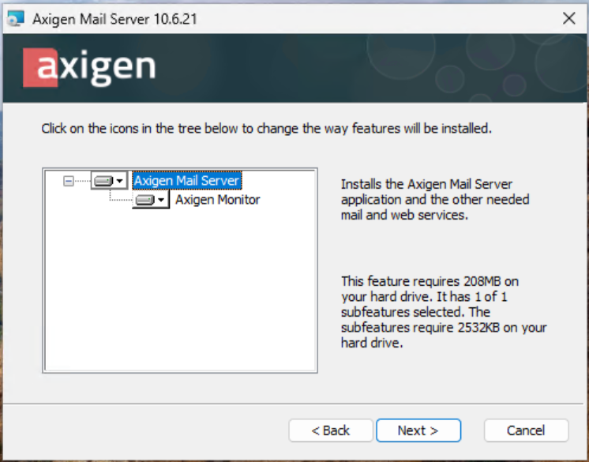
Nous pouvons laisser l’emplacement par défaut pour nos TPs
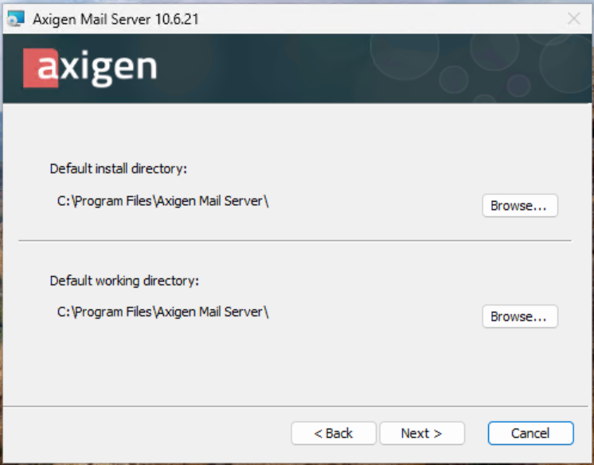
Une fois l’installation terminée, votre navigateur s’ouvre sur la page de configuration https://localhost:9443.
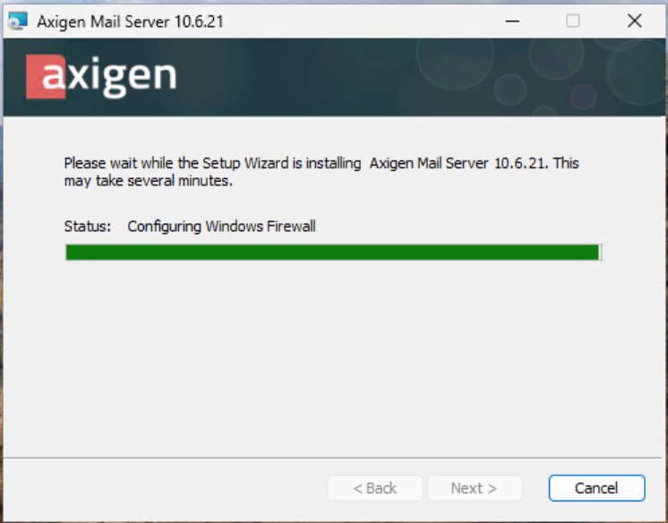
## Configuration
Vous avez une alerte car le certificat est auto-signé.
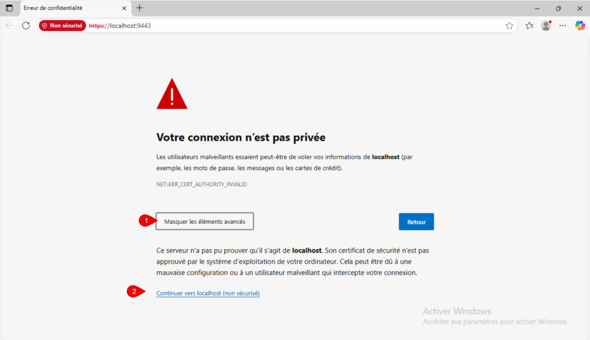
On accepte le certificat auto-signé et le contrat de licence.
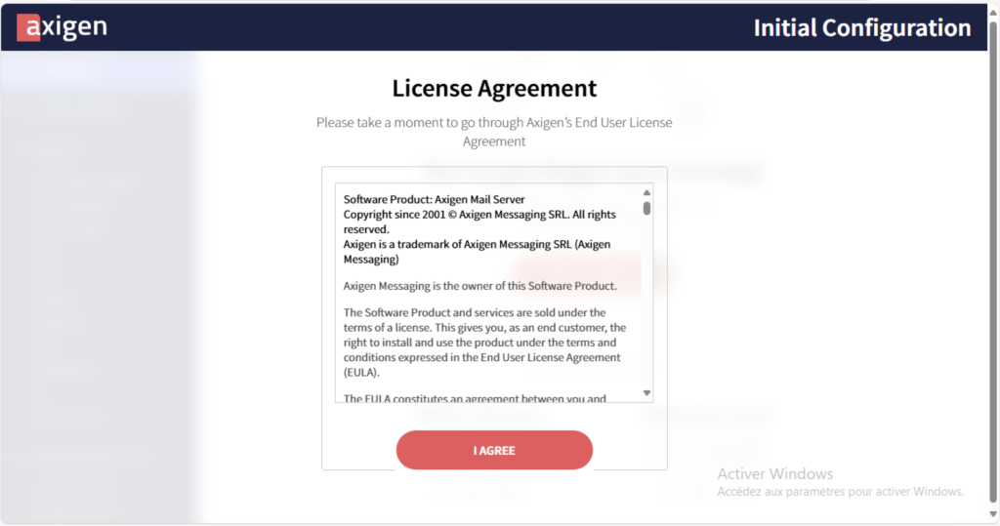
Nous allons définir le mot de passe administrateur
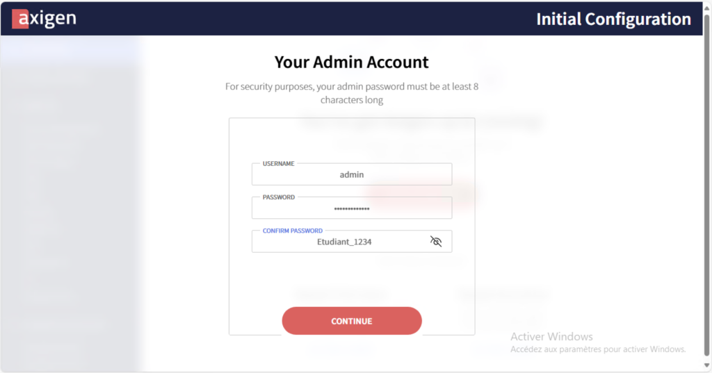
Nous allons sauter l’étape
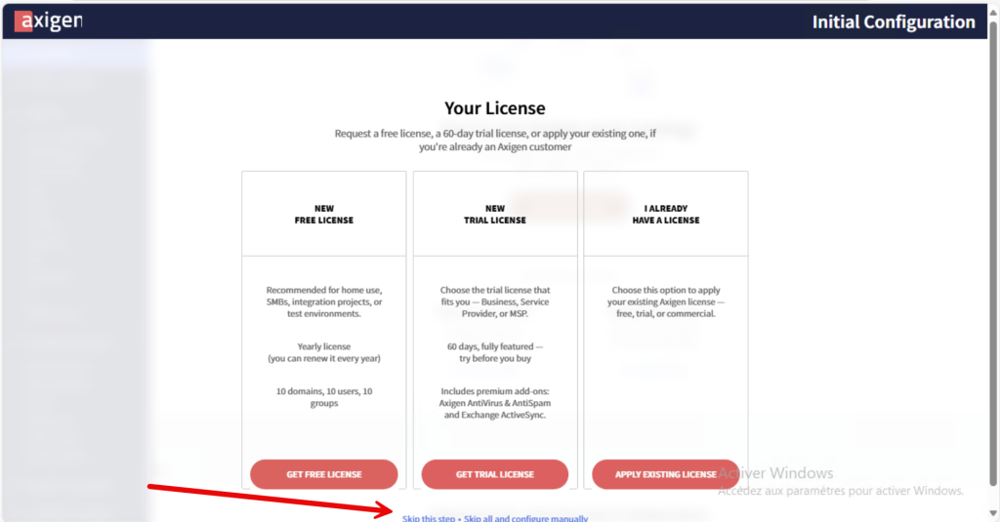
Nous avons ensuite la liste des services avec leurs ports par défaut.
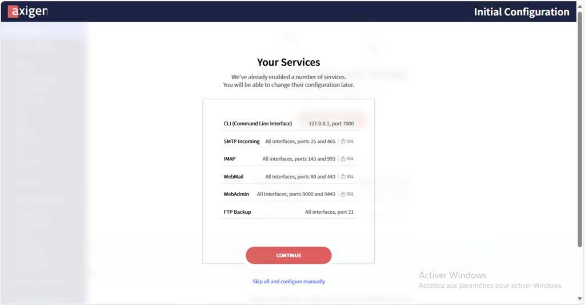
Nous allons créer un domaine et un mot de passe pour POSTMASTER
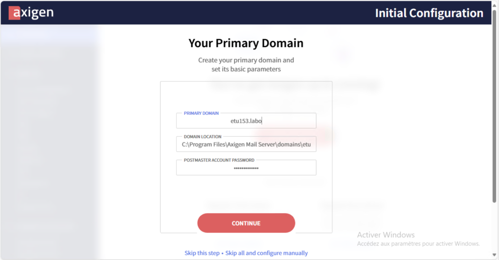
La configuration de base est terminée.
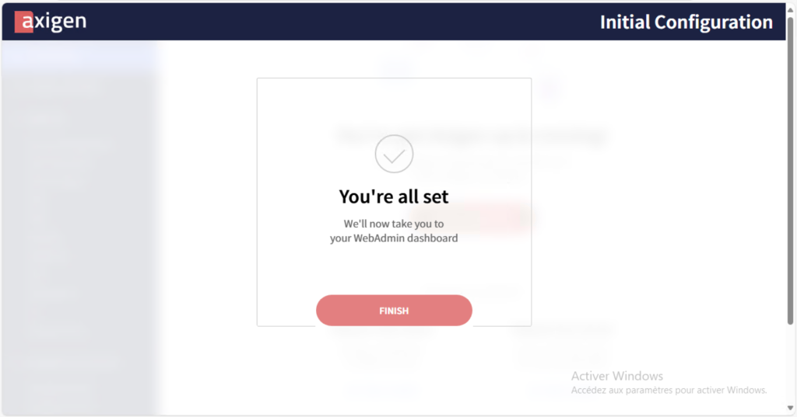