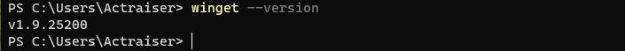
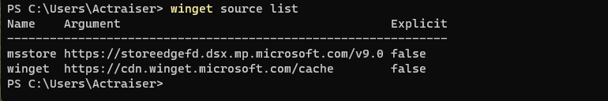
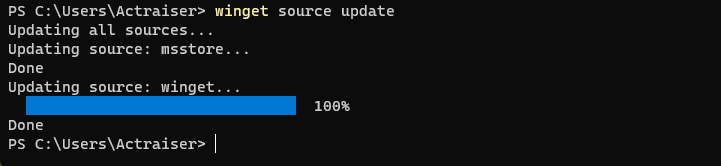
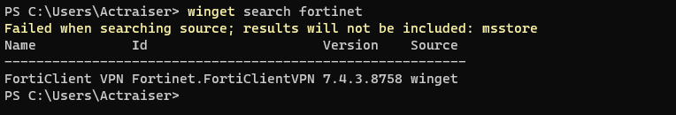
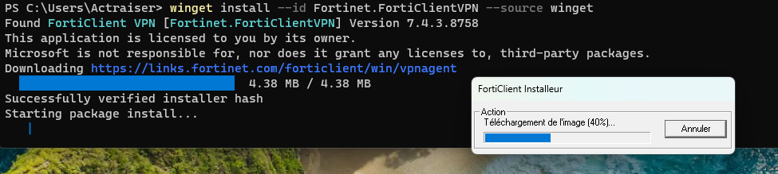

**Winget (Windows Package Manager)** est un gestionnaire de paquets en ligne de commande pour Windows 10, 11 et server 2025. Il permet d'installer, de mettre à jour et de gérer des applications directement depuis le terminal.

Il est la version Windows des gestionnaires de paquets comme `apt` pour Debian.

Il est inclus dans Windows 11 et Windows Server 2025.

Pour connaitre la version installée de winget, utilisez la commande suivante dans PowerShell ou l'invite de commandes :

```powershell
winget --version
```



Comme pour les autres gestionnaires de paquets, winget utilise des "sources" pour récupérer les informations sur les paquets disponibles. La source par défaut est le dépôt officiel de Microsoft.
Pour afficher les sources configurées, utilisez la commande suivante :

```powershell
winget source list
```



Pour mettre à jour la liste des paquets disponibles, utilisez la commande suivante :

```powershell
winget source update
```



Pour rechercher un paquet, utilisez la commande suivante :

```powershell
winget search <nom_du_paquet>
``` 



pour installer un paquet, utilisez la commande suivante :

```powershell
winget install <nom_du_paquet> --source <source>
```

