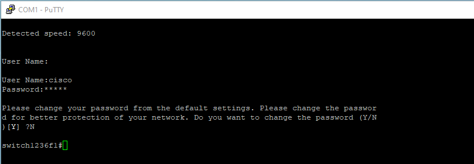
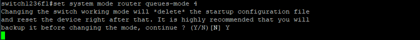
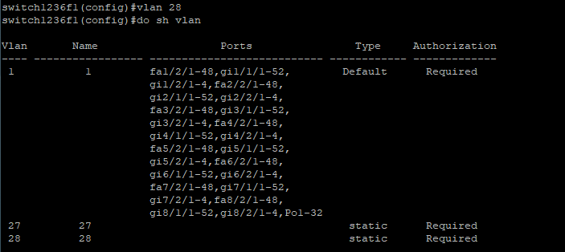
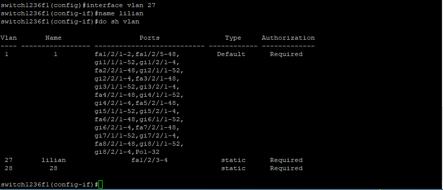
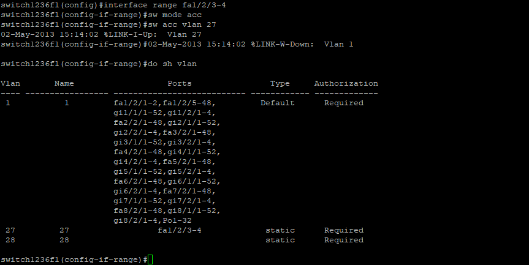
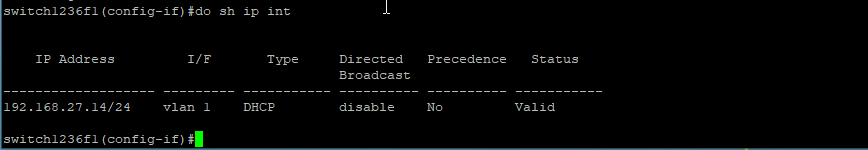
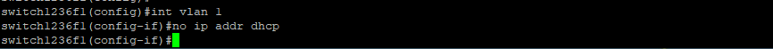
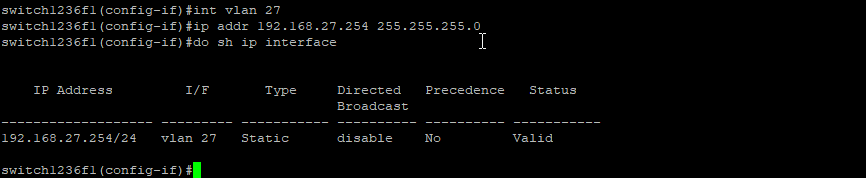
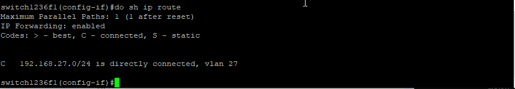

Tout bon admin réseaux connait les commandes Cisco IOS de base, je peux configurer un 2960 avec la main gauche les yeux fermés. En revanche, je suis tombé sur une SF500-24 qui a l’avantage d’être un commutateur POE de niveau 3. Parfait pour les TP avec des bornes Wifi ou des téléphones IP.

En revanche, les commandes ne sont pas tout à fait similaire à celle que je connais déjà.

J’ai donc décidé de faire un article pour historiser mes commandes utiles.

#### Réinitialisation du switch

Maintenir 10 secondes sur le bouton reset.

#### Connexion port console

Saisissez les informations de connexion par défaut :

- Nom d’utilisateur : cisco
- Mot de passe par défaut :  cisco  (les mots de passe sont sensibles à la casse)



#### Passer le switch en N3 ou N2

```bash
set system mode switch queues-mode 4  //passer en niveau 2
set system mode router queues-mode 4    //passer en niveau 3
```



Pour le N3, il faut redémarrer

#### Revenir en arrière

Le bouton backspace ne fonctionne pas, pour effacer le caractère précédent, il faut faire SHIFT+BACKSPACE.

#### Création d’un VLAN

```bash
vlan [numero] //Création d'un VLAN
sh vlan //affichage des VLAN
```



#### Nommer un VLAN

```bash
interface vlan [numero]
name [nom]
```



#### Affecter une interface à un VLAN

```bash
//Affecter une interface
int fa1/2/1
sw mode acc
sw acc vlan [numero]
 
//Affecter plusieurs interfaces
int range fa1/2/1-2
sw mode acc
sw acc vlan [numero]
```



#### Afficher les IP du commutateur

```bash
sh ip interface
```



#### Désactiver le DHCP sur un VLAN

```bash
int vlan [numero]
no ip addr dhcp
```



#### Affecter une ip à un VLAN

```bash
int vlan [numero]
ip addr [ip] [masque]
```



#### Afficher les routes

```bash
sh ip route
```

