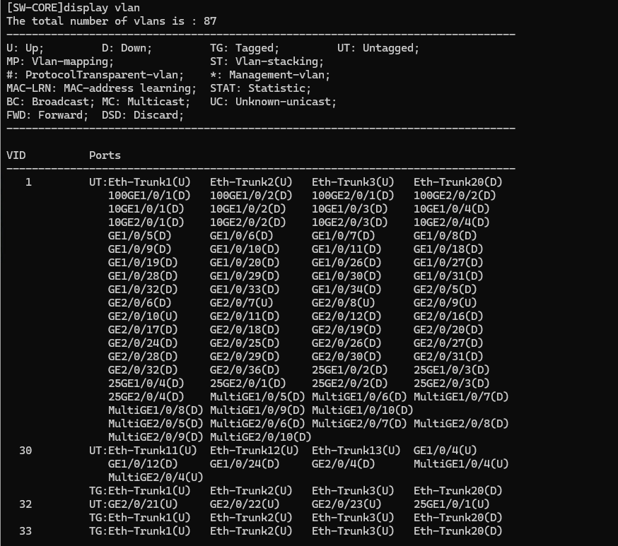

### Création d’un VLAN

La commande « vlan » permet de créer des VLAN (il faut être en mode de configuration).

Voir l’exemple :
```bash
<SW-CORE>sys
Enter system view, return user view with return command.
[SW-CORE]vlan 306
[SW-CORE-vlan306]name VLAN306
[SW-CORE-vlan306]q
[SW-CORE]vlan 305
[SW-CORE-vlan305]name VLAN305
[SW-CORE-vlan305]q
[SW-CORE]vlan 303
[SW-CORE-vlan303]name VLAN303b
[SW-CORE-vlan303]q
[SW-CORE]vlan 302
[SW-CORE-vlan302]name VLANIUT
[SW-CORE-vlan302]q
[SW-CORE]q
<SW-CORE>save
Warning: The current configuration will be written to the device. Continue? [Y/N]:y
Now saving the current configuration to the slot 2 .
Info: Save the configuration successfully.
Now saving the current configuration to the slot 1 ...
Info: Save the configuration successfully.
<SW-CORE>
```

### Affecter un VLAN à une interface

Il faut aller sur l’interface, la passer en access puis affecter le VLAN.
On va affecté le port 1/0/23 au vlan 306

```bash
<SW-CORE>
<SW-CORE>sys
Enter system view, return user view with return command.
[SW-CORE]inter
[SW-CORE]interface GE 1/0/23
[SW-CORE-GE1/0/23]port link-type access
[SW-CORE-GE1/0/23]port default vlan 306
[SW-CORE-GE1/0/23]q
[SW-CORE]q
<SW-CORE>save
Warning: The current configuration will be written to the device. Continue? [Y/N]:y
Now saving the current configuration to the slot 2 .
Info: Save the configuration successfully.
Now saving the current configuration to the slot 1 ..
Info: Save the configuration successfully.
<SW-CORE>
```

 

### Voir les VLANs

```bash
[SW-CORE]display vlan
```

