## Présentation

OPNsense est un système d'exploitation open source basé sur FreeBSD, conçu pour fournir des fonctionnalités de pare-feu et de routage avancées. Il est largement utilisé pour sécuriser les réseaux d'entreprise et domestiques, offrant une interface utilisateur conviviale et une grande flexibilité dans la configuration des règles de sécurité. OPNsense est également connu pour sa communauté active et son développement continu, ce qui en fait un choix populaire pour les administrateurs réseau et les passionnés de sécurité informatique.

## Prérequis

L'installation d'OPNsense sera réalisée sur une VM installée dans mon Homelab Proxmox afin de distribuer le réseau sur mes différents VLANs.

- vcpu: 2
- RAM: 4GB
- Disque: 30GB
- Network : virtio
- Boot : Seabios
- OS : OPNsense-26.1.6-OpenSSL-dvd-amd64.iso
- Système : Linux (même si c'est du FreeBSD)

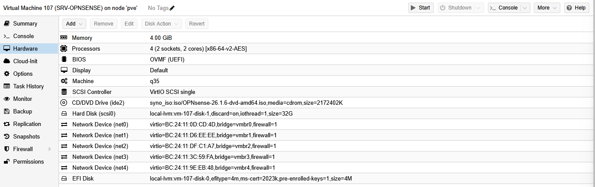

## Installation

Démarrer la VM, le processus d'installation va se lancer automatiquement.

OPNSense va démarrer en mode `Live` il faut soit se connecter en `root` pour continuer, soit avec l'utilisateur `installer` pour lancer l'installation.

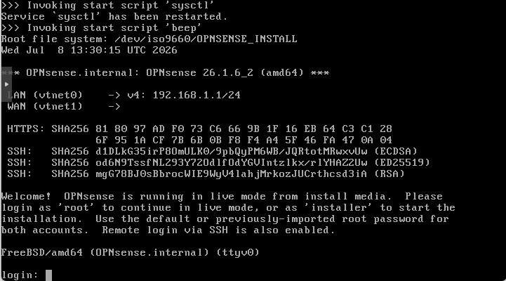

:::note
Login : installer (attention clavier en QWERTY)

Mot de passe : opnsense
:::

Pour ne plus être embêté par le clavier en QWERTY, il est possible de changer la disposition du clavier en AZEERTY sur l'écran suivant :

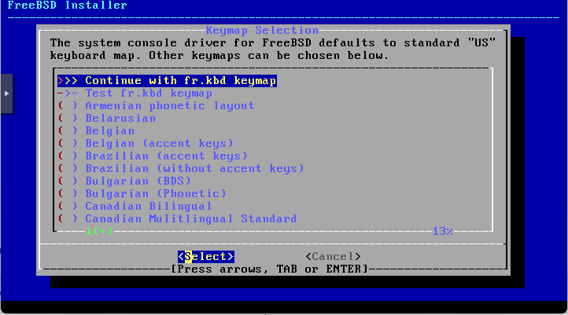

Lancer l'installation en ZFS.

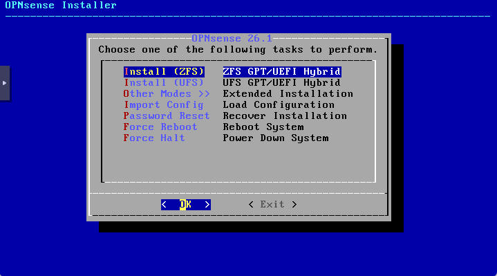

Je n'ai mis qu'un disque dur de 30GB pour l'installation, il est possible d'en mettre plusieurs pour faire du RAID.
On choisit le mode `Stripe` qui correspond à un disque.

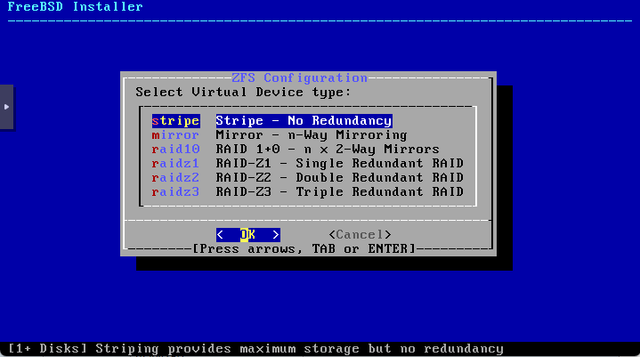

Choisir ensuite le disque sur lequel on souhaite installer OPNsense.

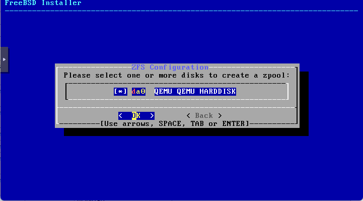

Puis, valider

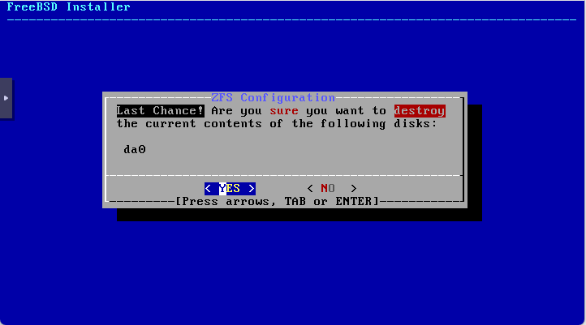

Mise à jour du mot de passe root, puis valider (optionnel).

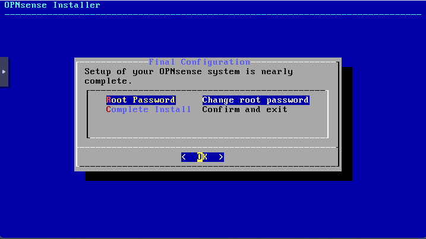

On termine par un redémarrage de la VM.

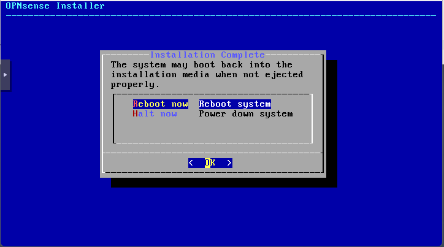

## Configuration initiale

### Configuration du réseau

Par défaut, OPNsense configure automatiquement les interfaces réseau. Cependant, il est possible de personnaliser cette configuration selon vos besoins.

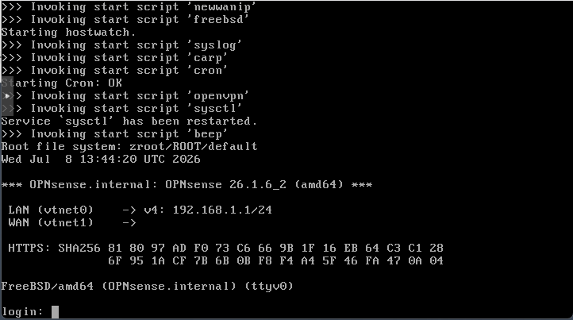

On commence par se connecter avec l'utilisateur `root` et le mot de passe que l'on a défini lors de l'installation (sinon, le mot de passe par défaut est `opnsense`).

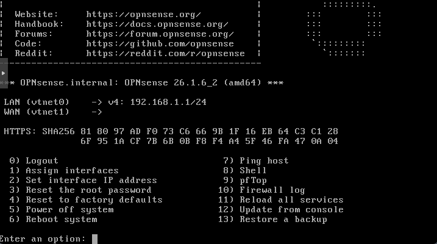

#### Assignation des interfaces réseau

Prendre l'option `1` pour assigner les interfaces réseau. OPNsense va détecter automatiquement les interfaces disponibles et vous demander de les assigner à des rôles spécifiques (WAN, LAN, etc.).

Nous pouvons déterminer les interfaces réseau en fonction des adresses MAC des cartes réseau.

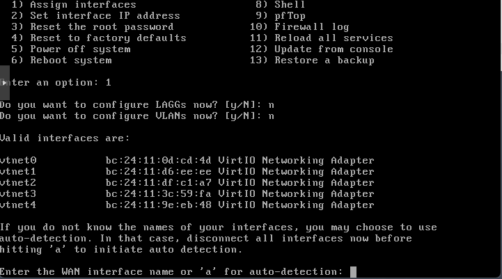

L'adresse MAC DC:24:11:0D:CD:4D correspond au vmbr0 de Proxmox, qui sera donc l'interface WAN.

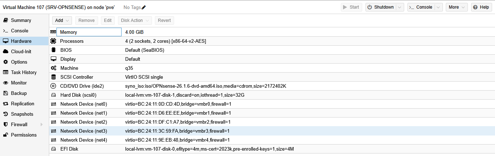

Elle correspond donc à l'interface `vtnet0` de la VM OPNsense.

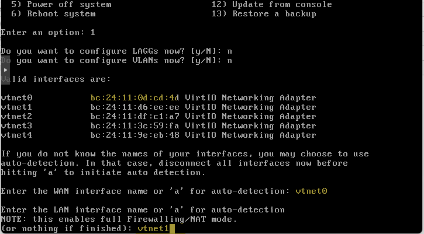

Le WAN sera en DHCP mais il est possible de le configurer en IP statique si nécessaire.

#### Configuration de l'interface WAN statique

Dans mon Homelab, j'ai configuré mon interface WAN en IP statique pour qu'elle soit sur le même réseau que mon serveur Proxmox.

L'option `2` permet de configurer l'interface WAN en IP statique.

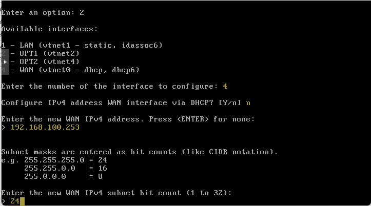

Nous pouvons ensuite lui donner sa passerelle et son DNS (vous pouvez mettre l'IP de votre passerelle mais dans mon Homelab, j'ai un serveur DNS distinct de ma passerelle).

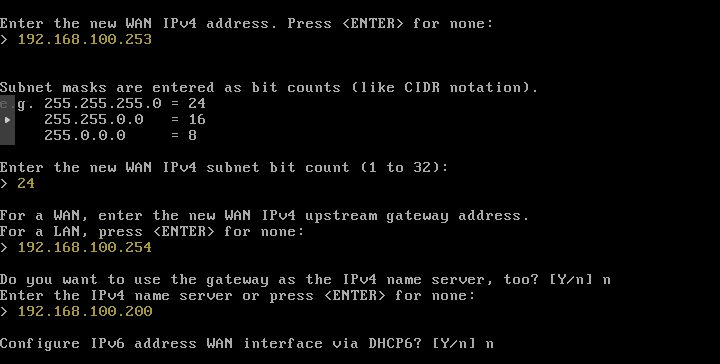

:::tip
L'interface d'administration n'est pas disponible depuis l'interface WAN pour des raisons de sécurité. Il est donc nécessaire de configurer l'interface LAN pour pouvoir accéder à l'interface d'administration.
:::

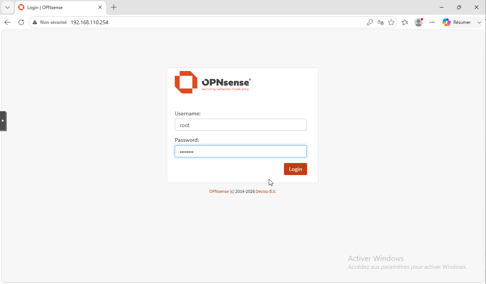

### Configuration de base

Lors de la première connexion à l'interface web d'OPNsense, il est recommandé de suivre l'assistant de configuration pour effectuer les réglages de base.

On peut préciser un domain et changer la langue de l'interface web.

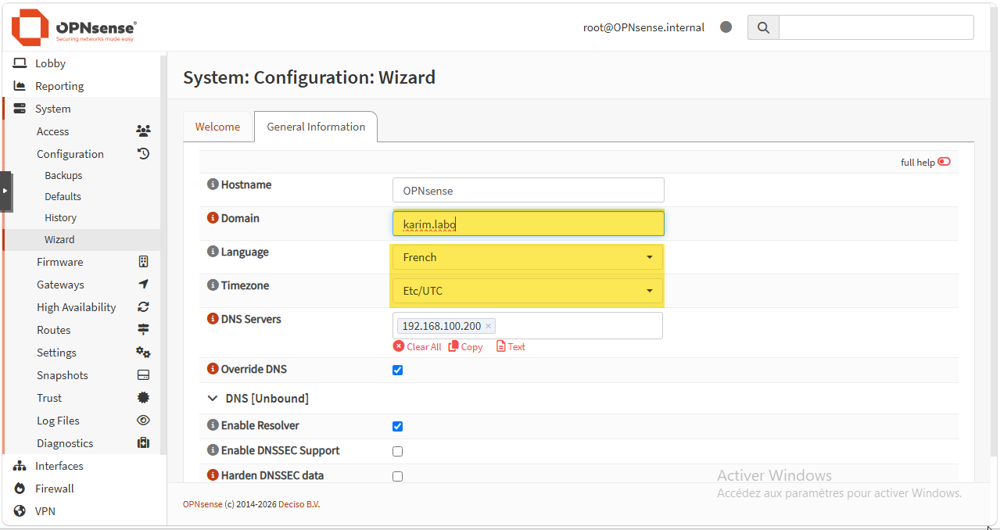

Dans notre Homelab, il faut également désactiver les politique par défaut RFC1918 qui bloque le trafic entre les réseaux privés.

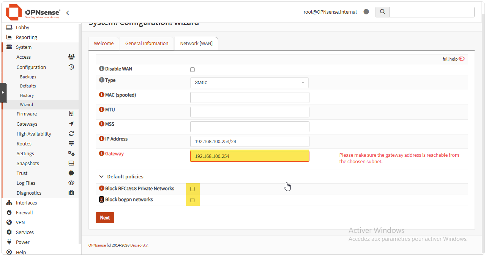

On peut ensuite valider le reste des étapes de l'assistant de configuration.

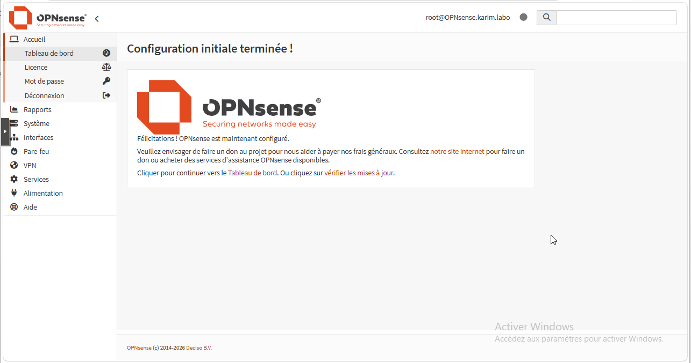

### Mise à jour d'OPNsense

On peut directement mettre à jour OPNsense après l'assistant de configuration. Sinon, il est possible de le faire plus tard depuis l'interface web dans le menu `System` > `Firmware` > `Updates`.

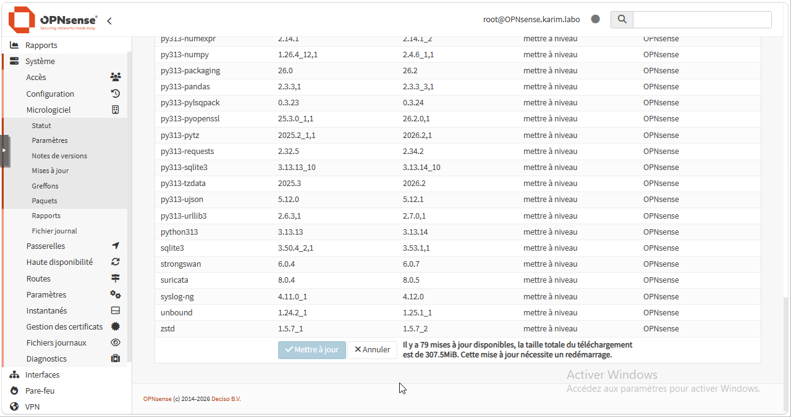

Une fois les mise à jour effectuées, il est nécessaire de redémarrer OPNsense pour que les changements soient pris en compte.

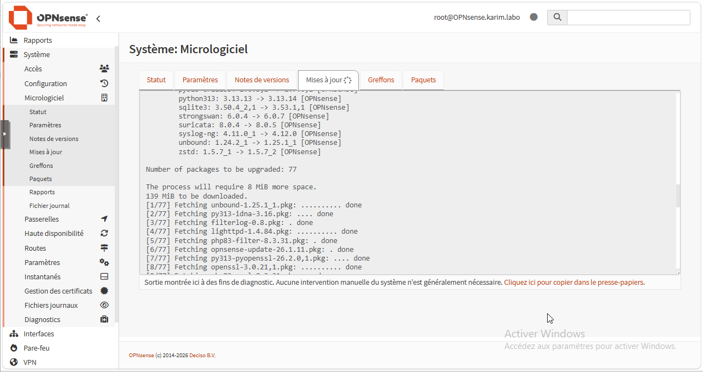

Nous avons accès à un joli tableau de bord qui nous permet de visualiser l'état du système et les différentes interfaces réseau.

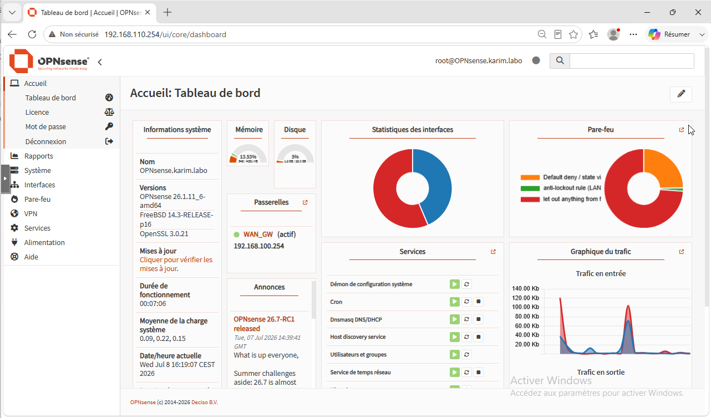

### Accès à l'interface web depuis le WAN

:::danger
Pour des raisons de sécurité, l'accès à l'interface web d'OPNsense est désactivé par défaut depuis l'interface WAN. Il est fortement recommandé de ne pas activer.
:::

#### Activation de l'accès HTTPS

Dans le menu `System` > `Settings` > `Administration`, il est possible d'activer le protocole HTTPS et préciser le port d'écoute (par défaut 443).

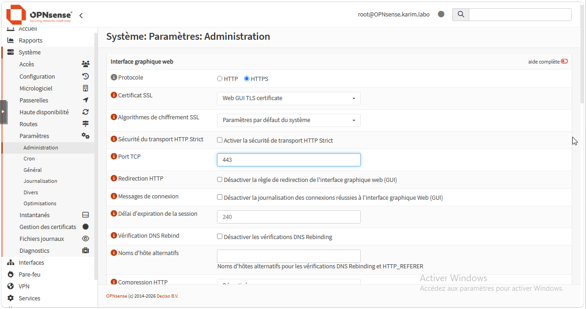

#### Autoriser le trafic vers l'interface web depuis le WAN

Il u a deux action à mener pour autoriser le trafic vers l'interface web depuis le WAN.

1. Créer une règle de pare-feu pour autoriser le trafic vers l'interface web depuis le WAN.

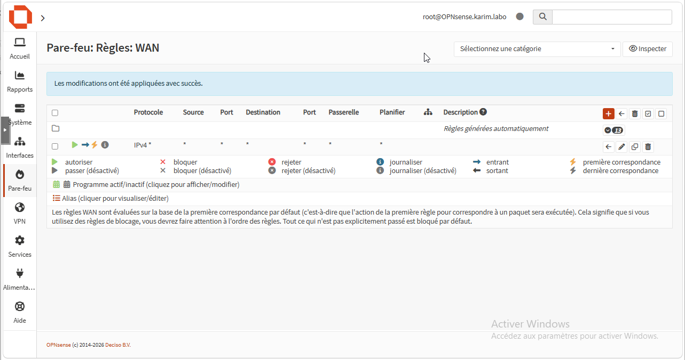

2. Dans les paramètres du pare-feu, il faut activer les options `Disable reply-to` et `Anti-lockout` pour que le trafic puisse passer correctement.

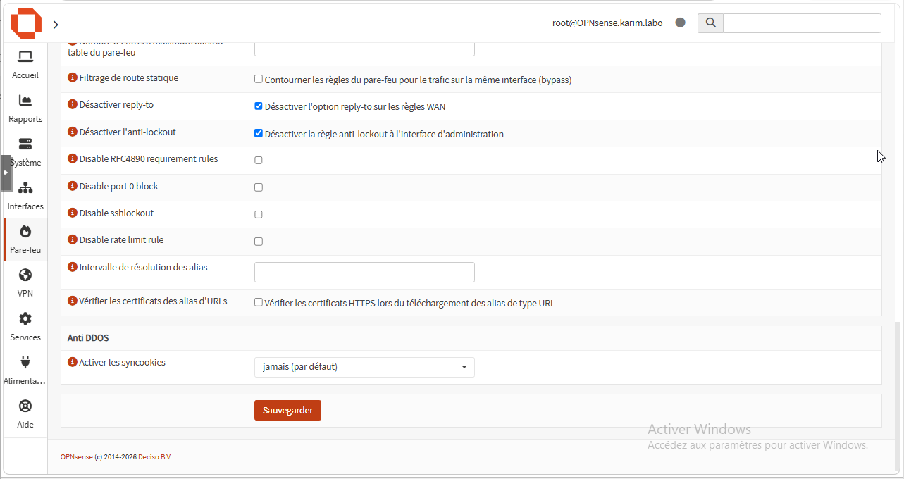

L'interface est disponible depuis le WAN !

## Configuration avancée

### Configuration DHCP

Aller dans le menu `Services` > `DHCPv4` > `Kea DHCP Server` pour configurer le serveur DHCP.

Activer le serveur DHCP sur l'interface LAN et configurer la plage d'adresses IP à distribuer.

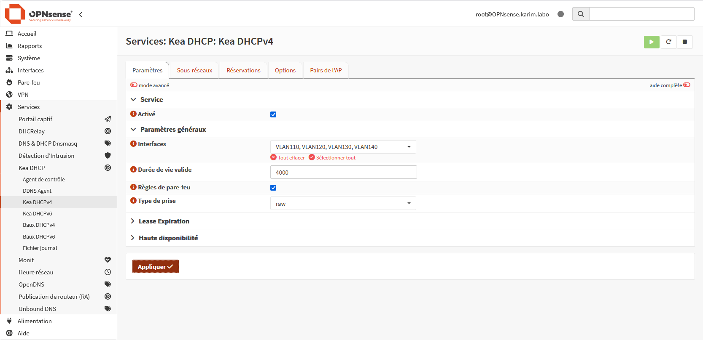

1. Sur l'interface LAN, ajouter une IP Fixe.

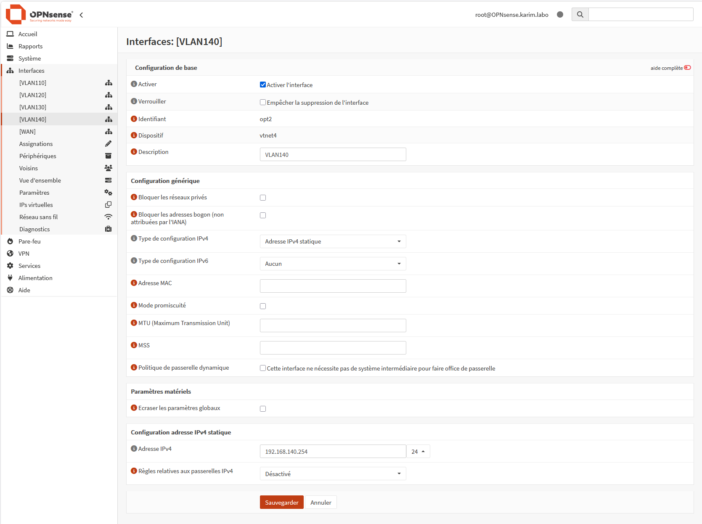

2. Dans les services DHCP, activer le service sur les interfaces LAN

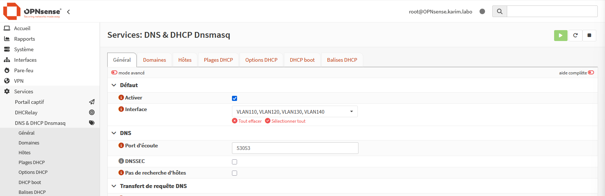

3. Créer les étendues DHCP pour chaque VLAN.

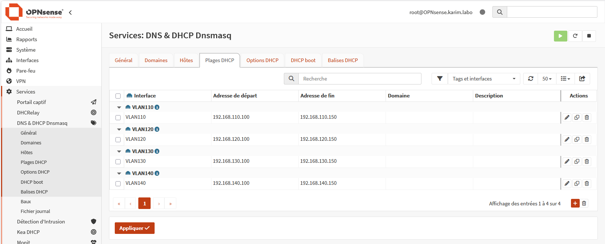

4. Ajouter une règle sur le pare-feu pour autoriser le trafic DHCP sur l'interface LAN.

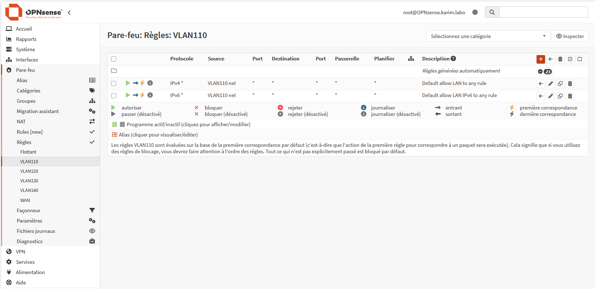