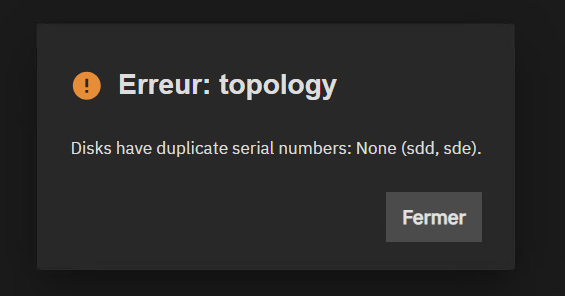
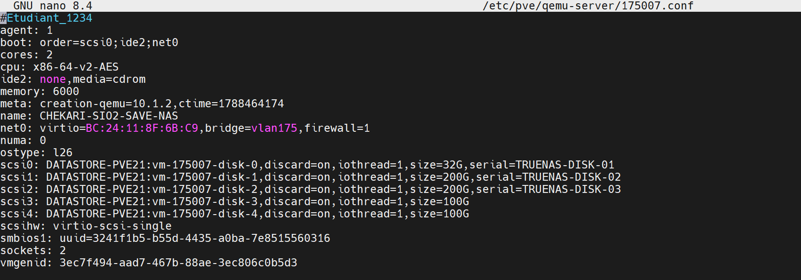

:::note
Version 25.04 / 25.10
:::

Erreur : Disks have duplicate serial numbers: None (sdd, sde).



Lors de la création d'un pool de stockage, il est possible que vous rencontriez une erreur indiquant que certains disques ont des numéros de série en double. Cette situation peut survenir si vous utilisez des disques provenant du même fabricant ou si vous avez cloné des disques.

Typiquement, cette erreur se retrouve lorsque le TrueNas est virtualisé dans un hyperviseur comme ProxMox.

Pour résoudre ce problème, vous pouvez suivre les étapes suivantes :

1. **Arreter le TrueNas** : Assurez-vous que le TrueNas est complètement arrêté avant de procéder à toute modification.
2. ** Modifier le fichier de configuration de la VM** : Accédez en SSH au serveur et modifier le fichier :

```bash
nano /etc/pve/qemu-server/ID_VM.conf
``` 

Ajouter la ligne suivante pour chaque disque concerné par l'erreur :

```bash
xxxxxxxxxxxxxxxxxxxxxxxx,serial=UNIQUE_SERIAL_NUMBER
```



3. Redémarrer le TrueNas : Une fois les modifications apportées, redémarrez le TrueNas et vérifiez si l'erreur persiste.
