Un LUN (Logical Unit Number) iSCSI est une unité de stockage logique présentée par un serveur de stockage (comme TrueNAS) à un client (comme un serveur ou une machine virtuelle) via le protocole iSCSI. Il permet aux clients d'accéder à des ressources de stockage distantes comme s'il s'agissait de disques locaux.

## Ajout d'un volume de stockage pour iSCSI
Avant de créer un LUN iSCSI, il est nécessaire d'avoir un volume de stockage configuré sur TrueNAS. Nous allons créer un volume ZFS dédié à l'iSCSI.
Aller dans le menu Storage > Add zVol.
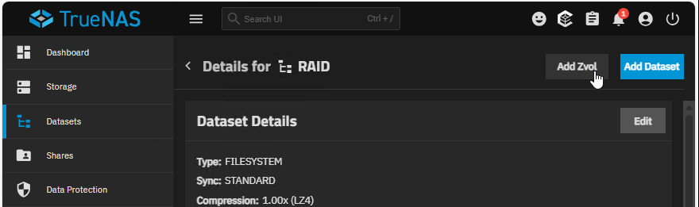
Nous allons créer un zVol nommé "LUN-ISCSI" avec une taille de 100 Go.
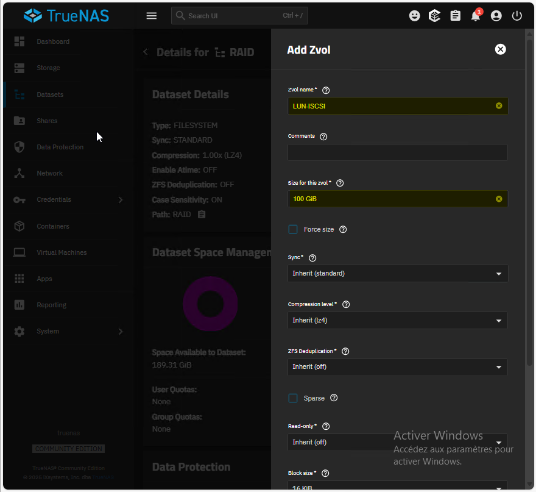
Nous sauvegardons la configuration.
Nous avons donc un volume ZFS prêt à être utilisé pour le LUN iSCSI.
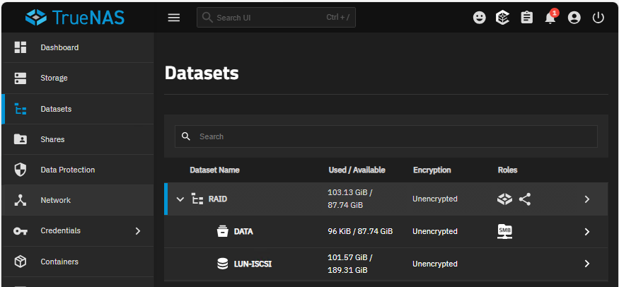

## Configuration d'un LUN iSCSI sur TrueNAS
Nous allons aller dans le menu Shares > Block (iSCSI) > LUNs pour créer un nouveau LUN iSCSI en utilisant l'assistant.
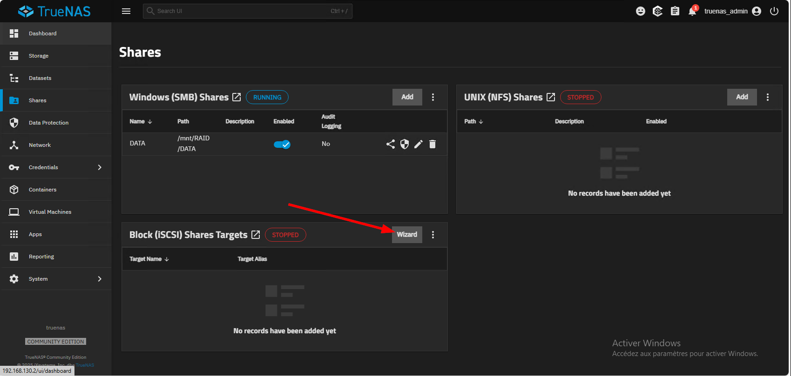
On choisit de créer une nouvelle cible iSCSI.
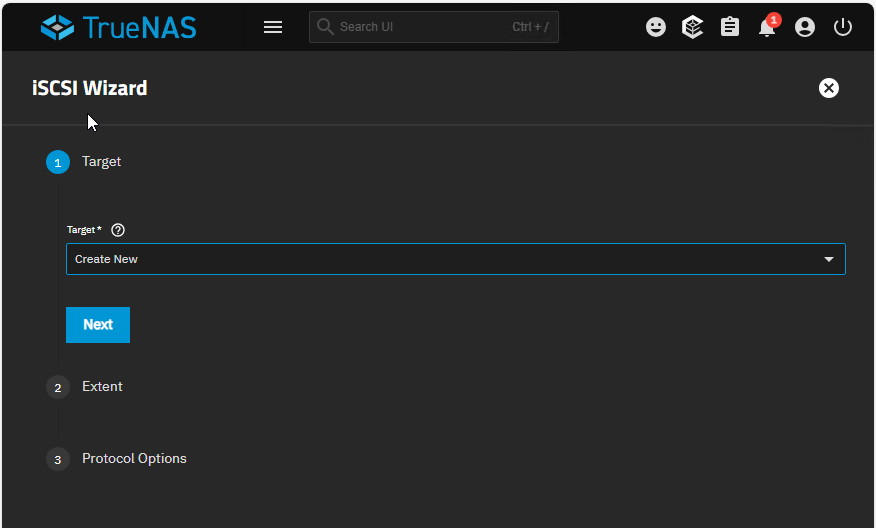
Il faut ensuite lui donner un nom, sélectionner le zVol créé précédemment et définir la taille du LUN.
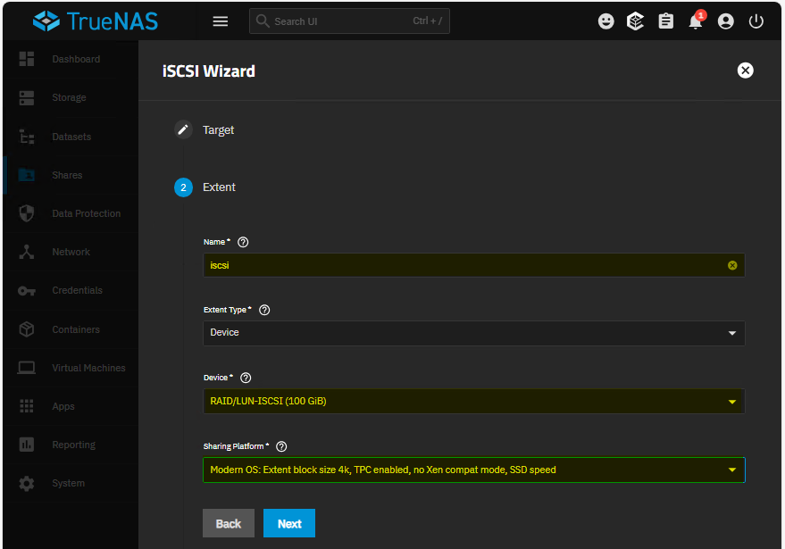
Créer un nouveau portail iSCSI. Lui donner son IPv4 (adresse IP de l'interface réseau de TrueNAS) et le port 3260 et laisser la partie initiator vide pour autoriser tous les initiators.
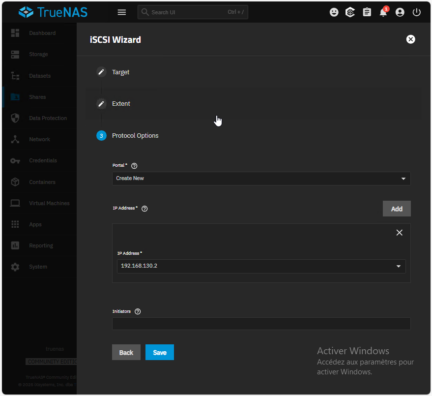
On démarre le service iSCSI dans le menu Services.

## Connexion au LUN iSCSI depuis un client Windows Server
Sur le client Windows Server, ouvrir le gestionnaire iSCSI (iSCSI Initiator).
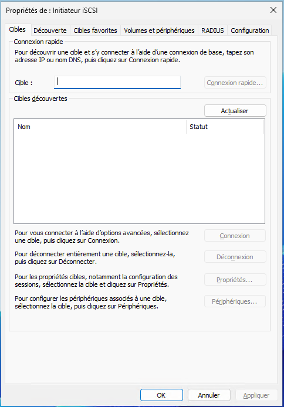
Dans l'onglet Découverte, ajouter l'adresse IP de TrueNAS pour découvrir les cibles iSCSI disponibles.
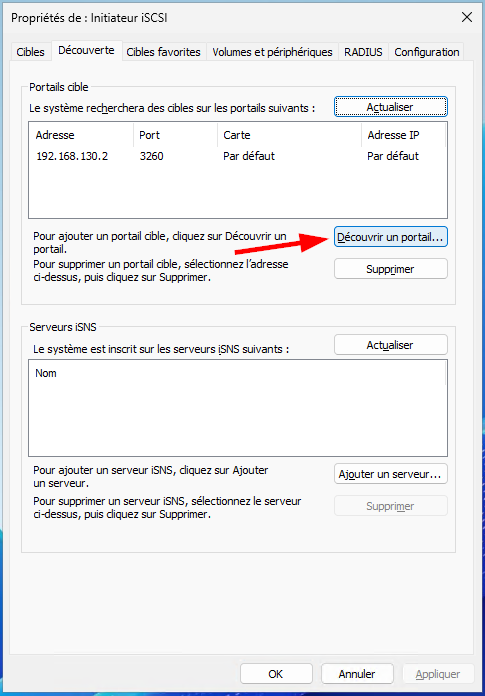
Dans l'onglet Cibles, sélectionner la cible iSCSI découverte et cliquer sur Connexion.
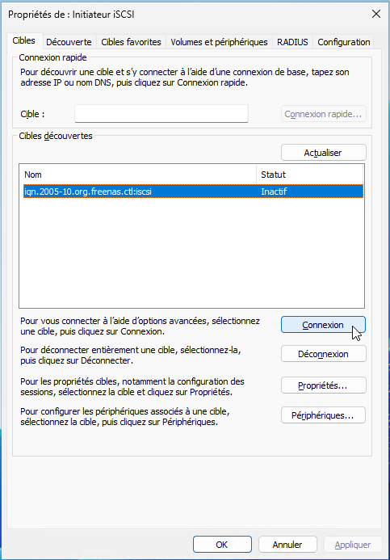
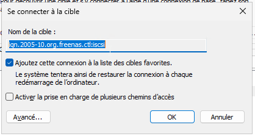

Le LUN iSCSI est maintenant connecté au client Windows Server.

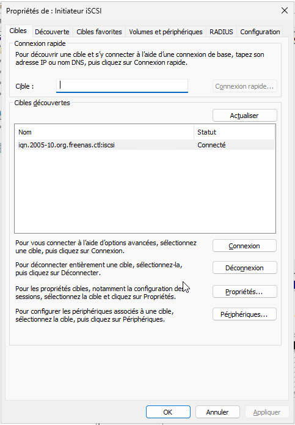

## Initialisation et formatage du LUN iSCSI sous Windows Server
Ouvrir le gestionnaire de disques (diskmgmt.msc) sur le client Windows Server.
Le nouveau disque iSCSI devrait apparaître comme un disque non initialisé.
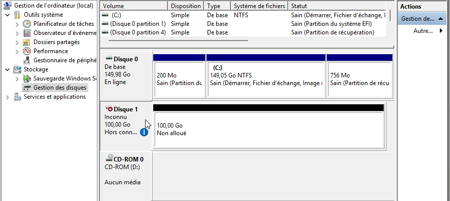
Initialiser le disque en choisissant le style de partition GPT.
Créer un nouveau volume simple, formater le disque avec le système de fichiers NTFS et lui attribuer une lettre de lecteur.
Le LUN iSCSI est maintenant prêt à être utilisé sur le client Windows Server.

