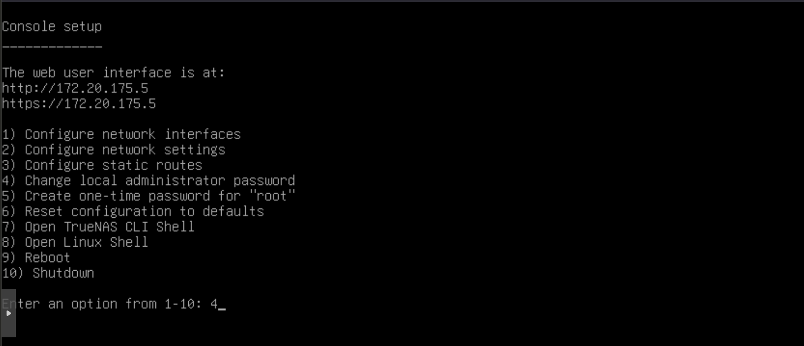
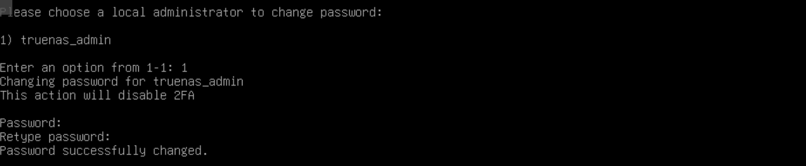
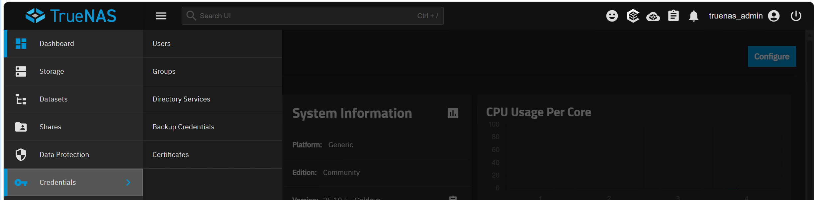
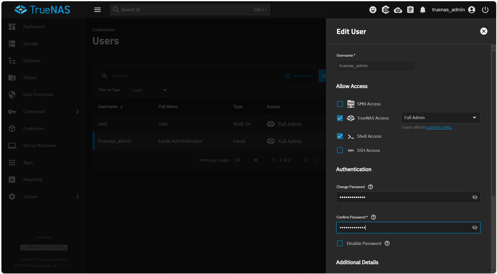

:::note
Version 25.04 / 25.10
:::

## Configuration depuis le CLI
La configuration IP peut se faire depuis le CLI (ligne de commande) en utilisant le choix 4 `Change local administrator password`.

:::caution
Attention, le clavier est en QWERTY, donc pour taper le mot de passe, il faut faire attention à la disposition des touches.
:::

Il faut ensuite choisir l'utilisateur pour lequel on veut changer le mot de passe (ici `truenas_admin`) puis taper le nouveau mot de passe deux fois pour le confirmer.

## Configuration depuis l'interface web

Il est également possible de configurer le mot de passe administrateur depuis l'interface web. Pour cela, il faut se connecter à l'interface web de TrueNas CE et aller dans `Credentials` puis `Users`.

On va ensuite editer l'utilisateur puis changer le mot de passe en le tapant deux fois pour le confirmer.

