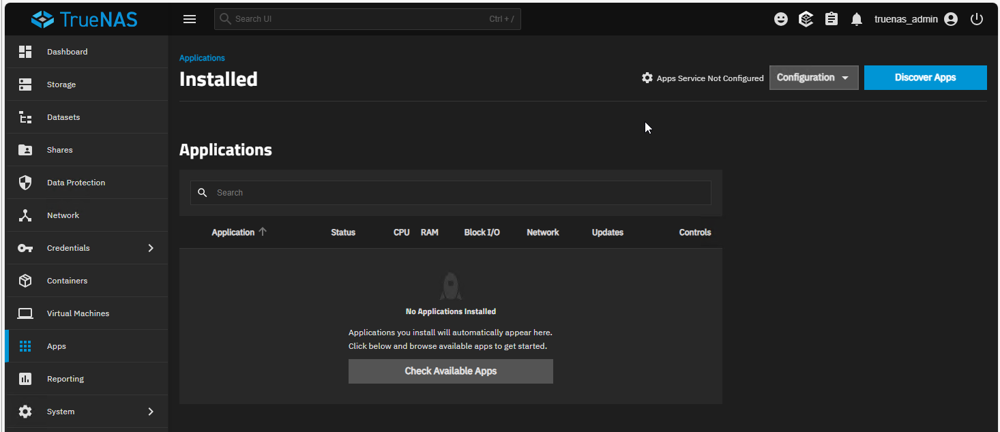
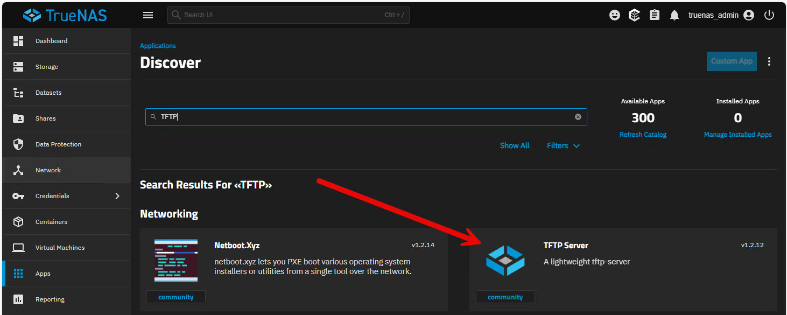
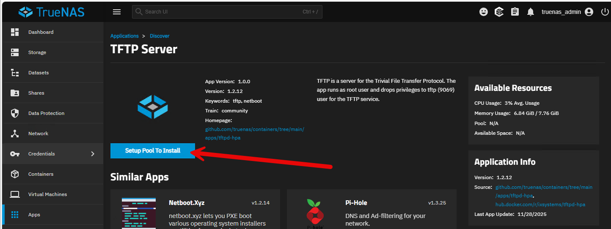
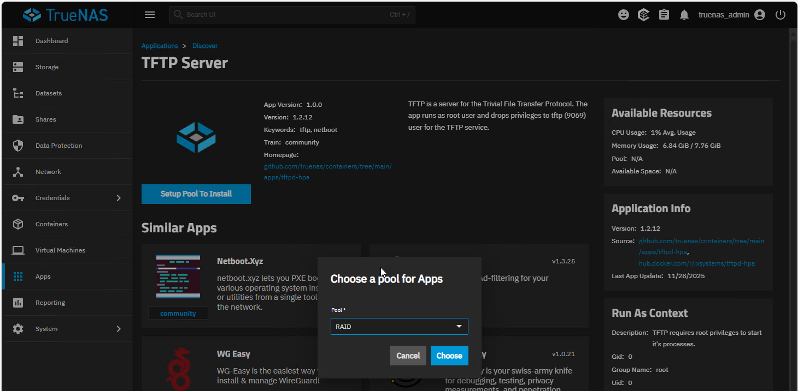
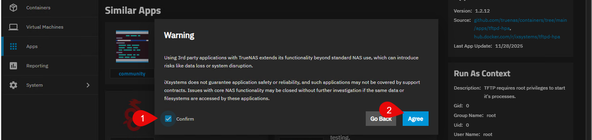
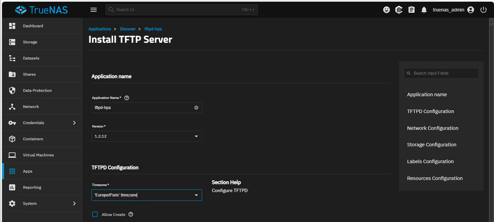
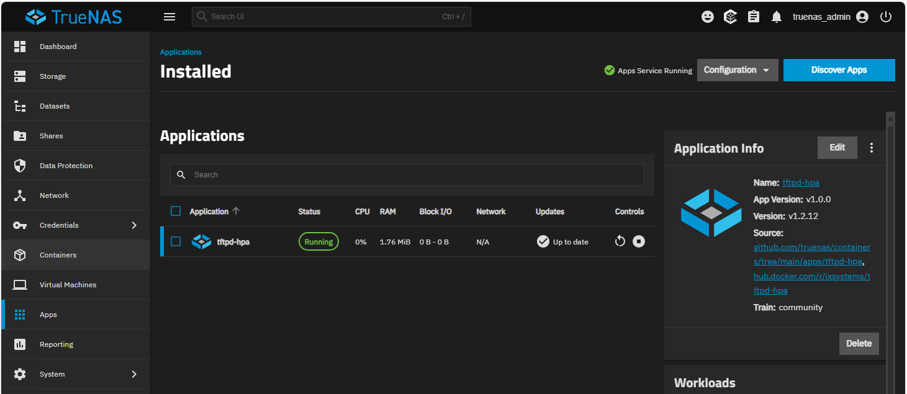

:::note
Version 25.04
:::
TrueNas n'est pas fournir en standard avec une application TFTP mais il est facile de l'ajouter.
Vous devez disposer d'une connexion Internet.

Aller dans **Apps** puis cliquer sur **Discover Apps**

Rechercher **TFTP Server** puis cliquer sur l'application.

Une fois dans la configuration de l'application, cliquer sur **Setup Pool To Install**

Choisir le pool concerné par l'installation.

Confirmer que vous accepter malgré le Warning.

Changer le fuseau horaire puis l'ancer l'installation en bas de page.

L'application est en cours d'éxecution.
