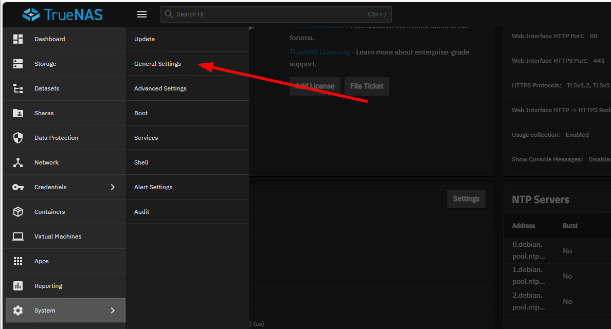
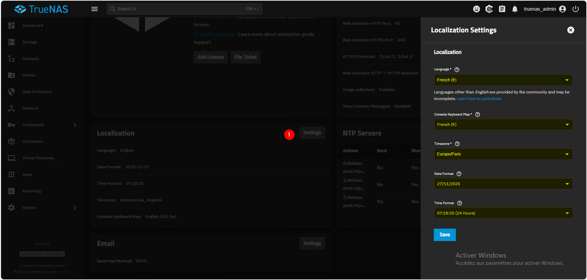

:::note
Version 25.04
:::
La première chose à faire est de configurer les paramètres de localisation (langue, fuseau horaire, clavier) dans **System Settings > General**.

Ensuite, dans **Localization** :
- Passer en français
- Choisir le fuseau horaire
- Configurer le clavier en AZERTY (France) 
- Le format de la date et de l’heure

