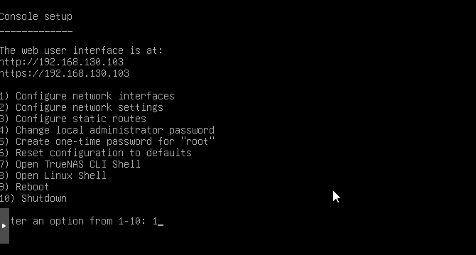
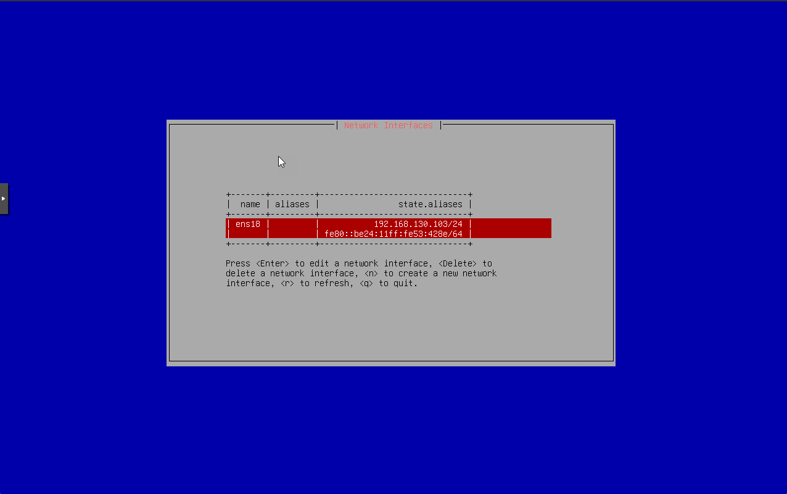
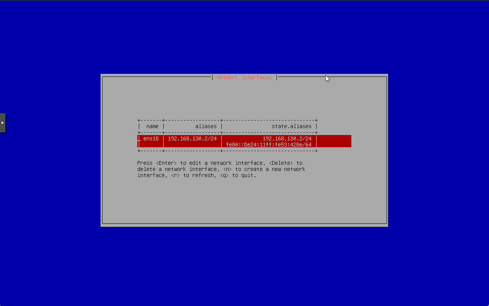
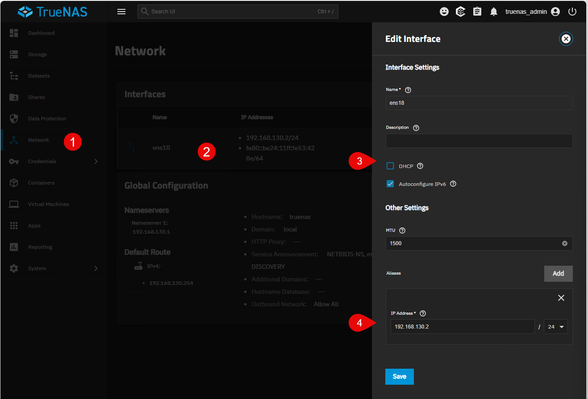

:::note
Version 25.04
:::

## Configuration depuis le CLI
La configuration IP peut se faire depuis le CLI (ligne de commande) en utilisant le choix 1 "Configure Network Interfaces".

On va voir la liste des interfaces réseau disponibles.
on choisit l'interface à configurer (ici `ens18`).

On va passer par le DHCP, on choisit donc `n` pour ne pas utiliser le DHCP (appuyer sur la touche entrée pour valider).
Dans aliases, on va ajouter une adresse IP statique.
puis `save` pour valider les changements.

On applique la configuration avec "a" (attention, clavier QWERTY).
Puis "p" pour que la configuration soit persistante au redémarrage.
puis "q" pour quitter.

Dans le menu 2, on peut configurer la passerelle par défaut ainsi que les serveurs DNS.

## Configuration depuis l'interface web
On peut aussi configurer l'interface réseau depuis l'interface web.
Aller dans "Network" puis "Interfaces".
Cliquer sur l'interface à configurer (ici `ens18`).

Nous pouvons passer par le DHCP ou configurer une adresse IP statique.

