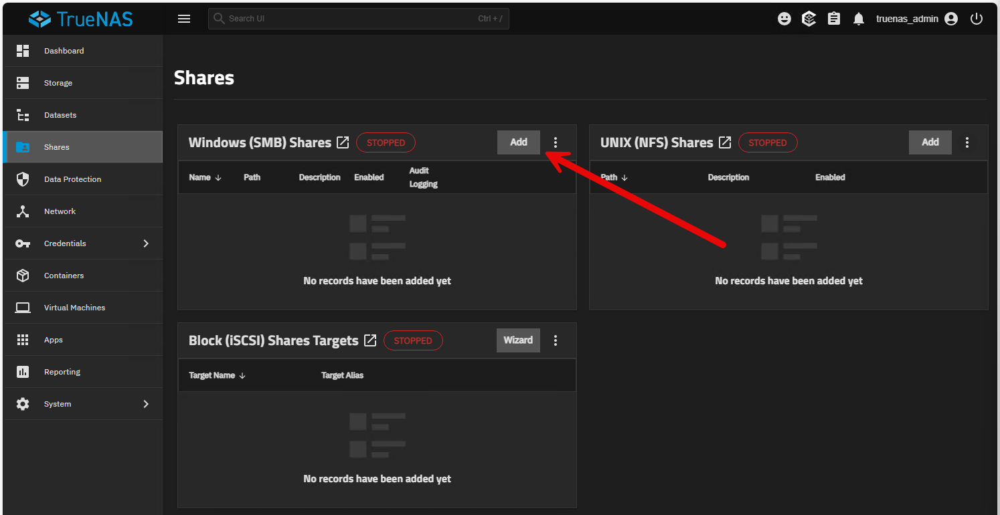
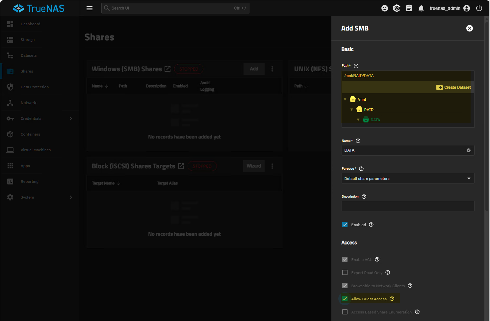
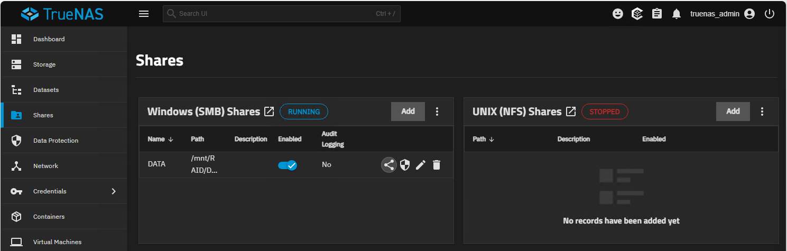
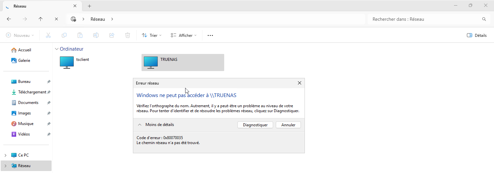
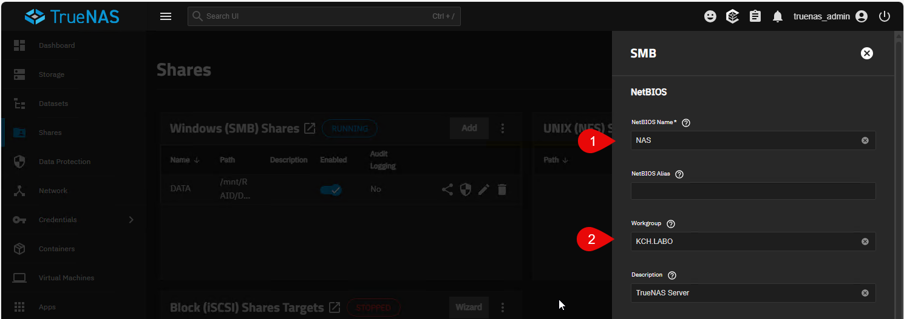
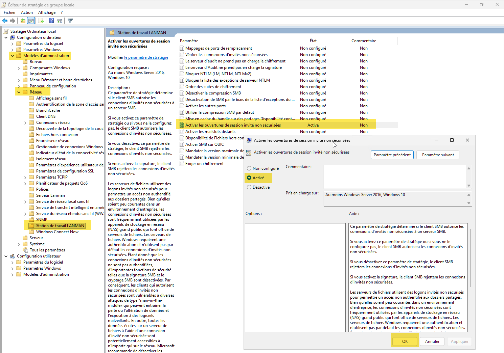
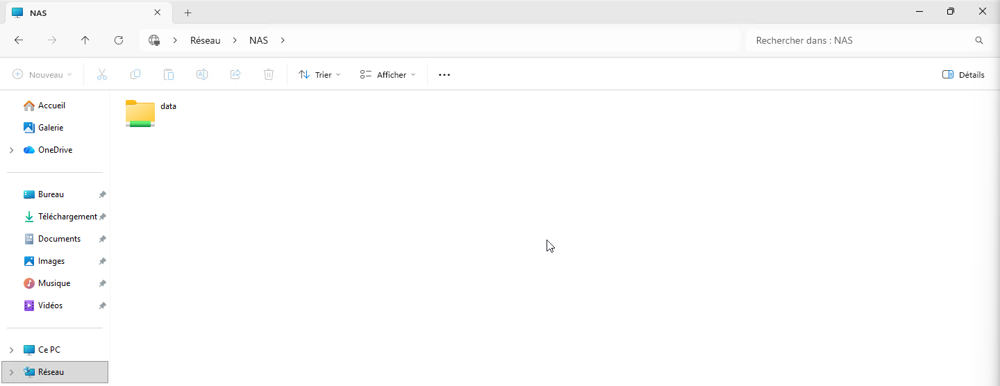

:::note
Version 25.04
:::

Nous allons configurer un partage SMB (Samba) sur TrueNAS pour permettre aux utilisateurs Windows d'accéder aux fichiers stockés sur le serveur TrueNAS.

## Activer le service SMB
Aller dans **Shares** et activer le service **Windows (SMB) Shares** en cliquant sur le bouton **Add** à droite.



Nous allons choisir le dataset créé précédemment pour le partage SMB. Puis cliquer sur les options avancées pour configurer les permissions. Autoriser les utilisateurs invités en cochant la case **Allow Guest Access**. Puis cliquer sur **Save**.



Ne pas modifier les ACLs pour le moment, nous avons déjà configuré les permissions au niveau du dataset.
Le service va démarrer.



Si vous avez l'erreur **Code d'erreur : 0x80070035 Le chemin d'accès réseau n'a pas été trouvé**

Il faut configurer le Workgroup pour qu'il corresponde à celui de votre réseau local. Aller dans **Services > SMB > Configure service**.



Sinon, dans les steatégies de sécurité de Windows, il faut activer les ouvertures de session invités non sécurisées.



IL est possible de le faire par GPO également.

.png>)

Si le souci persiste, lancer ses commandes PowerShell en administrateur :

```powershell
PS C:\Users\administrateur> Set-SmbClientConfiguration -EnableInsecureGuestLogons $true -Force
PS C:\Users\administrateur> Set-SmbClientConfiguration -RequireSecuritySignature $false -Force
PS C:\Users\administrateur> Set-SmbServerConfiguration -RequireSecuritySignature $false -Force
PS C:\Users\administrateur>
```
L'accès est maintenant possible.


