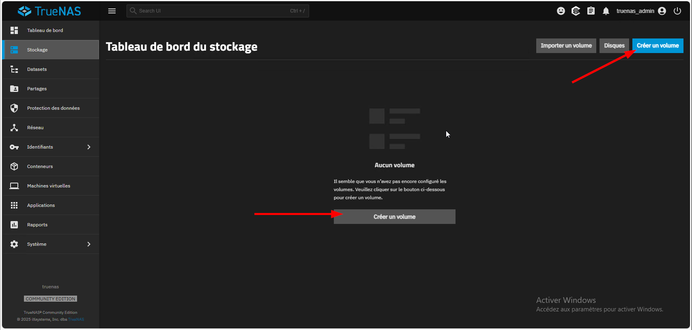
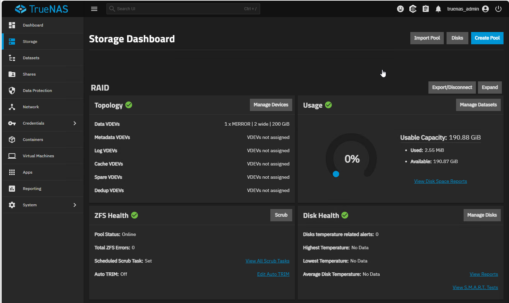
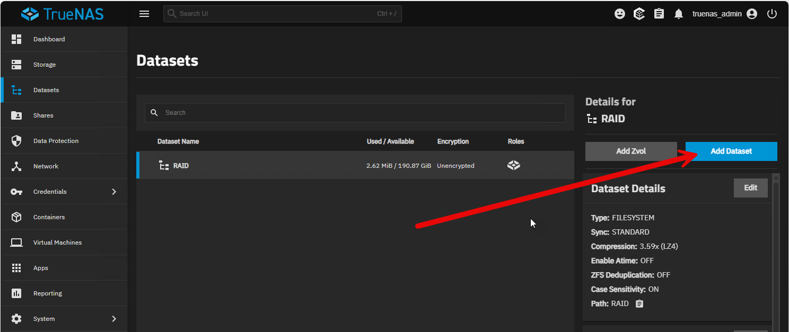
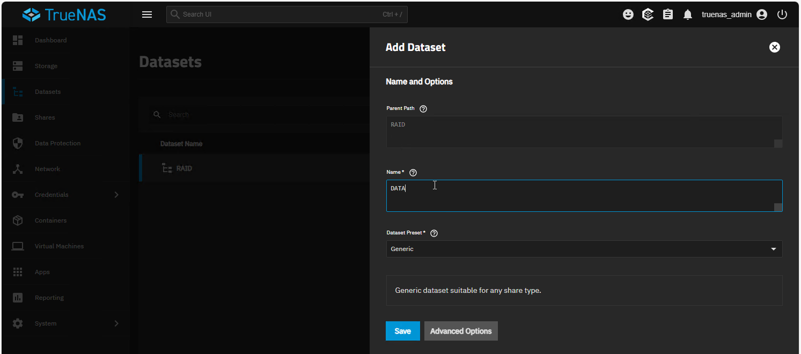
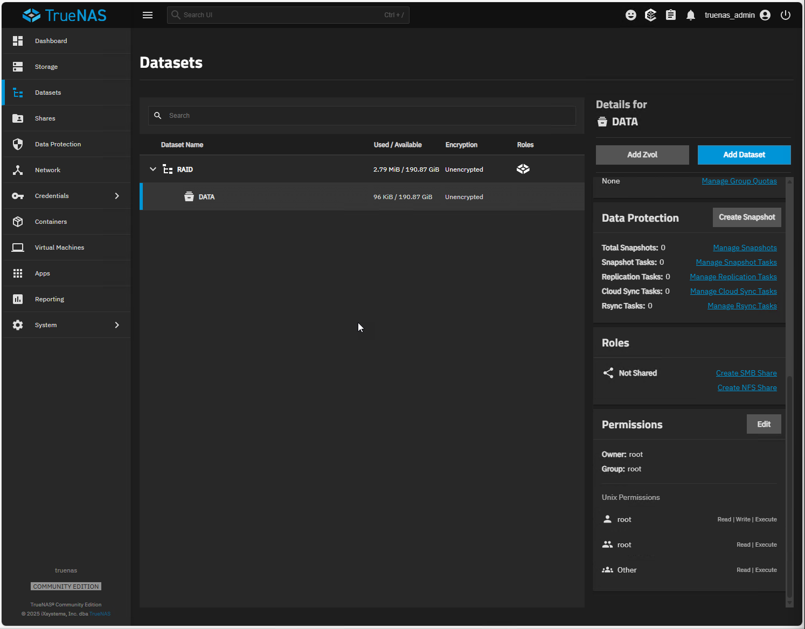
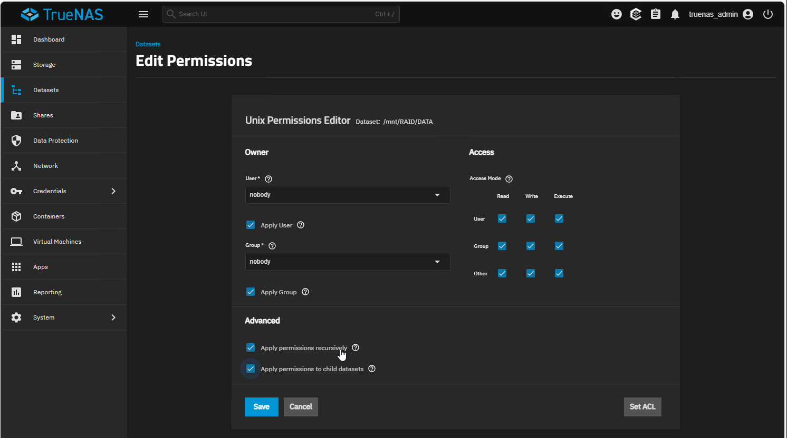
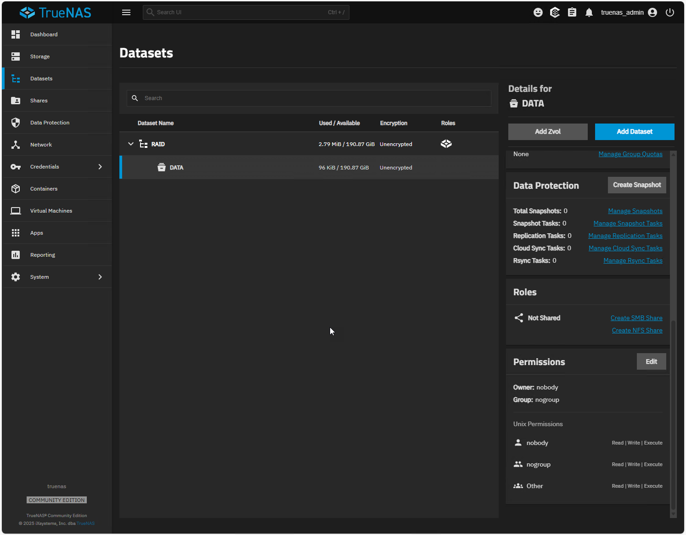

:::note
Version 25.04
:::

Nous allons créer un volume RAID pour stocker les données avec deux disques de 200go en RAID 1 (miroir) afin d’assurer la redondance des données.

:::tip
Rappel sur le RAID :
-  Stripe ou RAID0, si vous perdez un seul disque, tout le volume sera HS, il n'y a pas de tolérance de panne.
-  Mirror ou RAID1 vous pouvez perdre un disque, les données sont stockées sur les deux disques.
-  RAIDZ ou RAID5 À partir de 3 disques, vous pouvez en perdre un.
:::

Pour créer un volume RAID, aller dans **Stockage > Créer un volume**.

Donner un nom au volume, sélectionner les disques à inclure dans le volume et choisir le type de RAID (ici MIROIR).
On en modifie pas les options facultatives.

Le volume est créé, nous allons créer un dataset pour stocker les données.
Aller dans le volume créé et choisir **Add Dataset**.

Donner un nom au dataset (ici "data") et valider.

Le dataset est créé, nous allons maintenant configurer les permissions.
Choisir **Edit Permissions**.

Nous allons donner les permissions à l'utilisateur "nobody" et au groupe "nogroup" pour que le partage SMB puisse y accéder.
Sélectionner "nobody" pour l'utilisateur et "nogroup" pour le groupe.
Cocher les cases pour donner les permissions de lecture, écriture et exécution.
Valider en cliquant sur **Save**.

Le dataset est prêt à être utilisé pour le partage SMB.

