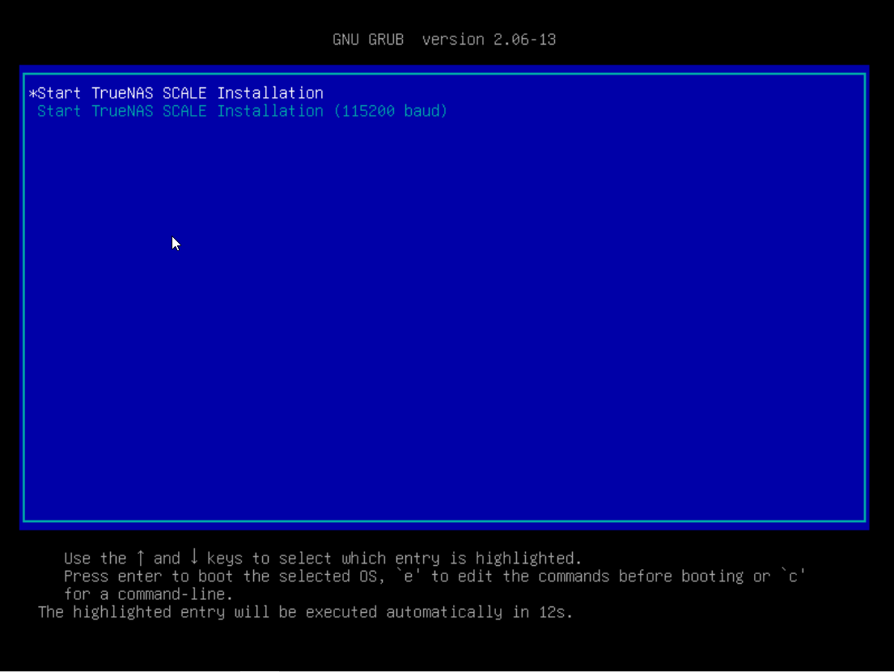
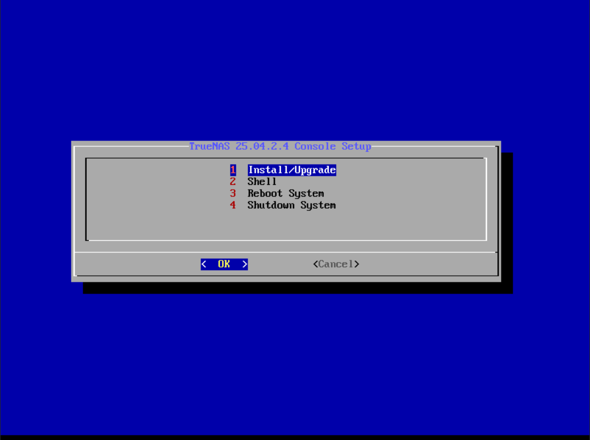
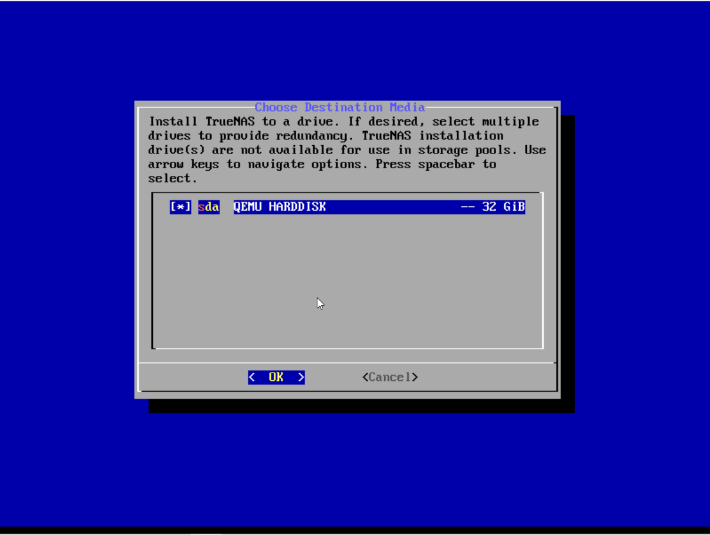
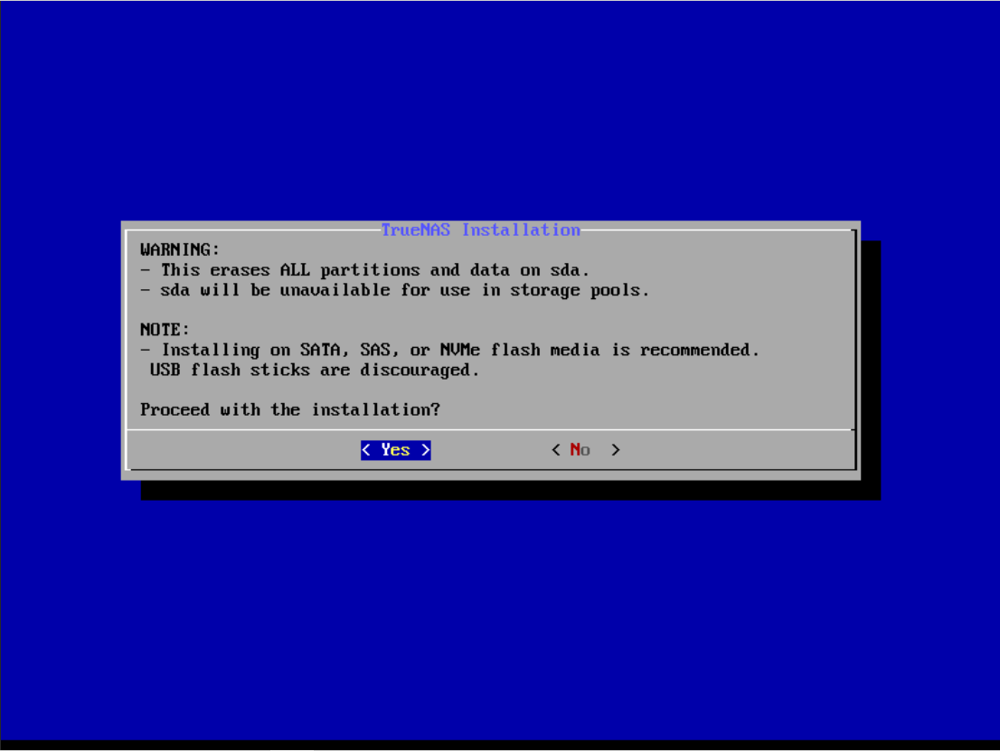
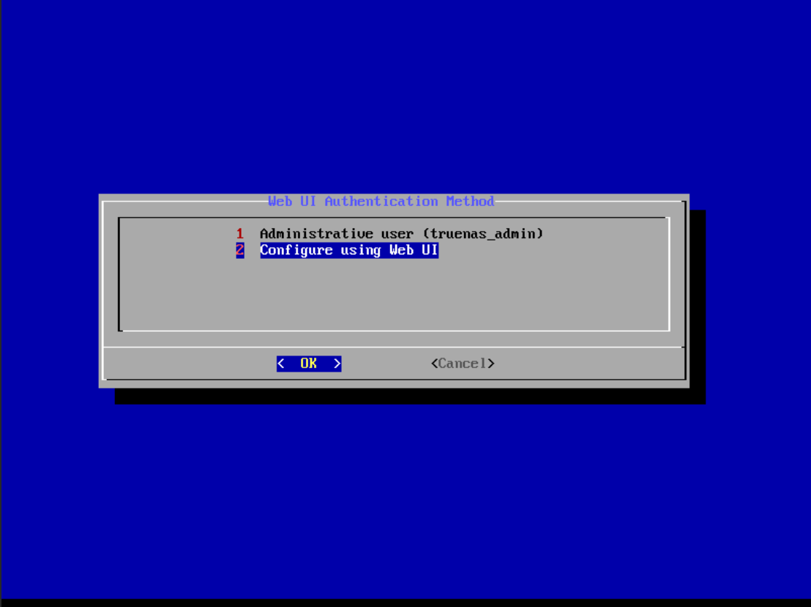
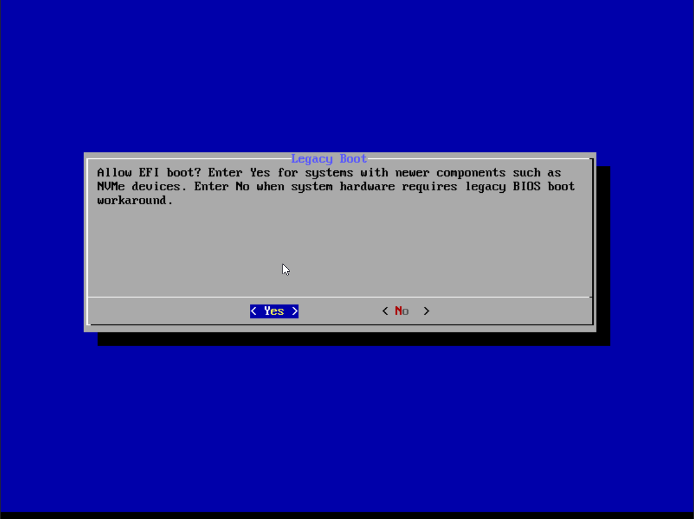
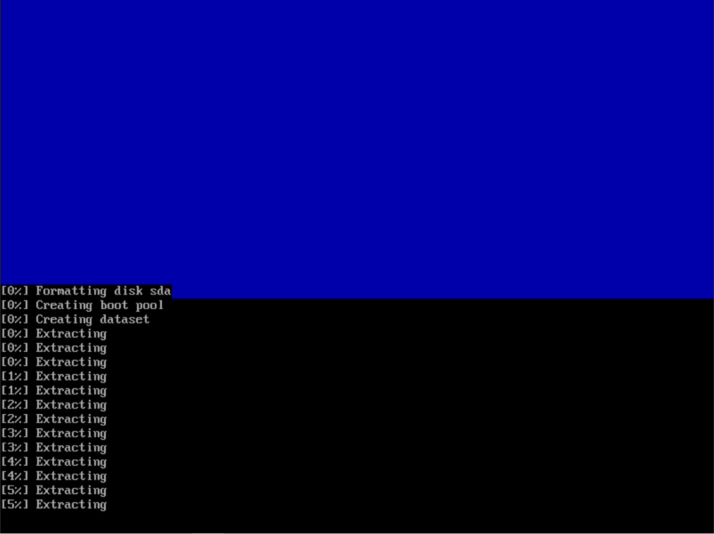
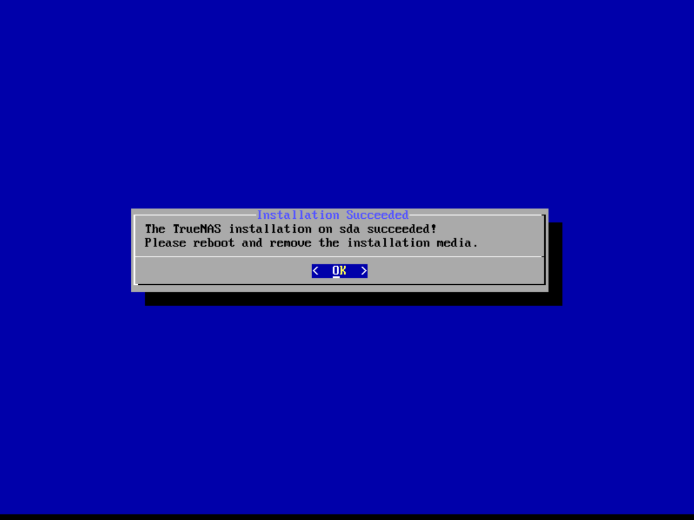
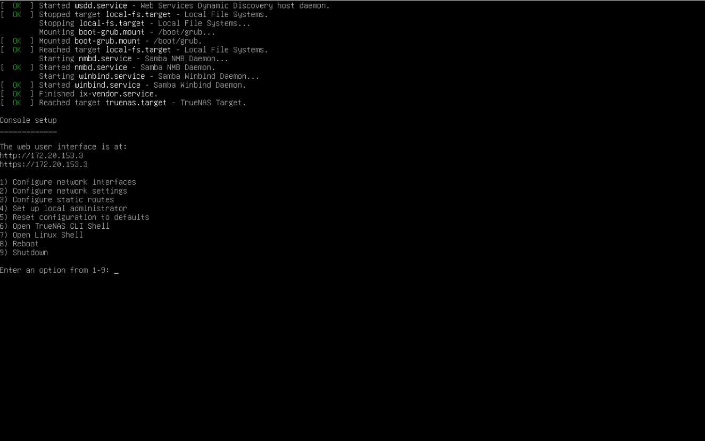
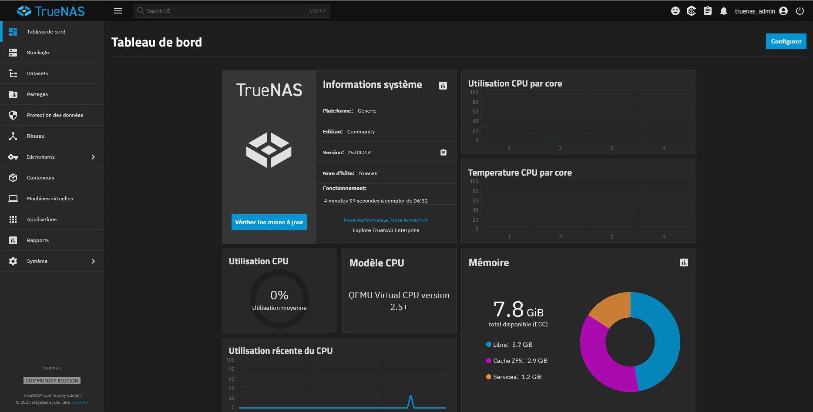

:::note
Installation version 25.04
:::
Ce guide concerne l’installation de TrueNas 25.04 sur une machine virtuelle ProxMox avec les caractéristiques suivantes :

https://www.truenas.com/docs/scale/gettingstarted/scalehardwareguide
- 4vCPU
- 8 Go RAM
- 32 Go stockage

Démarrer sur le disque puis choisir Install/Upgrade

Séléctionner ensuite le disque pour l’installation (touche ESPACE) et lancer l’installation

Le clavier étant en QWERTY, c’est plus simple de saisir le mot de passe lors de la première connexion à l’interface web.

Activer le boot EFI et l’installation se lance.

On peut maintenant redémarrer et nous arrivons sur un menu pour configurer l’IP et avoir accès à un SHELL

Depuis l’interface web, nous devons renseigner le mot de passe.
Nous sommes ensuite connecté sur l’interface web.
