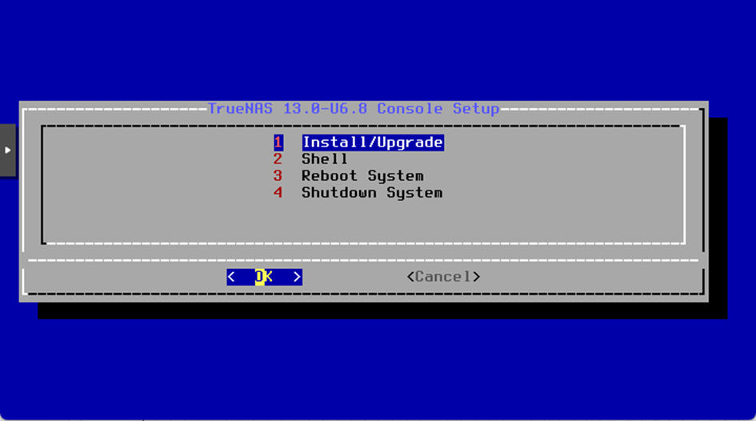
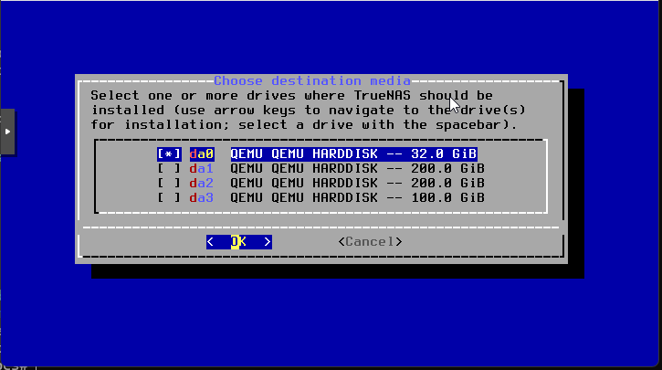
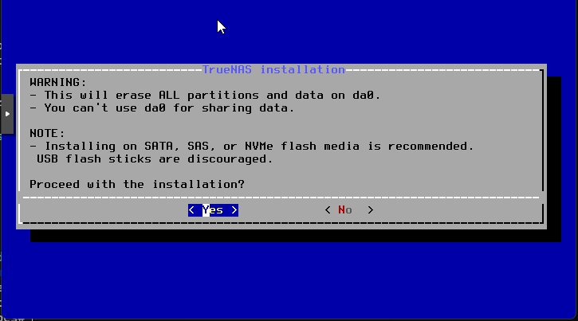
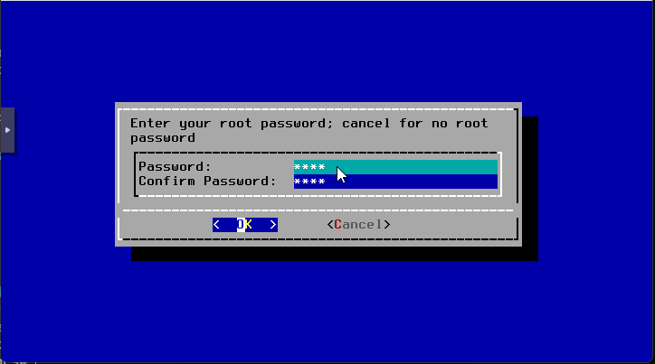
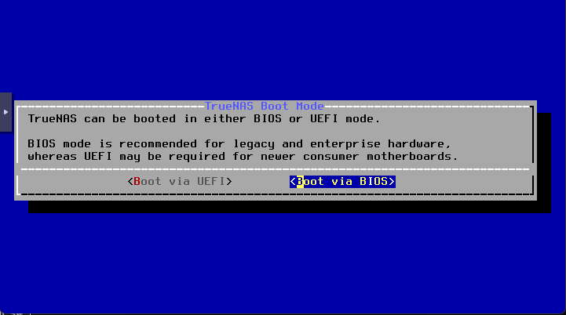
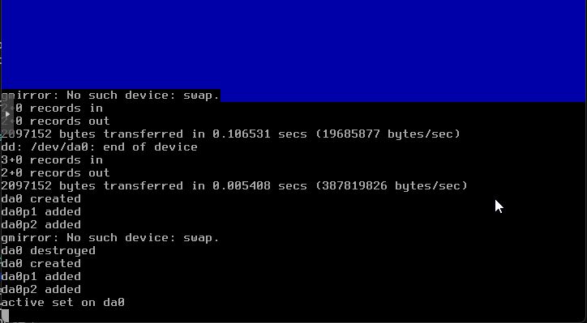
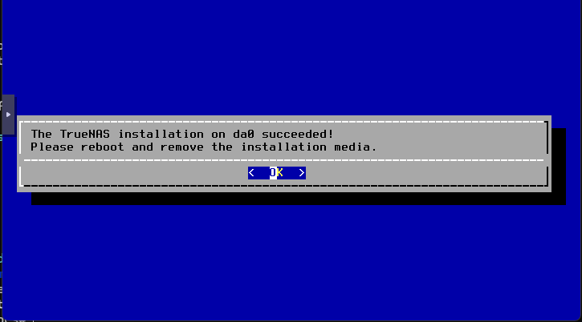
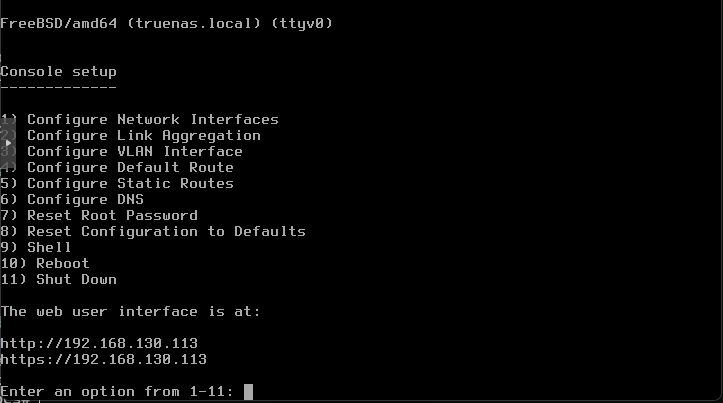

:::note
Installation version 13.0-U6.8
:::
Choisir Install/Upgrade

Sélectionner ensuite le disque pour l’installation (touche ESPACE) et lancer l’installation

Un message d’avertissement apparaît, valider avec YES

Saisir ensuite le mot de passe deux fois, attention le clavier est en QWERTY

Vous pouvez maintenant choisir le boot en UEFI ou Legacy, puis l’installation se lance.

Une fois l’installation terminée, redémarrer la machine.

Nous arrivons sur un menu pour configurer l’IP et avoir accès à un SHELL
