:::note
Installation version 13.0-U6.8
:::
Dans un dataset existant ou nouvellement créé, nous allons créer un volume iSCSI (LUN) afin de le partager avec un client.
Aller dans **Storage > Pools** puis sélectionner le pool dans lequel vous souhaitez créer le zVol.
- Donner un nom
- Une taille
- Compression Level : LZ4
- ZFS De-duplication : Désactivée
- Block size : 16K

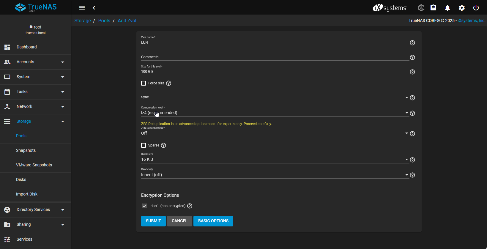

Le pool apparait maintenant avec le zVol créé.
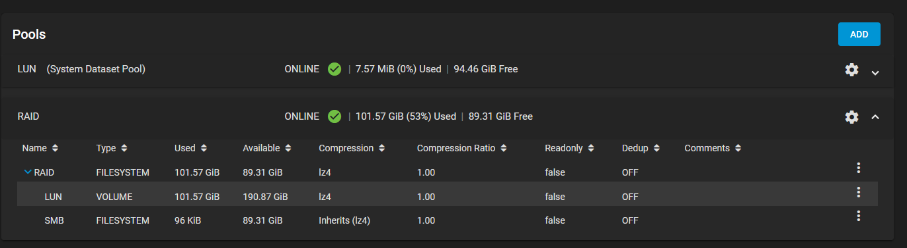

Aller dans **Sharing > Block Shares (iSCSI)** puis dans lancer le **Wizard**.
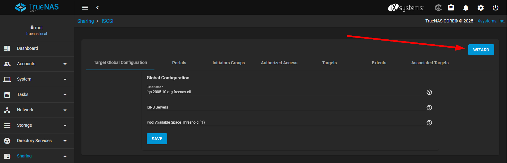

Dans la première étape :
- Donner un nom au Target
- Définir le type sur Device
- Selectionner le zVol créé précédemment
- Sharing Plateforme : Modern OS car nous allons partager ce LUN avec une machine virtuelle récente.
Faire ensuite **Next**.

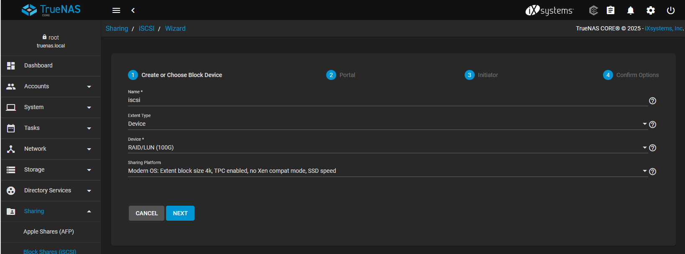

Créer un nouveau portail en spécifiant l’IP de votre serveur TrueNas.
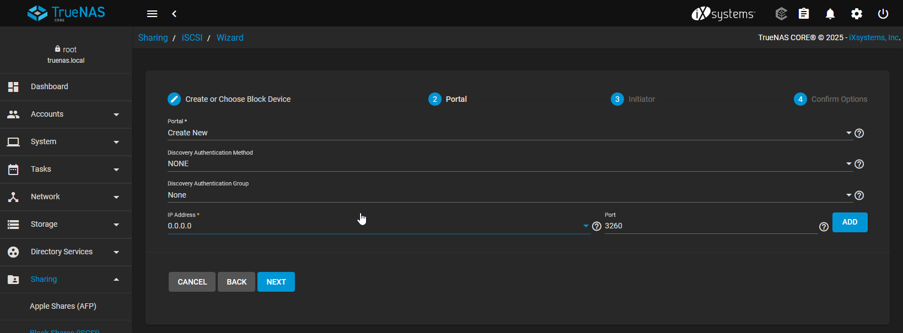
Faire ensuite **Next**.

Faire Next à l’étape des initiateurs puis valider le résumé.

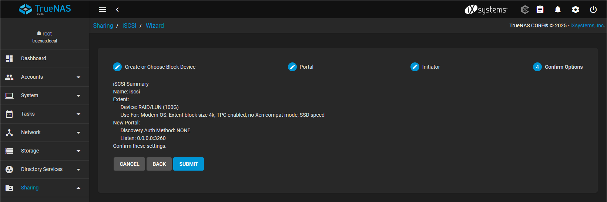

Démarrer le service iSCSI dans **Services > iSCSI**.

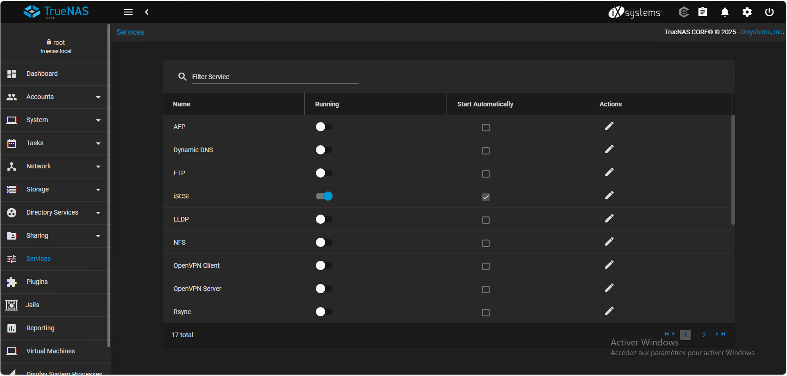

## Connexion depuis Windows Server 2025
Sur la machine Windows Server 2025, ouvrir le gestionnaire iSCSI (iSCSI Initiator) > Onglet Découverte.
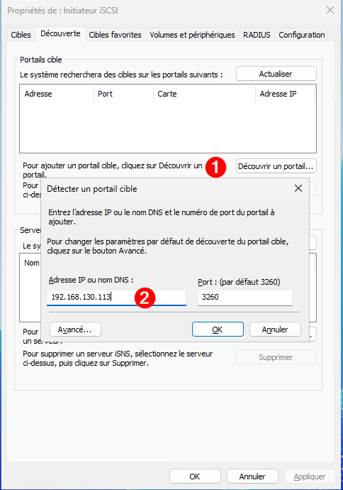

Connecter ensuite la cible iSCSI

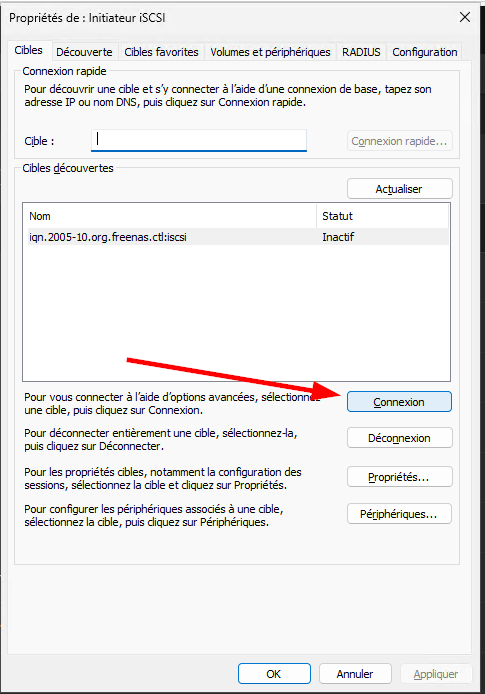

Dans le gestionnaire des disques, nous voyons maintenant le nouveau disque disponible.
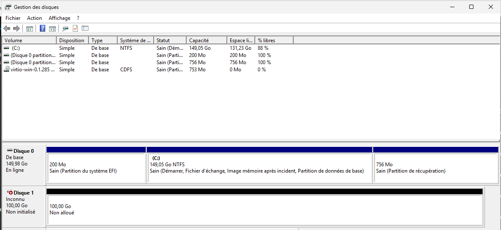
Il faut initialiser en créant une partition GPT avant de pouvoir l’utiliser.
Puis nous allons créér un nouveau volume simple que nous allons formater et lui affecter une lettre.

Le stockage apparait bien comme un disque local.

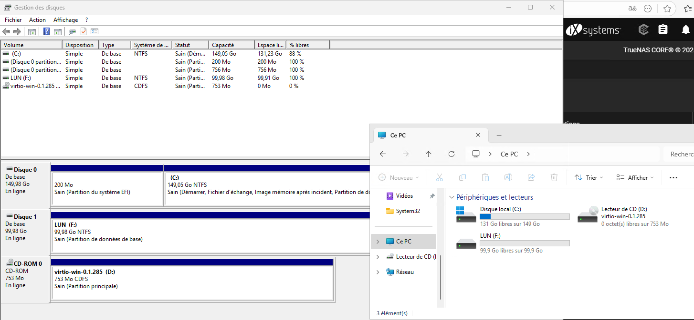