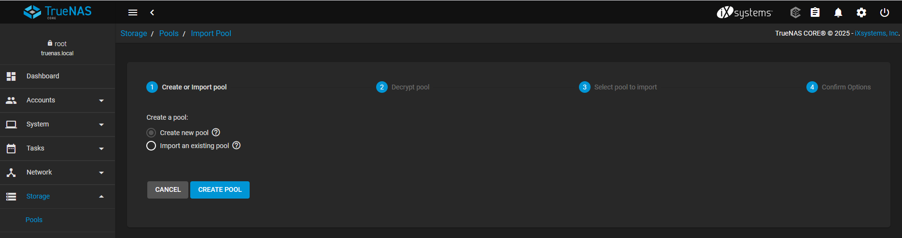
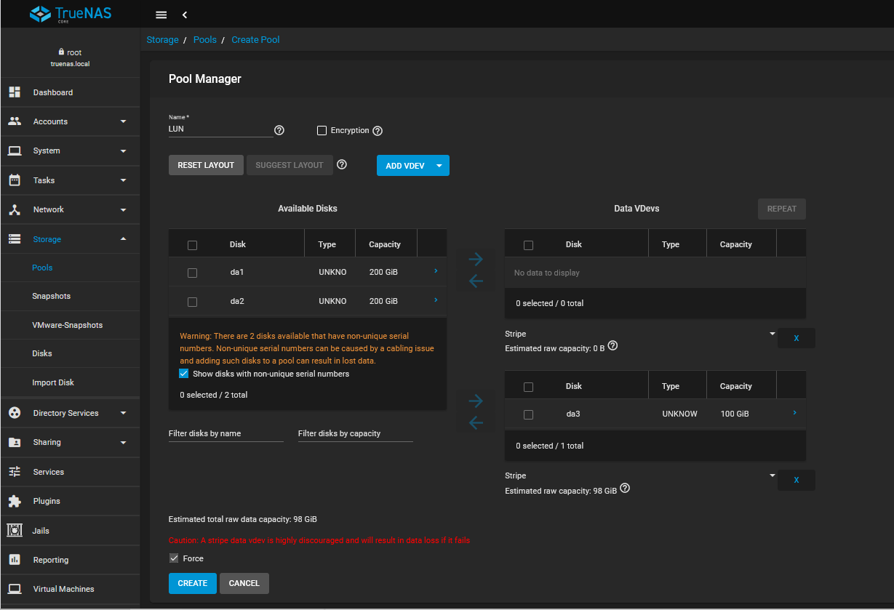

:::note
Installation version 13.0-U6.8
:::
Dans le menu de gauche, aller dans **Storage** > **Pools** puis cliquer sur  **Create new pool**

Nous allons faire un pool avec un seul disque (à éviter en production).
L'objectif est d'avoir un stockage simple pour monter un LUN iSCSI sur un Windows Server.
- Donner un nom au pool
- Sélectionner le disque puis cliquer sur la flèche pour l'ajouter au pool.
Cliquer sur **Create** pour créer le pool (un message d'avertissement apparaitera).

Le pool est maintenant créé.
