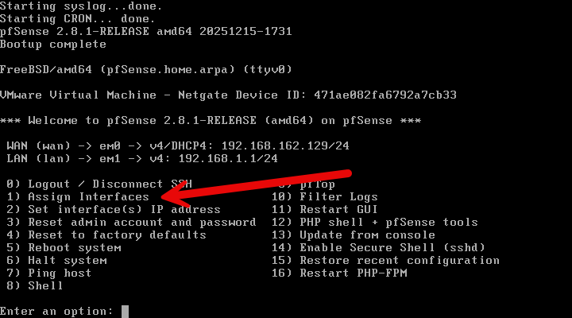
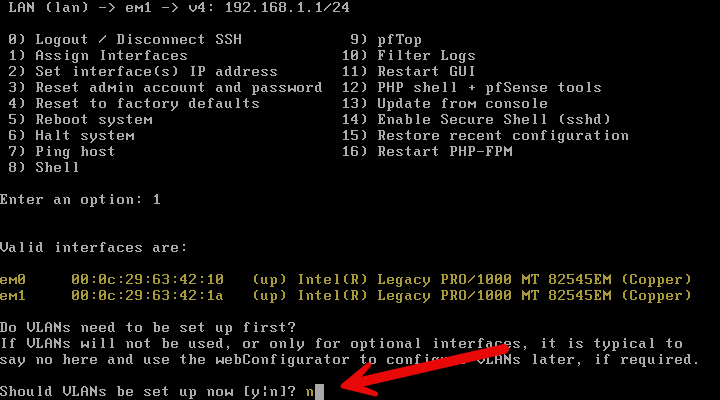
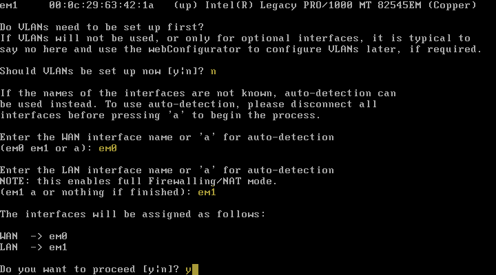
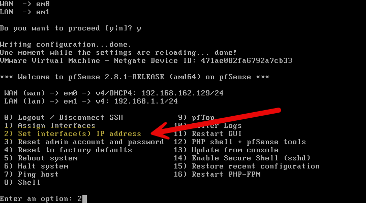
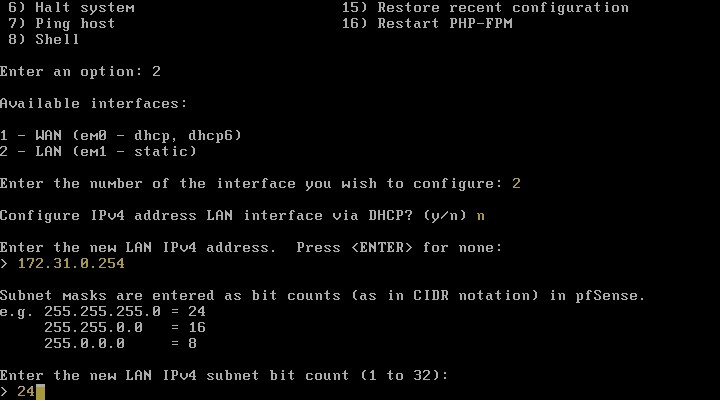
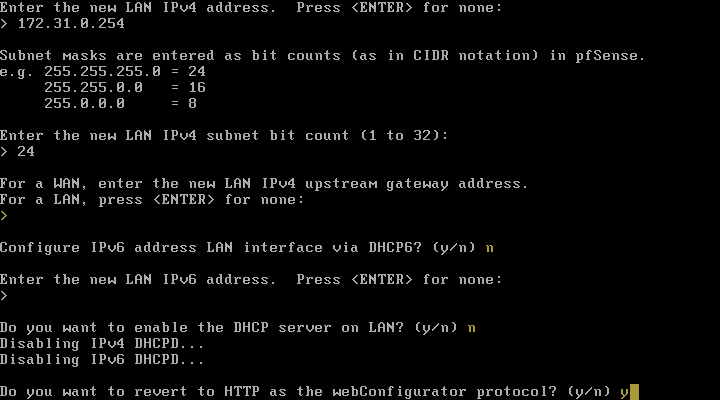
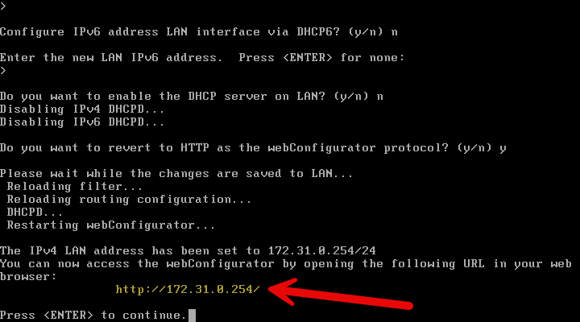

:::note
Configuration réalisée sur pfSense 2.8.1 CE
:::

La configuration IP de pfSense se fait généralement lors de l'installation initiale, mais elle peut également être modifiée ultérieurement via l'interface web. Voici les étapes pour configurer l'adresse IP sur pfSense :

## Assignation des interfaces

Depuis le menu principal de pfSense, allez dans **1) Assign Interfaces**.

Noter le nom de l'interface que vous souhaitez configurer.

Répondre "n" pour la configuration des VLANs si vous n'en avez pas besoin.

Choisir l'interface WAN à configurer (vous pouvez la déterminer grace à l'adresse MAC), puis l'interface LAN.

## Configuration de l'adresse IP

Depuis le menu principal de pfSense, allez dans **2) Set interface(s) IP address**.

- Sélectionner l'interface à configurer (WAN ou LAN).
- Choisir le type d'adresse IP (statique ou DHCP).
- Si vous choisissez une adresse IP statique, entrez l'adresse IP, le masque de sous-réseau et la passerelle par défaut.

Sauf si vous en avec besoin, ne pas configurer de passerelle et d'IPv6.

A la question « Do you want to revert to HTTP as the webConfigurator protocol ? » répondez par oui en pressant la touche « y » puis valider par la touche « Entrée ».

pfSense est maintenant accessible coté LAN via l'adresse IP configurée.

