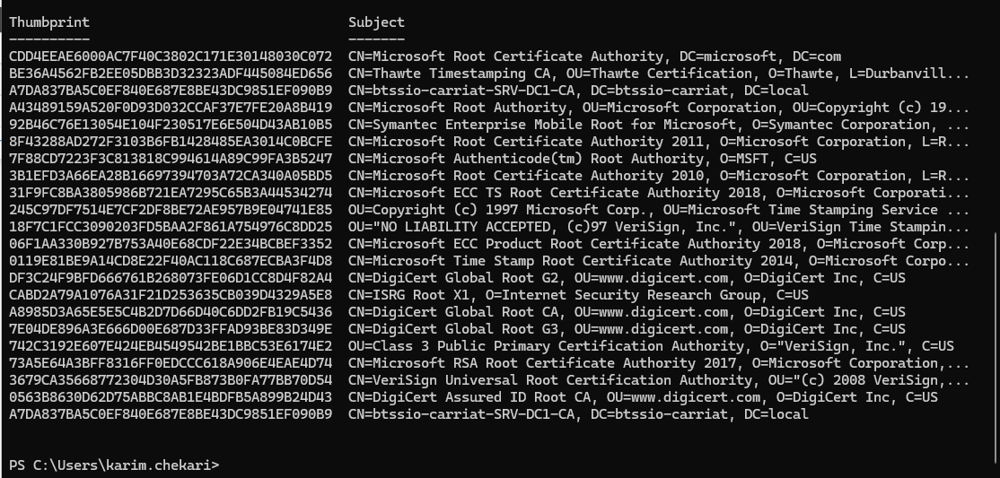
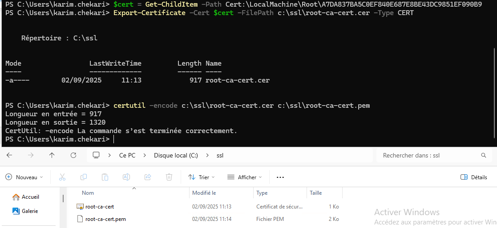
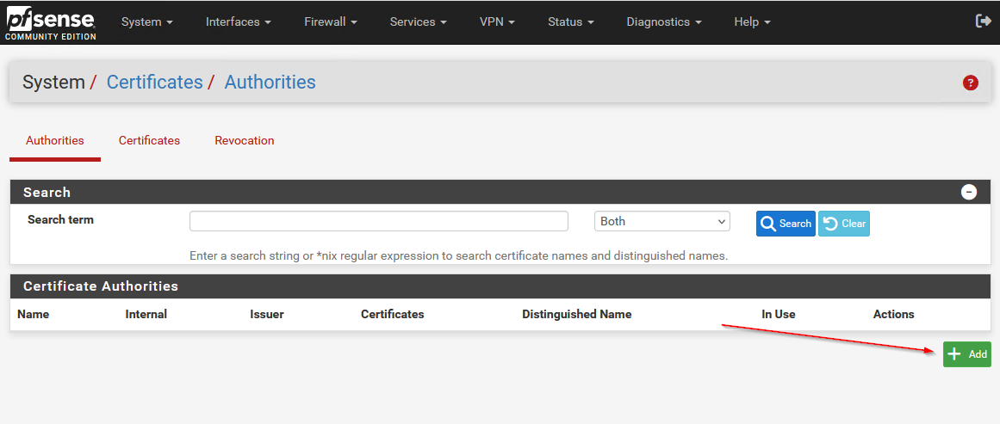
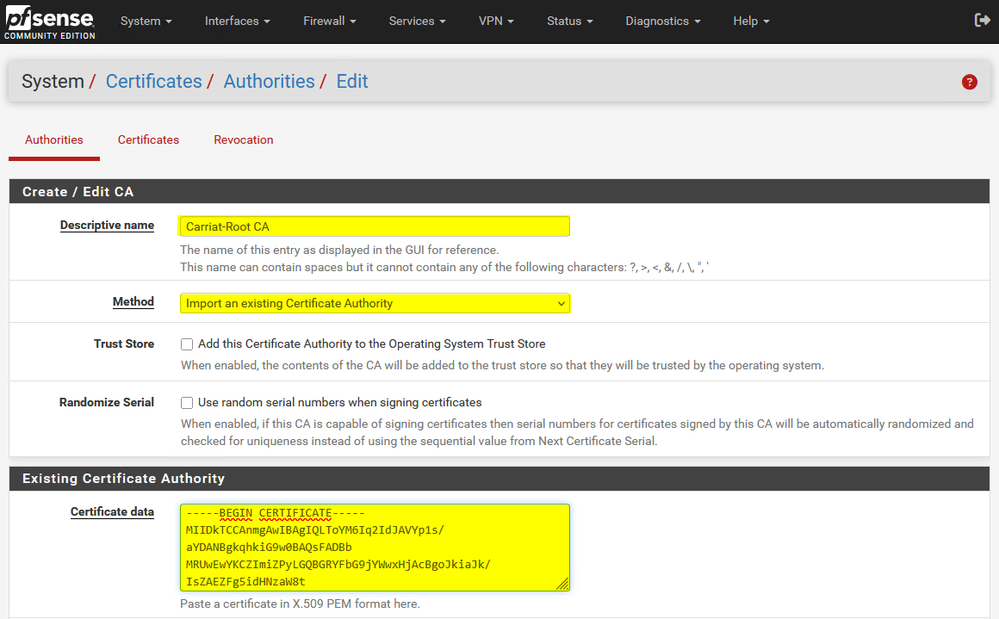
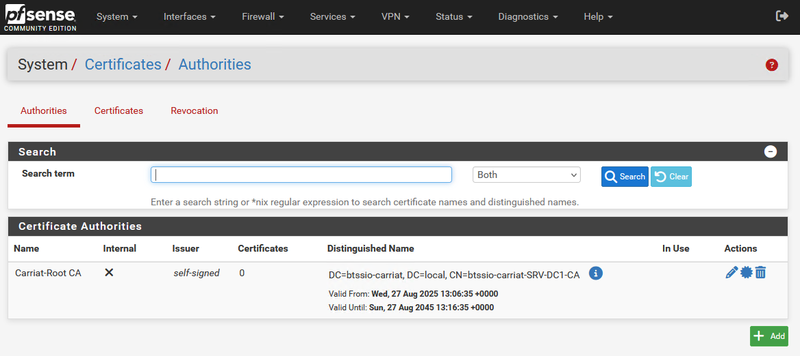
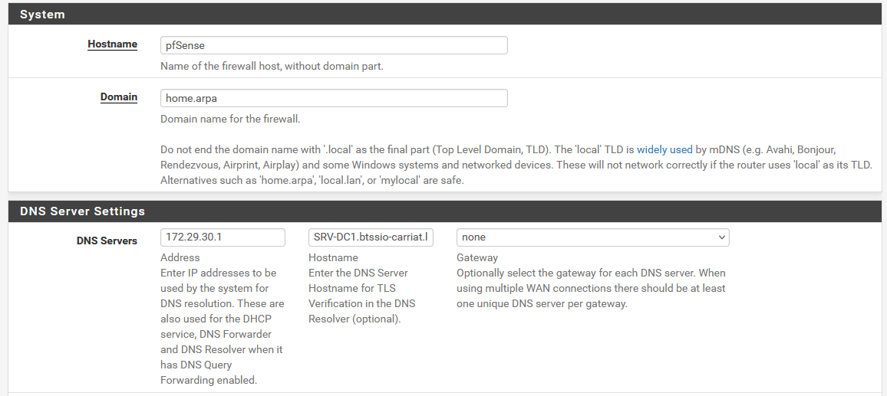
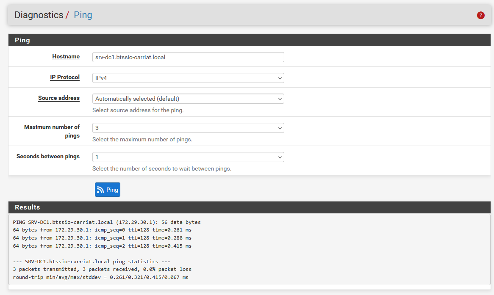
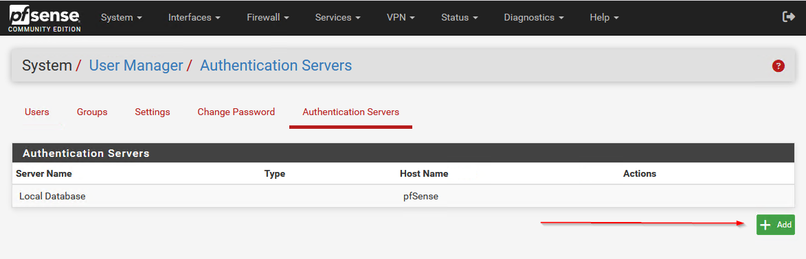

Il faut au préalable avoir installé le rôle d’autorité de certification sur l’ad.

Sur l’AD, afficher les certificats racine et leur empreinte :

```powershell
Get-ChildItem -Path Cert:\LocalMachine\Root
```


On va ensuite exporter le certificat de l’AD :

```powershell
$cert = Get-ChildItem -Path Cert:\LocalMachine\Root\A7DA837BA5C0EF840E687E8BE43DC9851EF090B9
Export-Certificate -Cert $cert -FilePath c:\ssl\root-ca-cert.cer -Type CERT
certutil -encode c:\ssl\root-ca-cert.cer c:\ssl\root-ca-cert.pem
```


Une fois le certificat en main, il faut également un utilisateur LDAP capable de lire l’annuaire (j’ai déjà un ldap.reader).

Maintenant que nous avons tout le nécessaire, direction pfSense.

`System > Certificates > Authorities > Add`

Nous allons importer le certificat

L’autorité est créé.

Il faut que le serveur puisse répondre au ping donc configurer le DNS et rajouter un Host Overrides

Le ping doit fonctionner

Nous pouvons maintenant créer le serveur d’authentification dans le menu System > User Manager > Authentification Server
