:::note
Installation en utilisant Netgate pfSense Community Edition 2.8.1-RELEASE (amd64)
:::
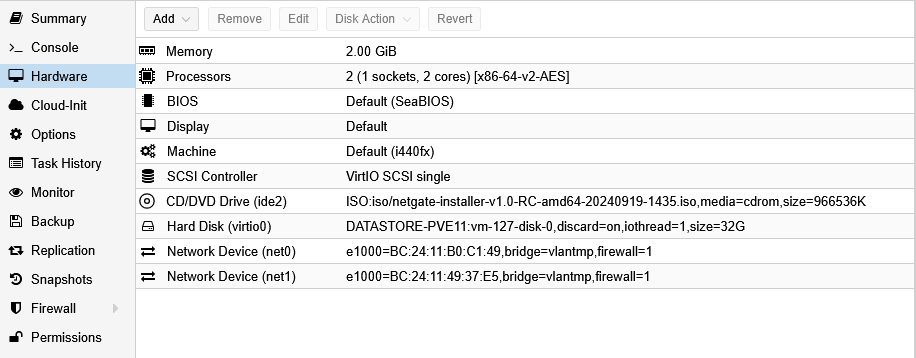
Nous allons charger l’iso de NetGate Installer
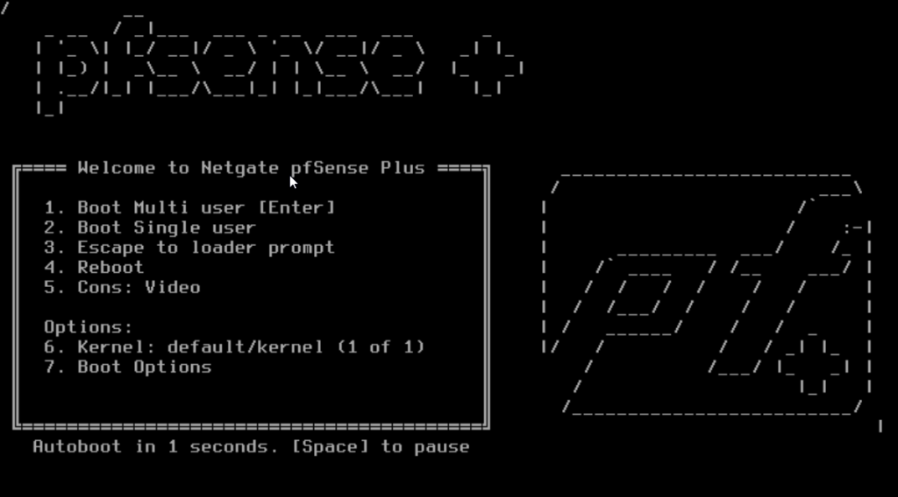
On accepte le contrat de licence
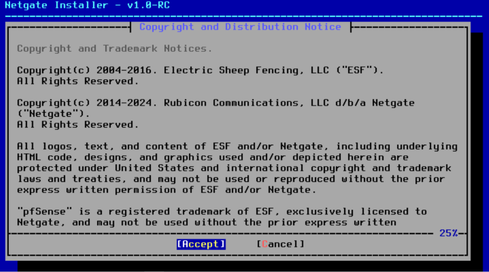
Choisir l’installation
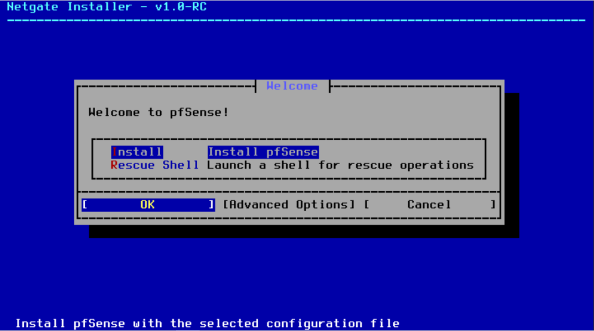
Il faut configurer la connexion réseau
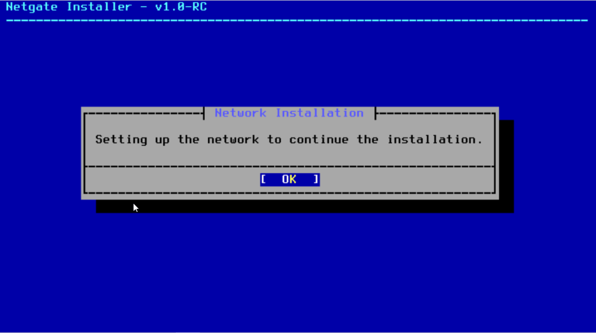
On retrouve les deux cartes avec leur adresses mac correspondant dans Proxmox
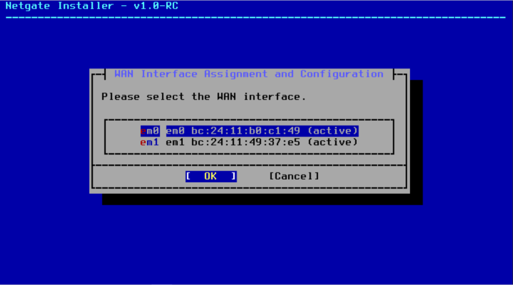
- La net0 (em0) sera l’interface WAN
- La net1 (em1) sera l’interface LAN
Nous allons tout laisser en DHCP car je suis en train de créer un modèle et nous pourrons le faire à la fin de l’installation.
:::caution
Le programme a besoin d’avoir Internet sur l’interface WAN.
:::
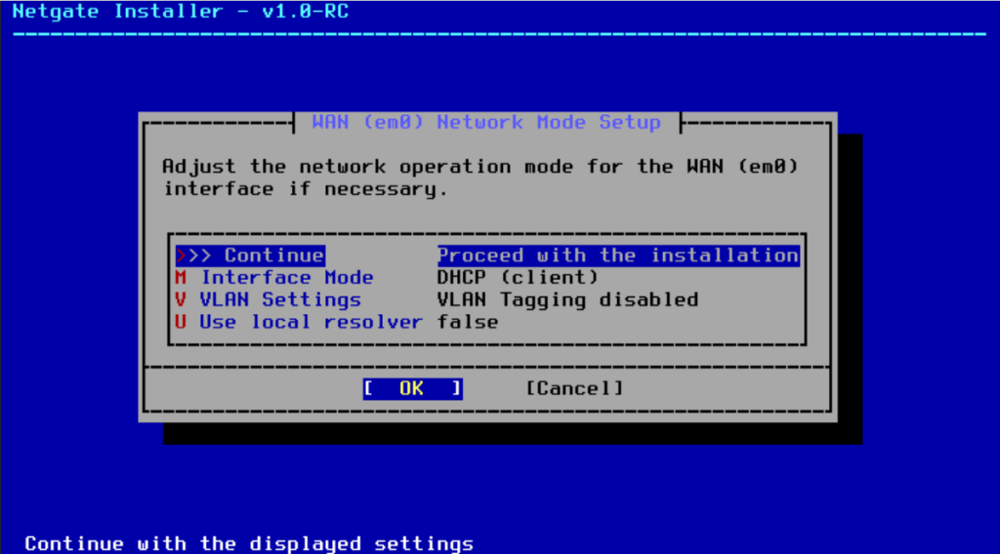
On selectionne l’interface LAN
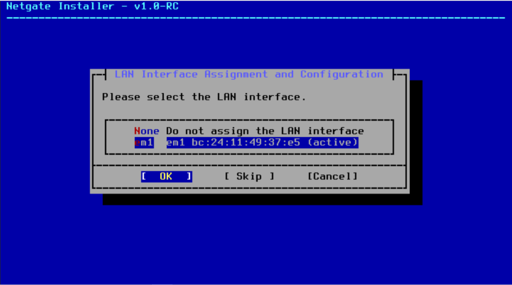
On peut laisser le LAN en static
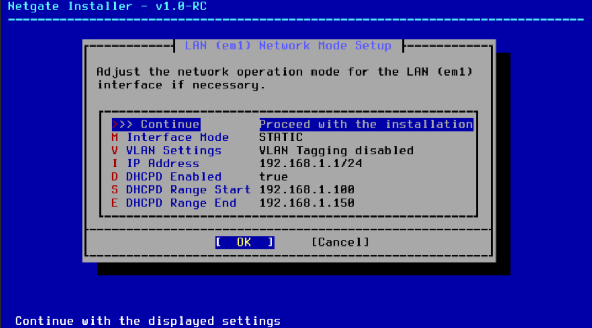
On peut confirmer le paramétrage.
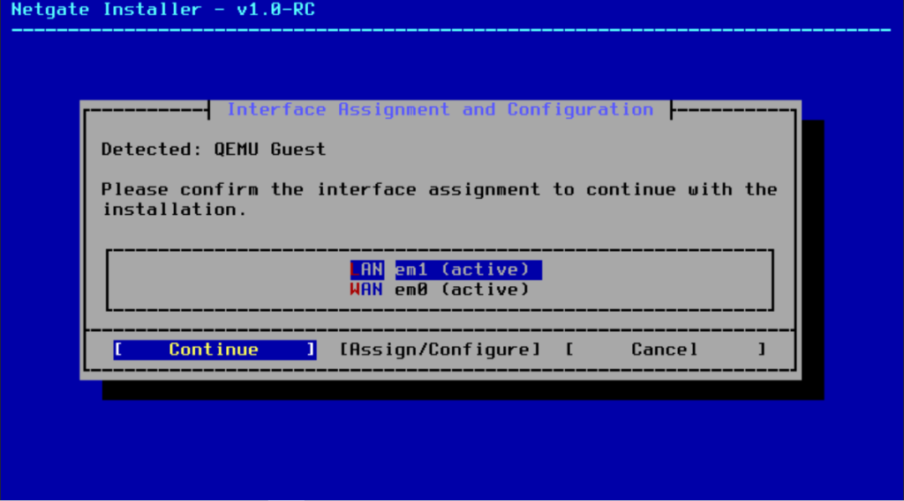
pfSense se connecte sur les serveurs de Netgate et propose l’installation.
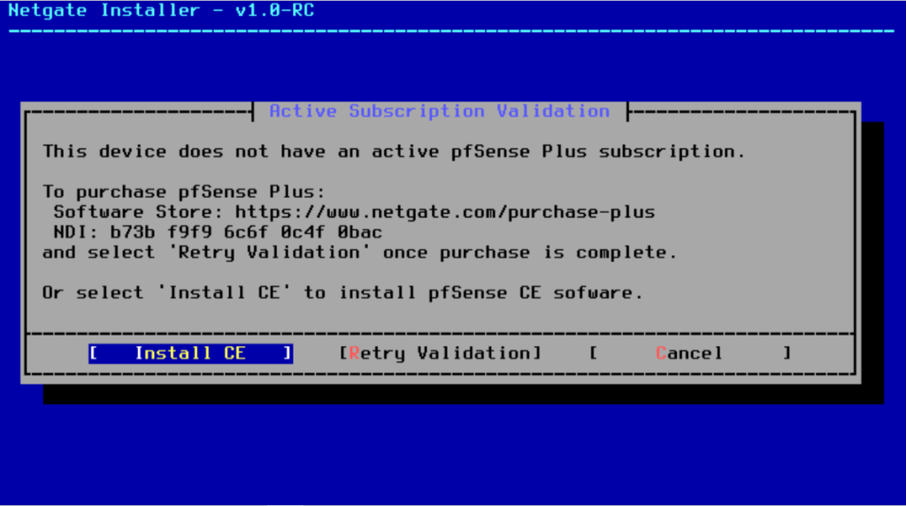
On reste sur la configuration du système de fichier par défaut
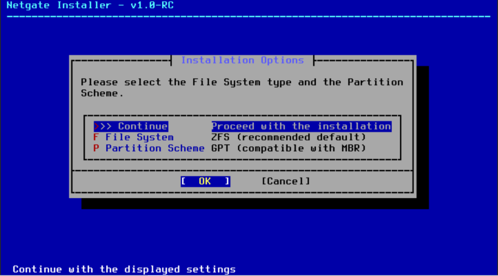
Sans rédondance, je n’ai mis qu’un disque de 32 go.
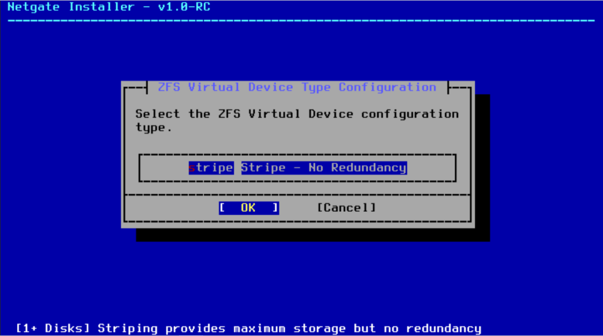
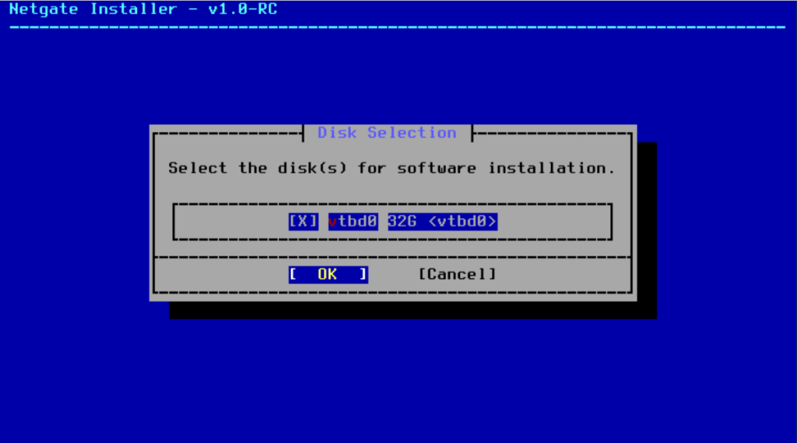
On efface tout
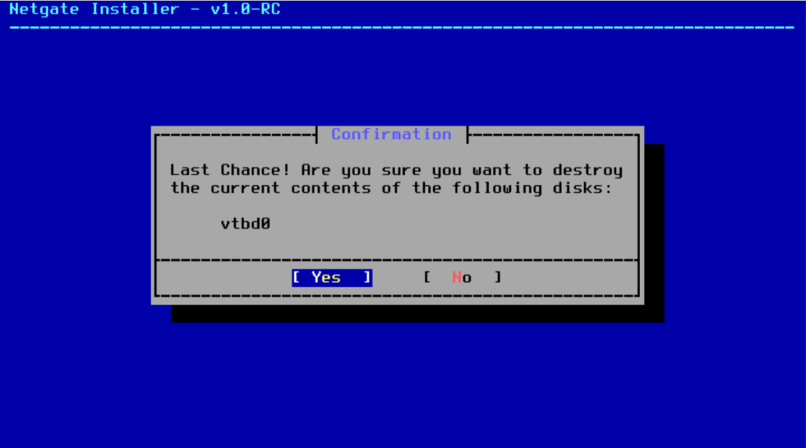
On va sélectionner la version à installer
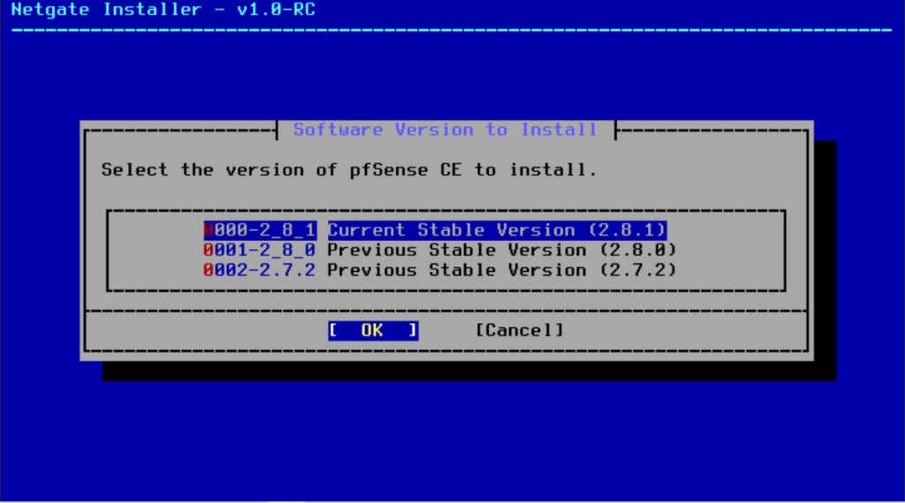
Il ne nous reste plus qu’à attendre.
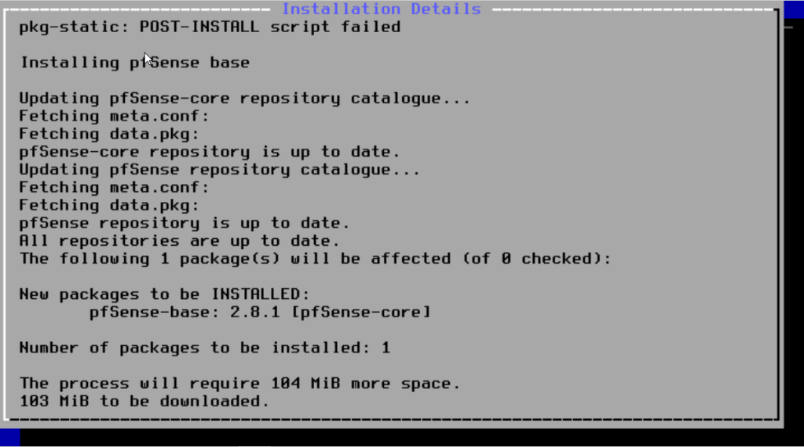
L’installation est terminée
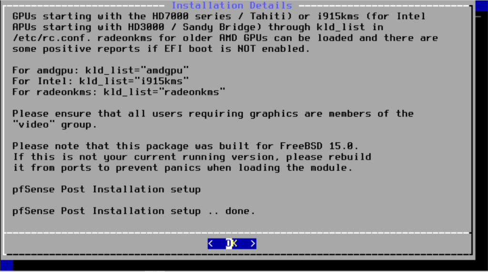
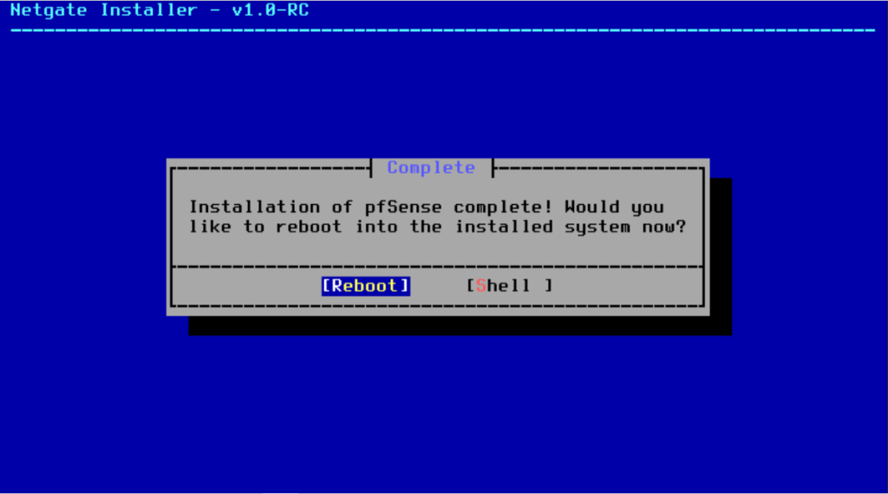